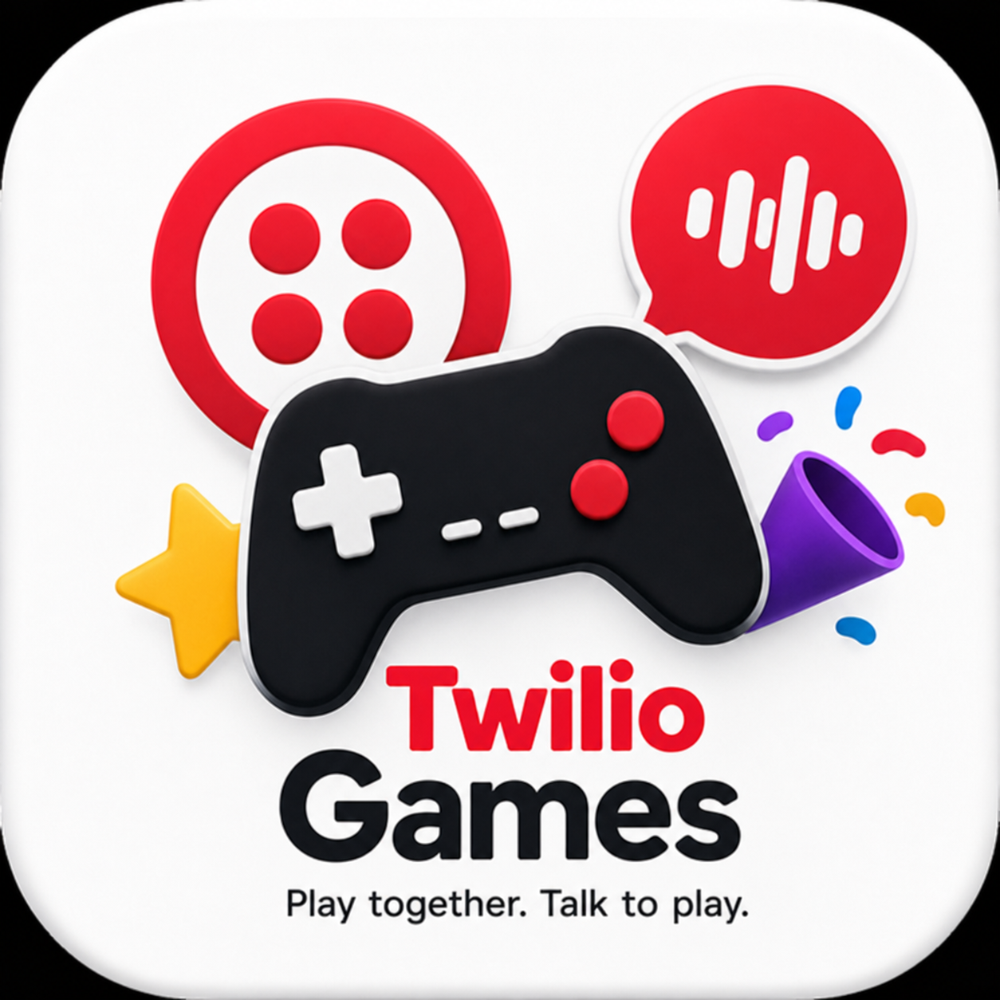
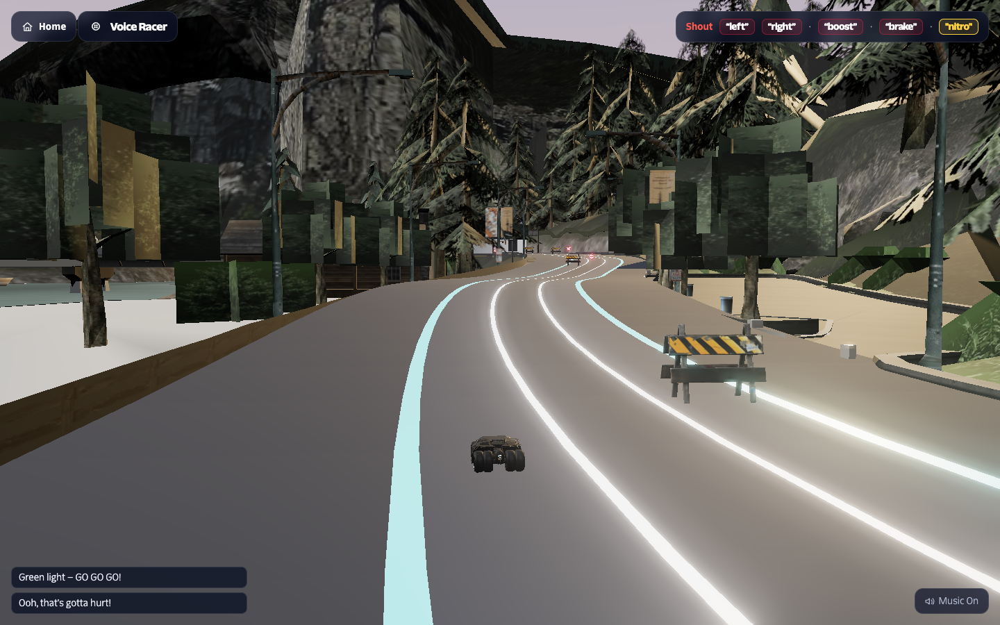
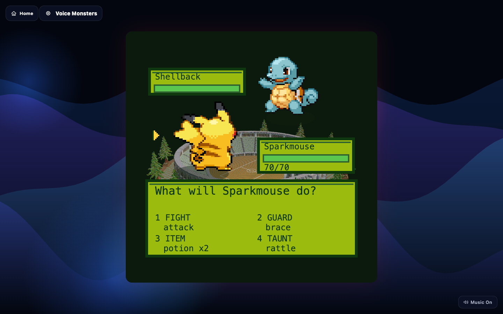
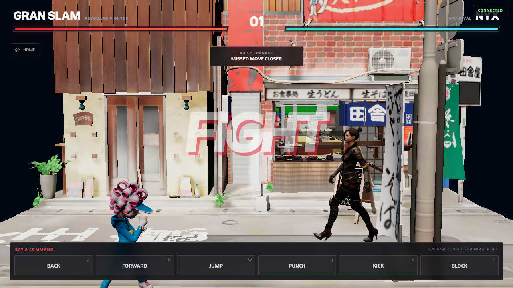
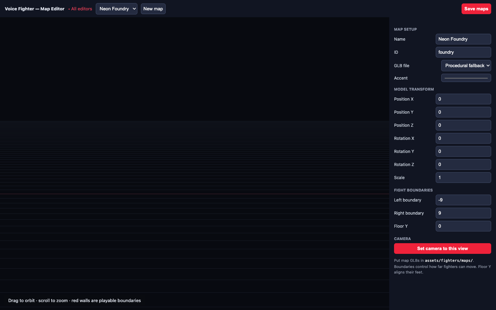
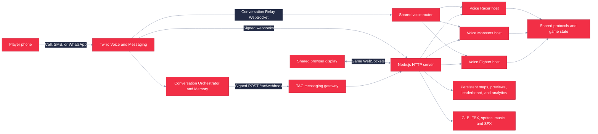
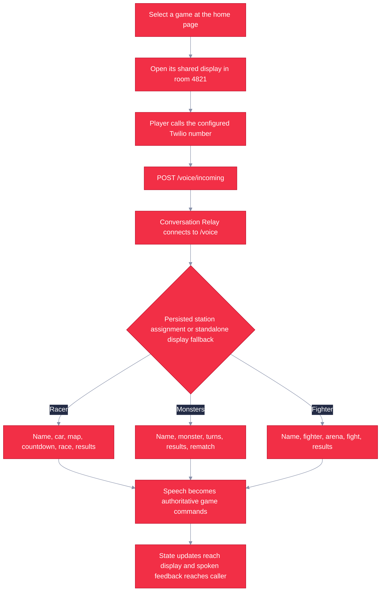

# Twilio Games

<p align="center">
  
</p>

Twilio Games is a shared-screen platform for three voice-controlled multiplayer games. Players join by browser, SMS, or WhatsApp, then call the locale-specific Twilio number when admitted. Conversation Relay sends speech and DTMF events to the Node.js server, which applies commands to authoritative game state and returns updates to the display and caller.

   

The current games are:

| Game | Format | Voice commands |
|---|---|---|
| Voice Racer | Real-time, three-lane 3D racing for up to four players | `left`, `right`, `boost`, `brake`, `nitro` |
| Voice Monsters | Turn-based creature battles with type matchups, moves, guard, items, and taunts | Names or numbers, `fight`, move names, `guard`, `item`, `taunt` |
| Voice Fighter | Real-time side-view 3D fighting with character and arena selection | Names or numbers, `forward`, `back`, `jump`, `punch`, `kick`, `block` |

All three games support a spectator display, phone callers, keyboard testing, music, sound effects, spoken guidance, and reconnectable WebSocket sessions. Station onboarding and game notices use TAC, Conversation Orchestrator, Conversation Memory, SMS, and WhatsApp when configured.

The home and playable games support US English and Brazilian Portuguese. The language picker updates
the shared display, deterministic commands, Conversation Relay recognition, and spoken responses.
See [Localization](docs/localization.md) to add another language.

The implemented product direction and remaining external provisioning work are documented in the canonical
[Twilio Games station and TAC plan](docs/TWILIO_ARCADE_PLAN.md). It covers runtime-configurable lead capture,
digital coins, earning challenges, one-display multiplayer queues, post-game summaries, Conversation
Memory, and Conversation Intelligence. The approved one-screen conference implementation is captured
separately in the [Expo Station plan](docs/ARCADE_EXPO_STATION_PLAN.md), including Racer's four-player
capacity, ready-pool timing, phase-two game selection, persistent QR, and SMS/WhatsApp onboarding.

## Screenshots

<table>
  <tr>
    <td width="50%" align="center">
      <br>
      <strong>Voice Racer</strong><br>
      Race, dodge barriers, and trigger boosts by voice.
    </td>
    <td width="50%" align="center">
      <br>
      <strong>Voice Monsters</strong><br>
      Choose moves in a turn-based creature battle.
    </td>
  </tr>
  <tr>
    <td width="50%" align="center">
      <br>
      <strong>Voice Fighter</strong><br>
      Move, attack, block, and jump in a voice-controlled fight.
    </td>
    <td width="50%" align="center">
      <br>
      <strong>Map editor</strong><br>
      Configure stages, boundaries, cameras, and previews.
    </td>
  </tr>
</table>

## Architecture



- `client/` contains the Vite multi-page browser client, Three.js renderers, audio managers, game pages, editors, and garage.
- `server/` contains the HTTP server, authoritative game hosts, WebSocket routing, Twilio webhook validation, Conversation Relay adapters, SMS concierge, and optional LLM integration.
- `shared/` contains game worlds, state machines, typed wire protocols, command parsing, rosters, maps, and shared utilities.
- `assets/` contains runtime 3D assets, manifests, map catalogs, previews, and attribution records.
- `tools/` contains asset inspection, optimization, fixture, and browser smoke-test utilities.

One `/voice` WebSocket serves all games. In station mode, persisted admission selects the exact game, room, launch generation, and player identity. Outside station mode, the incoming-call webhook falls back to the most recently connected game display and defaults to Voice Racer.

## Game Flow



Incoming calls join the default room `4821` immediately. The current `/voice/incoming` flow does not ask callers to enter a room code. `/voice/join` remains an alias for legacy DTMF room-code requests.

## Installation

Requirements:

- Node.js 22.13 or later
- npm
- Git LFS, because Fighter source FBX files and map GLBs are LFS-managed

```bash
git lfs install
git lfs pull
npm ci
```

Start the server and client in separate terminals:

```bash
npm run dev:server
```

```bash
npm run dev:client
```

Open <http://localhost:5173/>. Vite serves the client on port `5173` and proxies APIs, assets, and WebSockets to the Node.js server on port `8080`.

## Usage

The home page lists the three playable games. Selecting a game opens its shared display in room `4821`:

| Page | Development URL | Purpose |
|---|---|---|
| Home | <http://localhost:5173/> | Select Voice Racer, Voice Monsters, or Voice Fighter |
| Voice Racer | <http://localhost:5173/play.html?display=1&room=4821> | Spectator and operator display |
| Voice Monsters | <http://localhost:5173/monsters.html?display=1&room=4821> | Spectator and operator display |
| Voice Fighter | <http://localhost:5173/fighter.html?display=1&room=4821> | Spectator and operator display |
| Editors | <http://localhost:5173/editor> | Choose the Racer level, Monsters arena, or Fighter map editor |
| Garage | <http://localhost:5173/garage> | Inspect and configure Racer models and manifest entries |
| Activation analytics | <http://localhost:5173/analytics> | Private date-filtered engagement dashboard and PDF reports |
| Visitor join | <http://localhost:5173/join> | Choose SMS, WhatsApp, or browser registration |
| Browser player page | <http://localhost:5173/player> | Registration, wallet, challenges, and ready-pool controls |
| Operator console | <http://localhost:5173/operator> | Staff-only station configuration, monitoring, and recovery |

The shared screen and operator preview display a visitor QR that opens `/join`. SMS and WhatsApp are live deterministic channels when configured; browser registration remains available in lead-capture mode.

Standalone shared displays start as spectators and do not consume a player slot; `P` adds or removes a local keyboard tester. Station-managed displays disable local players so admitted phone callers remain authoritative. Use `Enter` to advance supported menu phases; Racer also uses left arrow to go back and right arrow to advance.

Keyboard controls:

| Game | Controls |
|---|---|
| Voice Racer | Arrow keys steer, boost, and brake; Space uses nitro |
| Voice Monsters | `1`-`4` choose root actions or moves, `0` returns from the move menu, `Enter` advances |
| Voice Fighter | `A` back, `D` forward, `W` or Space jump, `J` punch, `K` kick, `L` block; number keys select cards |

To test a browser player instead of a spectator, omit `display=1` and add a name where supported, for example <http://localhost:5173/play.html?room=4821&name=Ada> or <http://localhost:5173/monsters.html?room=4821&name=Ada>. Voice Fighter joins a local player from its shared display with `P`.

For a live call, expose port `8080` through a public HTTPS endpoint, set `PUBLIC_BASE_URL`, and configure both Twilio Voice numbers with `POST https://YOUR_HOST/voice/incoming`. Configure Conversation Orchestrator capture rules and its signed status callback at `POST https://YOUR_HOST/tac/webhook`; `/sms` remains the direct fallback only when TAC is disconnected or station mode is off. See [Voice setup](docs/voice-setup.md) and [Infrastructure setup](docs/INFRA_SETUP.md).

## Editors and Assets

`/editor` is a hub for three persistent content tools:

- Voice Racer level editor: tracks, maps, props, lighting, cameras, and preview shots.
- Voice Monsters arena editor: arena transform, framing, and spin settings.
- Voice Fighter map editor: GLB placement, floor, boundaries, cameras, map catalog, and preview capture.

`/garage` configures Racer model roles, order, transforms, and animation settings in `assets/manifest.json`. On public deployments, set `EDITOR_TOKEN`; editor write requests then require the same token, which can be supplied with the editor's `?token=` query parameter.

```bash
npm run inspect-assets
npm run optimize-assets
```

The asset inspector scans Racer assets and reports model metadata. The optimizer processes source GLBs with glTF Transform. Runtime audio is under `client/public/audio/`; `MusicManager` changes playlists with game context, while `SoundEffectsManager` handles shared and game-specific effects.

Asset licenses are tracked separately in [assets/CREDITS.md](assets/CREDITS.md). Some Voice Fighter asset provenance is still marked unknown there and must not be assumed reusable or redistributable.

## Configuration

The application runs locally without Twilio or OpenAI credentials. Configure these environment variables as needed:

| Variable | Purpose | Default |
|---|---|---|
| `PORT` | Node.js HTTP and WebSocket port | `8080` |
| `PUBLIC_BASE_URL` | Public HTTPS origin used to build Twilio callback and relay URLs | `http://localhost:PORT` |
| `TWILIO_AUTH_TOKEN` | Validates Twilio Voice and Messaging webhook signatures; validation turns on when set | Unset |
| `TWILIO_VALIDATE_SIGNATURES` | Explicitly enable or disable webhook signature validation | Enabled when `TWILIO_AUTH_TOKEN` is set |
| `GAME_PHONE_NUMBER` | Number displayed and QR-encoded on game lobbies | Placeholder when unset |
| `VOICE_RELAY_TOKEN` | Dedicated bearer token for Conversation Relay setup frames | Required and separate from `TWILIO_AUTH_TOKEN` in production |
| `CR_TTS_VOICE` | ElevenLabs voice ID used by Conversation Relay talk-back | Relay default voice |
| `CR_TTS_VOICE_PT_BR` | Optional Brazilian Portuguese ElevenLabs voice ID | Relay's `pt-BR` default voice |
| `DEFAULT_LOCALE` | Call locale when no localized game display is connected | `en-US` |
| `OPENAI_API_KEY` | Enables conversational hosting for Voice Racer and Voice Monsters | Conversational host disabled when unset; deterministic and scripted flows remain |
| `OPENAI_MODEL` | OpenAI model used by the optional host | Server default |
| `EDITOR_TOKEN` | Requires authentication for editor and manifest writes | Writes open when unset |
| `GOOGLE_OAUTH_CLIENT_ID` | Google OAuth web client for the private analytics dashboard | Analytics access disabled when unset |
| `GOOGLE_OAUTH_CLIENT_SECRET` | Google OAuth web client secret | Analytics access disabled when unset |
| `ANALYTICS_ALLOWED_EMAIL` | One exact verified Google email allowed in addition to `@twilio.com` accounts | No exception account |
| `ANALYTICS_PATH` | Persistent daily analytics rollup file | `data/analytics.json` |
| `ARCADE_ADMIN_EMAILS` | Comma-separated Google-authenticated emails allowed to update Arcade runtime configuration | Admin APIs disabled when unset |
| `ARCADE_CONFIG_DIRECTORY` | Persistent Arcade configuration and audit directory | `data/` |
| `ARCADE_SIGNING_SECRET` | Exactly 64 hexadecimal characters used to derive player-session and challenge-token keys when station mode is enabled | Not read while station mode is `off` |
| `ARCADE_STATE_PATH` | Persistent player, wallet, and queue state | `data/arcade-state.json` |
| `ARCADE_DEV_ADMIN` | Explicit local-only admin bypass used by `dev:arcade:server`; ignored in production | `false` |
| `ARCADE_TAC_ENABLED` | Enables the active-event TAC lifecycle gateway; the local Arcade script disables it for credential-free testing | Enabled in production |
| `TWILIO_ACCOUNT_SID`, `TWILIO_API_KEY`, `TWILIO_API_SECRET` | TAC, Conversation Memory, and outbound Messaging credentials from the primary SMS/WhatsApp account | Required by the production workflow |
| `TWILIO_PT_AUTH_TOKEN` | Validates Voice webhooks from the separate account that owns the Portuguese number | Required for the current two-account deployment |
| `TWILIO_PHONE_NUMBER`, `TWILIO_SMS_NUMBER` | SMS sender registered with TAC and used for direct fallback/outbound delivery | Required in production |
| `TWILIO_CONVERSATION_CONFIGURATION_ID` | Conversation Orchestrator configuration linked to the event Memory store | Required; `conv_configuration_<26 lowercase letters or digits>` |
| `FIGHTER_DISPLAY_TOKEN` | Requires host authentication for the Fighter display | Unset |
| `GAME_SERVER_URL` | Vite development proxy target | `http://localhost:8080` |
| `MAPS_PATH`, `ARENA_PATH`, `FIGHTER_MAPS_PATH` | Live writable game configuration paths | Files under `data/` |
| `BUNDLED_MAPS_PATH`, `BUNDLED_ARENA_PATH`, `BUNDLED_FIGHTER_MAPS_PATH` | Seed configuration paths | Files under `assets/` |
| `FIGHTER_PREVIEW_DIR` | Writable Fighter preview directory | `data/fighter-previews` |

When signature validation is enabled without `TWILIO_AUTH_TOKEN`, Twilio webhooks fail closed. Keep `EDITOR_TOKEN`, Google OAuth credentials, `VOICE_RELAY_TOKEN`, and `FIGHTER_DISPLAY_TOKEN` set on public deployments where their protections are required.

## Activation Analytics

`/analytics` reports engaged participants, sessions, completion, active play time, accepted voice commands, daily trends, per-game performance, and popular maps, characters, and vehicles. Filters support a date range of up to 366 days and an individual game. The PDF button downloads the same filtered report model shown on screen.

Access uses Google OAuth. The server accepts verified Google emails ending exactly in `@twilio.com`, plus one exact exception configured through `ANALYTICS_ALLOWED_EMAIL`. Sessions are server-side and use an eight-hour secure, HTTP-only cookie. Configure the Google web client redirect URI as `<PUBLIC_BASE_URL>/auth/google/callback`. See [Analytics setup](docs/analytics.md).

Collection happens at authoritative server transitions, so browser refreshes and spectators do not inflate gameplay metrics. The store keeps pseudonymous participant keys and daily aggregates only: it does not retain phone numbers, display names, transcripts, or LLM text. Rollups are retained for 730 days in `data/analytics.json` on the Azure Files mount.

## Testing

```bash
npm test
npm run typecheck
npm run build
```

The current Vitest suite contains 1,139 passing tests across 113 files. It covers game worlds and protocols, room and reconnect behavior, Conversation Relay routing, voice command parsing, TwiML, webhook signatures, HTTP APIs, persistence, analytics, scoped Google OAuth authorization, the Twilio Games player experience and station QR, signed player sessions, wallet, queue, challenge, audited operator match APIs, the canonical game-capacity registry, and the deterministic station/round reducer, TAC lifecycle gating, asset governance, render helpers, audio management, and WebSocket integration.

For a credential-free local Twilio Games station walkthrough, run `npm run dev:arcade:server` and `npm run dev:arcade:client` in separate terminals, then open <http://localhost:5173/player> or <http://localhost:5173/operator>. These scripts use isolated `data/arcade-dev-*` state, an explicit loopback-only development operator, and disabled TAC; production and non-loopback deployments remain authenticated and fail-closed.

Additional Chromium-based render checks are available when a compatible browser is installed:

```bash
npm run smoke
npm run smoke:editor
```

GitHub Actions runs Node.js 22.13, restores Git LFS assets, installs with `npm ci`, typechecks, runs the test suite, builds the Vite client, and reports high-severity dependency audit results without making that audit step blocking.

## Deployment

Production uses one Azure Container Apps replica. The container builds the Vite multi-page client and runs one Node.js process that serves pages, APIs, static assets, Twilio webhooks, and the `/game`, `/battle`, `/fighter`, and `/voice` WebSockets.

Pushes to `main` and manual workflow runs execute the shared `Validate` CI job before deployment. On success, the deploy workflow provisions or updates Azure resources, builds the image in Azure Container Registry, updates the Container App, and checks `/healthz`.

The single-replica limit is a correctness requirement because rooms, active matches, call sessions, and WebSocket coordination are in memory. Azure Files persists analytics, the leaderboard, live editor configuration, map catalogs, and generated Fighter previews across revisions.

See [Deployment](docs/DEPLOYMENT.md) for pipeline and rollback behavior and [Infrastructure setup](docs/INFRA_SETUP.md) for Azure resources, GitHub secrets, Twilio webhooks, and first deployment.

## Documentation

- [Voice setup](docs/voice-setup.md): shared Conversation Relay routing, local public tunnels, controls, and live call testing.
- [Deployment](docs/DEPLOYMENT.md): container runtime, CI gate, persistence, and rollback.
- [Infrastructure setup](docs/INFRA_SETUP.md): Azure and GitHub configuration.
- [Asset credits](assets/CREDITS.md): model provenance and third-party licenses.
- [Asset layout](assets/README.md): runtime asset directory conventions.
- [Music setup](MUSIC_SETUP.md): audio contexts and extension points.
- [Design records](docs/superpowers/): historical specifications and implementation plans. These are design records, not the current operational source of truth.

## License

This repository does not contain a project-level `LICENSE` file. Treat the source code as private and not licensed for redistribution. Third-party game assets have separate terms and attribution requirements recorded in [assets/CREDITS.md](assets/CREDITS.md); those asset terms do not license the application source.
