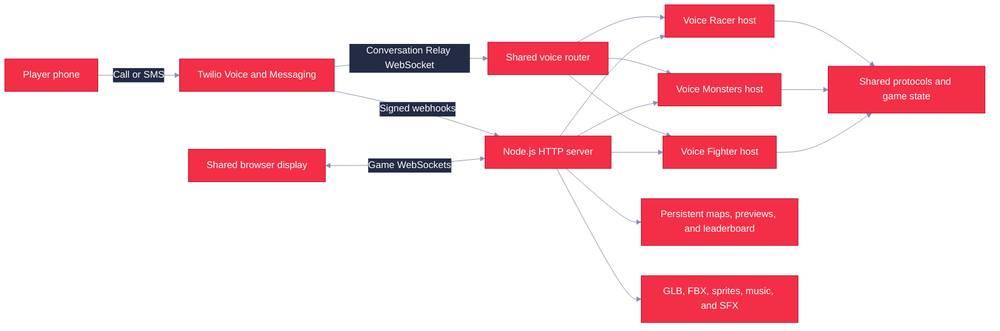
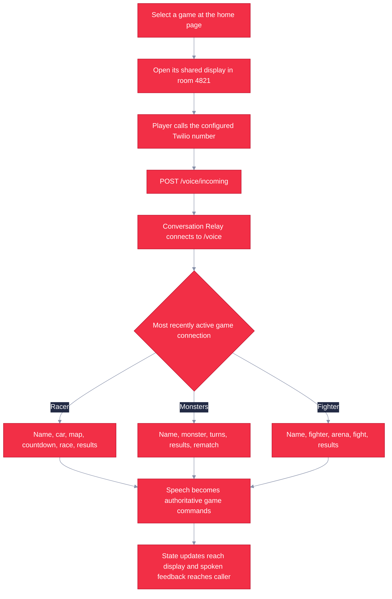

# Twilio Games

Twilio Games is a shared-screen platform for three voice-controlled multiplayer games. Players call one Twilio number, and Twilio Conversation Relay sends speech and DTMF events to the Node.js server. The server routes each call to the active game, applies commands to authoritative game state, and sends state and commentary back to the browser and caller.

   

The current games are:

| Game | Format | Voice commands |
|---|---|---|
| Voice Racer | Real-time, three-lane 3D racing for up to eight players | `left`, `right`, `boost`, `brake`, `nitro` |
| Voice Monsters | Turn-based creature battles with type matchups, moves, guard, items, and taunts | Names or numbers, `fight`, move names, `guard`, `item`, `taunt` |
| Voice Fighter | Real-time side-view 3D fighting with character and arena selection | Names or numbers, `forward`, `back`, `jump`, `punch`, `kick`, `block` |

All three games support a spectator display, phone callers, keyboard testing, music, sound effects, spoken guidance, and reconnectable WebSocket sessions. Voice Racer also includes an SMS concierge for joining and selecting cars or maps.

## Architecture



- `client/` contains the Vite multi-page browser client, Three.js renderers, audio managers, game pages, editors, and garage.
- `server/` contains the HTTP server, authoritative game hosts, WebSocket routing, Twilio webhook validation, Conversation Relay adapters, SMS concierge, and optional LLM integration.
- `shared/` contains game worlds, state machines, typed wire protocols, command parsing, rosters, maps, and shared utilities.
- `assets/` contains runtime 3D assets, manifests, map catalogs, previews, and attribution records.
- `tools/` contains asset inspection, optimization, fixture, and browser smoke-test utilities.

One `/voice` WebSocket serves all games. The incoming-call webhook selects the game whose live game WebSocket was opened most recently, writes that game into the Conversation Relay setup parameters, and defaults to Voice Racer when no game client is connected. Run one shared game display at a time when accepting calls.

## Game Flow



Incoming calls join the default room `4821` immediately. The current `/voice/incoming` flow does not ask callers to enter a room code. `/voice/join` remains an alias for legacy DTMF room-code requests.

## Installation

Requirements:

- Node.js 20 or later
- npm
- Git LFS, because Fighter source FBX files and map GLBs are LFS-managed

```bash
git lfs install
git lfs pull
npm ci
```

Start the server and client in separate terminals:

```bash
npm run dev:server
```

```bash
npm run dev:client
```

Open <http://localhost:5173/>. Vite serves the client on port `5173` and proxies APIs, assets, and WebSockets to the Node.js server on port `8080`.

## Usage

The home page lists the three playable games. Selecting a game opens its shared display in room `4821`:

| Page | Development URL | Purpose |
|---|---|---|
| Home | <http://localhost:5173/> | Select Voice Racer, Voice Monsters, or Voice Fighter |
| Voice Racer | <http://localhost:5173/play.html?display=1&room=4821> | Spectator and operator display |
| Voice Monsters | <http://localhost:5173/monsters.html?display=1&room=4821> | Spectator and operator display |
| Voice Fighter | <http://localhost:5173/fighter.html?display=1&room=4821> | Spectator and operator display |
| Editors | <http://localhost:5173/editor> | Choose the Racer level, Monsters arena, or Fighter map editor |
| Garage | <http://localhost:5173/garage> | Inspect and configure Racer models and manifest entries |

The shared display starts as a spectator and does not consume a player slot. Press `P` to add or remove a local keyboard player. Use `Enter` to advance supported menu phases; Racer also uses left arrow to go back and right arrow to advance.

Keyboard controls:

| Game | Controls |
|---|---|
| Voice Racer | Arrow keys steer, boost, and brake; Space uses nitro |
| Voice Monsters | `1`-`4` choose root actions or moves, `0` returns from the move menu, `Enter` advances |
| Voice Fighter | `A` back, `D` forward, `W` or Space jump, `J` punch, `K` kick, `L` block; number keys select cards |

To test a browser player instead of a spectator, omit `display=1` and add a name where supported, for example <http://localhost:5173/play.html?room=4821&name=Ada> or <http://localhost:5173/monsters.html?room=4821&name=Ada>. Voice Fighter joins a local player from its shared display with `P`.

For a live call, expose port `8080` through a public HTTPS endpoint, set `PUBLIC_BASE_URL`, and configure the Twilio number's incoming Voice webhook as `POST https://YOUR_HOST/voice/incoming`. Configure incoming Messaging as `POST https://YOUR_HOST/sms` to use the Voice Racer SMS concierge. See [Voice setup](docs/voice-setup.md) and [Infrastructure setup](docs/INFRA_SETUP.md) for account and webhook details.

## Editors and Assets

`/editor` is a hub for three persistent content tools:

- Voice Racer level editor: tracks, maps, props, lighting, cameras, and preview shots.
- Voice Monsters arena editor: arena transform, framing, and spin settings.
- Voice Fighter map editor: GLB placement, floor, boundaries, cameras, map catalog, and preview capture.

`/garage` configures Racer model roles, order, transforms, and animation settings in `assets/manifest.json`. On public deployments, set `EDITOR_TOKEN`; editor write requests then require the same token, which can be supplied with the editor's `?token=` query parameter.

```bash
npm run inspect-assets
npm run optimize-assets
```

The asset inspector scans Racer assets and reports model metadata. The optimizer processes source GLBs with glTF Transform. Runtime audio is under `client/public/audio/`; `MusicManager` changes playlists with game context, while `SoundEffectsManager` handles shared and game-specific effects.

Asset licenses are tracked separately in [assets/CREDITS.md](assets/CREDITS.md). Some Voice Fighter asset provenance is still marked unknown there and must not be assumed reusable or redistributable.

## Configuration

The application runs locally without Twilio or OpenAI credentials. Configure these environment variables as needed:

| Variable | Purpose | Default |
|---|---|---|
| `PORT` | Node.js HTTP and WebSocket port | `8080` |
| `PUBLIC_BASE_URL` | Public HTTPS origin used to build Twilio callback and relay URLs | `http://localhost:PORT` |
| `TWILIO_AUTH_TOKEN` | Validates Twilio Voice and Messaging webhook signatures; validation turns on when set | Unset |
| `TWILIO_VALIDATE_SIGNATURES` | Explicitly enable or disable webhook signature validation | Enabled when `TWILIO_AUTH_TOKEN` is set |
| `GAME_PHONE_NUMBER` | Number displayed and QR-encoded on game lobbies | Placeholder when unset |
| `VOICE_RELAY_TOKEN` | Validates Conversation Relay setup frames | Falls back to `TWILIO_AUTH_TOKEN` |
| `CR_TTS_VOICE` | ElevenLabs voice ID used by Conversation Relay talk-back | Relay default voice |
| `OPENAI_API_KEY` | Enables conversational hosting for Voice Racer and Voice Monsters | Conversational host disabled when unset; deterministic and scripted flows remain |
| `OPENAI_MODEL` | OpenAI model used by the optional host | Server default |
| `EDITOR_TOKEN` | Requires authentication for editor and manifest writes | Writes open when unset |
| `FIGHTER_DISPLAY_TOKEN` | Requires host authentication for the Fighter display | Unset |
| `GAME_SERVER_URL` | Vite development proxy target | `http://localhost:8080` |
| `MAPS_PATH`, `ARENA_PATH`, `FIGHTER_MAPS_PATH` | Live writable game configuration paths | Files under `data/` |
| `BUNDLED_MAPS_PATH`, `BUNDLED_ARENA_PATH`, `BUNDLED_FIGHTER_MAPS_PATH` | Seed configuration paths | Files under `assets/` |
| `FIGHTER_PREVIEW_DIR` | Writable Fighter preview directory | `data/fighter-previews` |

When signature validation is enabled without `TWILIO_AUTH_TOKEN`, Twilio webhooks fail closed. Keep `EDITOR_TOKEN`, `VOICE_RELAY_TOKEN`, and `FIGHTER_DISPLAY_TOKEN` set on public deployments where their protections are required.

## Testing

```bash
npm test
npm run typecheck
npm run build
```

The current Vitest suite contains 705 passing tests across 82 files. It covers game worlds and protocols, room and reconnect behavior, Conversation Relay routing, voice command parsing, TwiML, webhook signatures, HTTP APIs, persistence, asset governance, render helpers, audio management, and WebSocket integration.

Additional Chromium-based render checks are available when a compatible browser is installed:

```bash
npm run smoke
npm run smoke:editor
```

GitHub Actions runs Node.js 20, restores Git LFS assets, installs with `npm ci`, typechecks, runs the test suite, builds the Vite client, and reports high-severity dependency audit results without making that audit step blocking.

## Deployment

Production uses one Azure Container Apps replica. The container builds the Vite multi-page client and runs one Node.js process that serves pages, APIs, static assets, Twilio webhooks, and the `/game`, `/battle`, `/fighter`, and `/voice` WebSockets.

Pushes to `main` and manual workflow runs execute the shared `Validate` CI job before deployment. On success, the deploy workflow provisions or updates Azure resources, builds the image in Azure Container Registry, updates the Container App, and checks `/healthz`.

The single-replica limit is a correctness requirement because rooms, active matches, call sessions, and WebSocket coordination are in memory. Azure Files persists the leaderboard, live editor configuration, map catalogs, and generated Fighter previews across revisions.

See [Deployment](docs/DEPLOYMENT.md) for pipeline and rollback behavior and [Infrastructure setup](docs/INFRA_SETUP.md) for Azure resources, GitHub secrets, Twilio webhooks, and first deployment.

## Documentation

- [Voice setup](docs/voice-setup.md): shared Conversation Relay routing, local public tunnels, controls, and live call testing.
- [Deployment](docs/DEPLOYMENT.md): container runtime, CI gate, persistence, and rollback.
- [Infrastructure setup](docs/INFRA_SETUP.md): Azure and GitHub configuration.
- [Asset credits](assets/CREDITS.md): model provenance and third-party licenses.
- [Asset layout](assets/README.md): runtime asset directory conventions.
- [Music setup](MUSIC_SETUP.md): audio contexts and extension points.
- [Design records](docs/superpowers/): historical specifications and implementation plans. These are design records, not the current operational source of truth.

## Screenshots

<!-- doc-beautifier:screenshot
what: the home page showing the Voice Racer, Voice Monsters, and Voice Fighter cards
how:  run both development servers, open http://localhost:5173/, and capture the desktop game selector
save: docs/assets/home.png
-->
> _Screenshot pending — see capture note above._

<!-- doc-beautifier:screenshot
what: representative shared-display gameplay from all three games
how:  capture Voice Racer, Voice Monsters, and Voice Fighter during active play and combine them into one labeled image
save: docs/assets/games.png
-->
> _Screenshot pending — see capture note above._

<!-- doc-beautifier:screenshot
what: the editor hub with Racer, Monsters, and Fighter editor choices
how:  open http://localhost:5173/editor and capture the desktop editor hub
save: docs/assets/editors.png
-->
> _Screenshot pending — see capture note above._

## License

This repository does not contain a project-level `LICENSE` file. Treat the source code as private and not licensed for redistribution. Third-party game assets have separate terms and attribution requirements recorded in [assets/CREDITS.md](assets/CREDITS.md); those asset terms do not license the application source.
