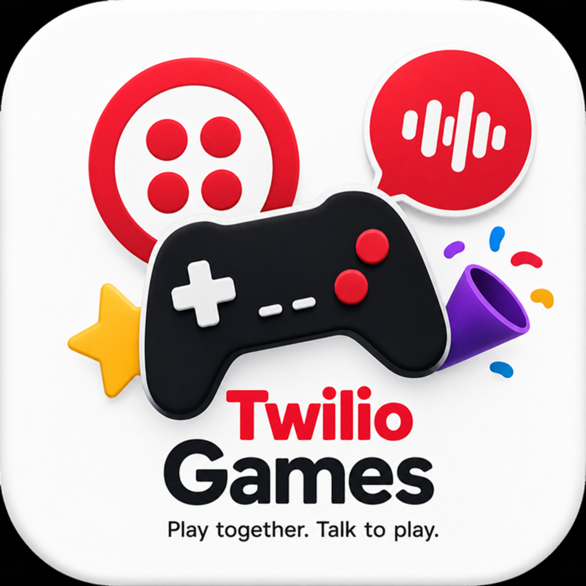
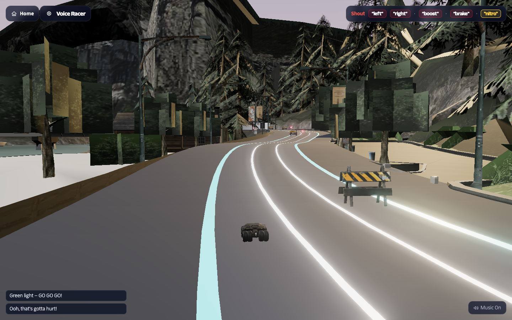
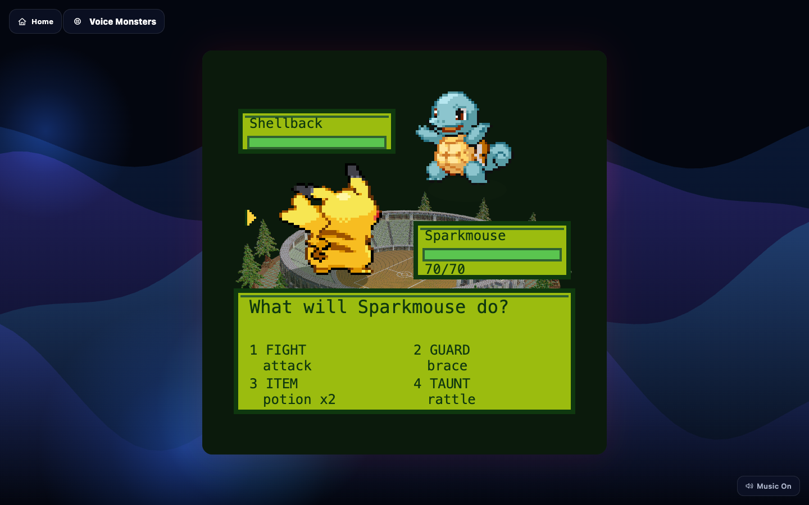
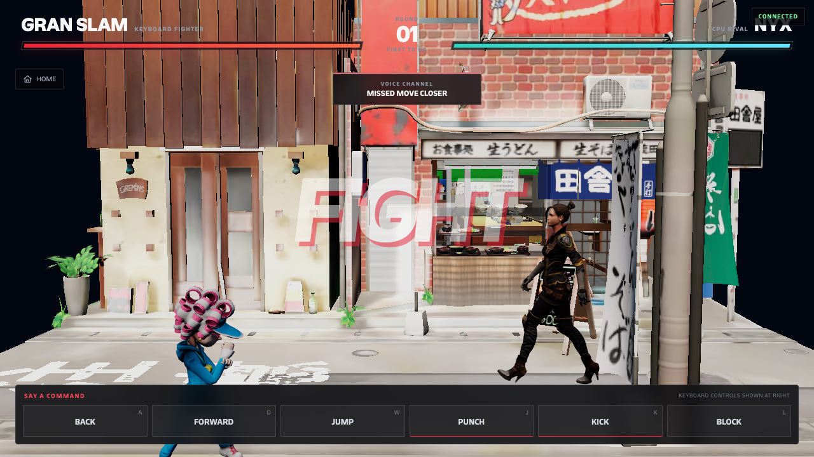
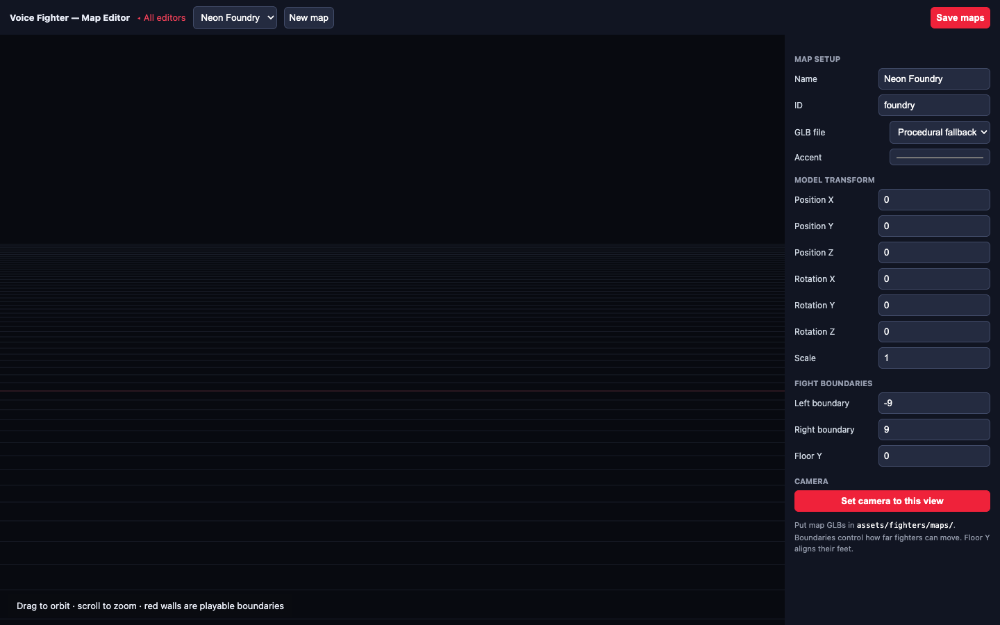
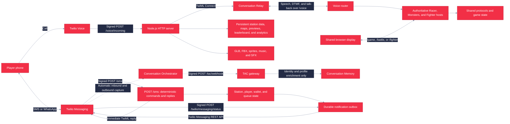
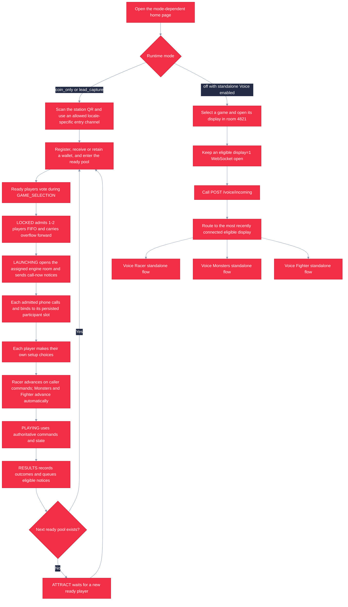

# Twilio Games

<p align="center">
  
</p>

Twilio Games is a shared-screen platform for three voice-controlled games. In an active station, English players enter through SMS or WhatsApp, with a browser fallback in lead-capture mode; Portuguese players use WhatsApp or the same lead-capture browser fallback. Messaging is always presented as the preferred path. Players then enter the ready pool and call the locale-specific Twilio number when admitted. Conversation Relay sends speech and DTMF events directly to the Node.js server, which applies deterministic commands to authoritative game state and returns updates to the display and caller.

   

The current games are:

| Game | Format | Voice commands |
|---|---|---|
| Voice Racer | Real-time, three-lane 3D racing for 1-2 human players | `left`, `right`, `boost`, `brake`, `nitro` |
| Voice Monsters | Turn-based creature battles for 1-2 human players; AI fills the solo opponent | Names or numbers, `fight`, move names, `guard`, `item`, `taunt` |
| Voice Fighter | Real-time side-view 3D fighting for 1-2 human players; AI fills the solo opponent | Names or numbers, `forward`, `back`, `jump`, `punch`, `kick`, `block` |

All three games support a spectator display, phone callers, keyboard testing, music, sound effects, spoken guidance, and reconnectable WebSocket sessions. The signed `POST /sms` webhook owns deterministic SMS and WhatsApp commands and immediate replies. Conversation Orchestrator and Twilio Agent Connect (TAC) only enrich Conversation Memory; a separate durable outbox sends proactive station notices through the Twilio Messaging REST API.

The home and playable games support US English and Brazilian Portuguese. The language picker updates
the shared display, deterministic commands, Conversation Relay recognition, and spoken responses.
See [Localization](docs/localization.md) to add another language.

The [Twilio Games station and TAC plan](docs/TWILIO_ARCADE_PLAN.md) records the broader product direction,
and the [Expo Station plan](docs/ARCADE_EXPO_STATION_PLAN.md) preserves the completed one-display station baseline.
The baseline at commit `0594e31` implements registration, wallets, earning challenges, station rounds,
game voting, FIFO admission and overflow, automatic launch coordination, results, durable notices, and
Conversation Memory identity enrichment. Conversation Intelligence, richer Memory and knowledge use,
and conversational rematch flows remain roadmap work; live Twilio and Azure acceptance still requires
external provisioning.

## Screenshots

<table>
  <tr>
    <td width="50%" align="center">
      <br>
      <strong>Voice Racer</strong><br>
      Race, dodge barriers, and trigger boosts by voice.
    </td>
    <td width="50%" align="center">
      <br>
      <strong>Voice Monsters</strong><br>
      Choose moves in a turn-based creature battle.
    </td>
  </tr>
  <tr>
    <td width="50%" align="center">
      <br>
      <strong>Voice Fighter</strong><br>
      Move, attack, block, and jump in a voice-controlled fight.
    </td>
    <td width="50%" align="center">
      <br>
      <strong>Map editor</strong><br>
      Configure stages, boundaries, cameras, and previews.
    </td>
  </tr>
</table>

## Architecture


```mermaid
%%{init: {"theme":"base","themeVariables":{"primaryColor":"#F22F46","primaryTextColor":"#FFFFFF","primaryBorderColor":"#B80F2A","lineColor":"#8891AA","secondaryColor":"#232B45","tertiaryColor":"#000D25","background":"#FFFFFF"}}}%%
flowchart LR
  Player[Player phone] -->|Call| Voice[Twilio Voice]
  Voice -->|Signed POST /voice/incoming| HTTP[Node.js HTTP server]
  HTTP -->|TwiML Connect| Relay[Conversation Relay]
  Relay <-->|Speech, DTMF, and talk-back over /voice| Router[Voice router]
  Router --> Hosts[Authoritative Racer, Monsters, and Fighter hosts]
  Display[Shared browser display] <-->|/game, /battle, or /fighter| Hosts

  Player <-->|SMS or WhatsApp| Messaging[Twilio Messaging]
  Messaging -->|Signed POST /sms| Direct[POST /sms: deterministic commands and replies]
  Direct --> State[Station, player, wallet, and queue state]
  Direct -->|Immediate TwiML reply| Messaging
  Messaging -.->|Automatic inbound and outbound capture| Orchestrator[Conversation Orchestrator]
  Orchestrator -.->|Signed POST /tac/webhook| TAC[TAC gateway]
  TAC -->|Identity and profile enrichment only| Memory[Conversation Memory]

  State --> Outbox[Durable notification outbox]
  Outbox -->|Twilio Messaging REST API| Messaging
  Messaging -->|Signed POST /twilio/messaging/status| Outbox
  Hosts --> Shared[Shared protocols and game state]
  HTTP --> Data[Persistent station data, maps, previews, leaderboard, and analytics]
  HTTP --> Assets[GLB, FBX, sprites, music, and SFX]
```

- `client/` contains the Vite multi-page browser client, Three.js renderers, audio managers, game pages, editors, and garage.
- `server/` contains the HTTP server, authoritative game hosts, WebSocket routing, Twilio webhook validation, Conversation Relay adapters, SMS concierge, and optional LLM integration.
- `shared/` contains game worlds, state machines, typed wire protocols, command parsing, rosters, maps, and shared utilities.
- `assets/` contains runtime 3D assets, manifests, map catalogs, previews, and attribution records.
- `tools/` contains asset inspection, optimization, fixture, and browser smoke-test utilities.

One `/voice` WebSocket serves all games. In station mode, persisted admission selects the exact game, room, launch generation, player identity, participant index, and expected participant count. In standalone mode, routing requires a connected `display=1` screen for an enabled game and chooses the most recently connected eligible display. It returns localized unavailable TwiML when no eligible display is open; it never claims Voice Racer as a default.

## Game Flow


```mermaid
%%{init: {"theme":"base","themeVariables":{"primaryColor":"#F22F46","primaryTextColor":"#FFFFFF","primaryBorderColor":"#B80F2A","lineColor":"#8891AA","secondaryColor":"#232B45","tertiaryColor":"#000D25"}}}%%
flowchart TD
  Home[Open the mode-dependent home page] --> Mode{Runtime mode}

  Mode -->|coin_only or lead_capture| Join[Scan the station QR and use an allowed locale-specific entry channel]
  Join --> Ready[Register, receive or retain a wallet, and enter the ready pool]
  Ready --> Vote[Ready players vote during GAME_SELECTION]
  Vote --> Lock[LOCKED admits 1-2 players FIFO and carries overflow forward]
  Lock --> Launch[LAUNCHING opens the assigned engine room and sends call-now notices]
  Launch --> Calls[Each admitted phone calls and binds to its persisted participant slot]
  Calls --> Setup[Each player makes their own setup choices]
  Setup --> Gates[Racer advances on caller commands; Monsters and Fighter advance automatically]
  Gates --> Play[PLAYING uses authoritative commands and state]
  Play --> Results[RESULTS records outcomes and queues eligible notices]
  Results --> Next{Next ready pool exists?}
  Next -->|Yes| Ready
  Next -->|No| Attract[ATTRACT waits for a new ready player]
  Attract --> Ready

  Mode -->|off with standalone Voice enabled| Select[Select a game and open its display in room 4821]
  Select --> Open[Keep an eligible display=1 WebSocket open]
  Open --> Incoming[Call POST /voice/incoming]
  Incoming --> Route[Route to the most recently connected eligible display]
  Route --> Racer[Voice Racer standalone flow]
  Route --> Monsters[Voice Monsters standalone flow]
  Route --> Fighter[Voice Fighter standalone flow]
```

During an active station event, incoming calls route directly to each admitted caller's assigned game room without asking for a room code. Each caller controls one stable engine slot and makes only their own car, monster, fighter, track, or arena choices. Racer prompts personal choices one caller at a time, waits at the lobby, car, and track gates until every required choice is complete and every assigned caller is connected, and lets either caller say `start` or `next` to advance. Callers can explicitly correct a choice before advancing. Monsters and Fighter retain automatic setup progression. Display-keyboard input cannot advance station setup. A two-player Racer match renders split-screen views plus numbered player markers above both cars. All three games admit exactly one or two humans; Monsters and Fighter add an AI opponent for solo play.

When station mode is `off`, the home page becomes the standalone launcher. Standalone calls use room `4821` by default, but they still require an eligible open shared display. `/voice/join` remains a legacy alias that accepts posted DTMF digits as a room code. Mode-off deployments with standalone Voice disabled, and standalone calls without an eligible display, receive localized Say-and-Hangup TwiML.

### Current Station Model

The implemented station keeps one persistent station, one active round, and one active match on one shared display. Its phases are `ATTRACT`, `RECRUITING`, `GAME_SELECTION`, `LOCKED`, `LAUNCHING`, `PLAYING`, and `RESULTS`. Persisted timestamps drive automatic transitions; in-memory timers only wake the reducer. Players who arrive after admission enter the next round, and overflow keeps FIFO priority and any paid reservation.

Implemented: runtime `off`, `coin_only`, and `lead_capture` modes; browser and deterministic Messaging onboarding; signed player sessions; per-player wallets and challenges; tolerant ready-pool voting; fixed 1-2 player capacities; caller-scoped multiplayer setup; explicit Racer phase gates; authenticated display launch; authoritative results; restart recovery; operator controls; Conversation Memory profile enrichment; and a durable, retrying, state-revalidating outbound notice worker.

Roadmap or external work: Conversation Intelligence analysis, richer Memory and knowledge experiences, conversational rematches, production sender and template approval, and live end-to-end Twilio/Azure acceptance. The broader smart-queue domain exists in code, but the current one-display game cycle uses station rounds and FIFO ready entries defined by the Expo Station plan.

## Installation

Requirements:

- Node.js 22.13 or later
- npm 9 or later
- Git LFS, because Fighter source FBX files and map GLBs are LFS-managed

```bash
git lfs install
git lfs pull
npm ci
```

Start the server and client in separate terminals:

```bash
npm run dev:server
```

```bash
npm run dev:client
```

Open <http://localhost:5173/>. Vite serves the client on port `5173` and proxies APIs, assets, and WebSockets to the Node.js server on port `8080`.

## Usage

The home route changes with the runtime mode. Mode `off` shows the standalone three-game launcher; `coin_only` and `lead_capture` show the active station and automatically launch its selected game display.

| Page | Development URL | Purpose |
|---|---|---|
| Home | <http://localhost:5173/> | Standalone launcher in mode `off`; station display in active modes |
| Voice Racer | <http://localhost:5173/play.html?display=1&room=4821> | Spectator and operator display |
| Voice Monsters | <http://localhost:5173/monsters.html?display=1&room=4821> | Spectator and operator display |
| Voice Fighter | <http://localhost:5173/fighter.html?display=1&room=4821> | Spectator and operator display |
| Editors | <http://localhost:5173/editor> | Choose the Racer level, Monsters arena, or Fighter map editor |
| Garage | <http://localhost:5173/garage> | Inspect and configure Racer models and manifest entries |
| Activation analytics | <http://localhost:5173/analytics> | Private date-filtered engagement dashboard and PDF reports |
| Visitor join | <http://localhost:5173/join> | English: configured SMS or WhatsApp; Portuguese: WhatsApp; both locales: browser fallback in lead-capture mode |
| Browser player page | <http://localhost:5173/player> | Registration, wallet, challenges, and ready-pool controls |
| Operator console | <http://localhost:5173/operator> | Staff-only station configuration, monitoring, and recovery |
| Challenge portal | <http://localhost:5173/challenge/> | No-store reward portal opened by signed Messaging links; a valid fragment token is required |

The shared screen and operator preview display a visitor QR that opens `/join`. English entry offers configured SMS and WhatsApp buttons; Portuguese entry offers WhatsApp with a prefilled `ENTRAR` command. Lead-capture mode adds browser registration for both locales as a visually secondary fallback, while the server continues to reject Portuguese SMS entry attempts. Every accepted reply states the next required answer. During game selection, ready players vote by game name/number or from `/player`; ties and missing votes use the configured automatic fallback.

Standalone shared displays start as spectators and do not consume a player slot; `P` adds or removes a local keyboard tester. Manual display-keyboard phase control applies only to standalone play: `Enter` advances supported menu phases, while Racer also uses left arrow to go back and right arrow to advance. Station-managed displays disable local players and display-driven setup advancement. Admitted Racer callers advance after completing their individual choices; Monsters and Fighter advance automatically.

Standalone keyboard controls:

| Game | Controls |
|---|---|
| Voice Racer | Arrow keys steer, boost, and brake; Space uses nitro |
| Voice Monsters | `1`-`4` choose root actions or moves, `0` returns from the move menu, `Enter` advances |
| Voice Fighter | `A` back, `D` forward, `W` or Space jump, `J` punch, `K` kick, `L` block; number keys select cards |

To test a browser player instead of a spectator, omit `display=1` and add a name where supported, for example <http://localhost:5173/play.html?room=4821&name=Ada> or <http://localhost:5173/monsters.html?room=4821&name=Ada>. Voice Fighter joins a local player from its shared display with `P`.

For live traffic, expose port `8080` through a public HTTPS endpoint and set `PUBLIC_BASE_URL`. Configure both Voice numbers with `POST https://YOUR_HOST/voice/incoming`, and configure the primary SMS number plus approved WhatsApp sender with `POST https://YOUR_HOST/sms`. The signed `/sms` webhook owns game commands and immediate replies; Conversation Orchestrator capture rules and signed `POST https://YOUR_HOST/tac/webhook` enrich Conversation Memory without sending a duplicate reply. See [Voice setup](docs/voice-setup.md) and [Infrastructure setup](docs/INFRA_SETUP.md).

WhatsApp call-now delivery uses the locale's approved `twilio/call-to-action` template with a static **Phone** action whenever its Content SID is configured, including inside the 24-hour session window. The static action must match the operator-configured locale Voice number and requires reapproval when that number changes. Without the call-now Content SID, the worker may send a free-form phone number only inside the session window; outside it, the notice is suppressed. Admission, overflow, standard result, and next-game notices use free-form text in session and require their approved localized template outside the window. Challenge-bearing results and challenge-reward notices have no template fallback and are suppressed outside the window. The worker revalidates every notice against current station state before sending.

## Editors and Assets

`/editor` is a hub for three persistent content tools:

- Voice Racer level editor: tracks, maps, props, lighting, cameras, and preview shots.
- Voice Monsters arena editor: arena transform, framing, and spin settings.
- Voice Fighter map editor: GLB placement, floor, boundaries, cameras, map catalog, and preview capture.

`/garage` configures Racer model roles, order, transforms, and animation settings in `assets/manifest.json`. On public deployments, set `EDITOR_TOKEN`; editor write requests then require the same token, which can be supplied with the editor's `?token=` query parameter.

```bash
npm run inspect-assets
npm run optimize-assets
```

The asset inspector scans Racer assets and reports model metadata. The optimizer processes source GLBs with glTF Transform. Runtime audio is under `client/public/audio/`; `MusicManager` changes playlists with game context, while `SoundEffectsManager` handles shared and game-specific effects.

Asset licenses are tracked separately in [assets/CREDITS.md](assets/CREDITS.md). Some Voice Fighter asset provenance is still marked unknown there and must not be assumed reusable or redistributable.

## Configuration

The application runs locally without Twilio or OpenAI credentials. Configure these environment variables as needed:

| Variable | Purpose | Default |
|---|---|---|
| `PORT` | Node.js HTTP and WebSocket port | `8080` |
| `NODE_ENV` | Enables production security defaults and disables development-only behavior when set to `production` | Unset |
| `PUBLIC_BASE_URL` | Public HTTPS origin used to build Twilio callback and relay URLs | `http://localhost:PORT` |
| `DATA_MOUNT` | Container startup directory whose `data/` child is linked to `/app/data` for persistent writes | `/app/appdata` in `scripts/start.sh` |
| `TWILIO_AUTH_TOKEN` | Validates primary-account Voice, Messaging, TAC, and status webhook signatures | Unset |
| `TWILIO_PT_AUTH_TOKEN` | Adds signature validation for Voice webhooks from the separate Portuguese-number account | Unset; required by the current production workflow |
| `TWILIO_VALIDATE_SIGNATURES` | Explicitly enables or disables webhook signature validation | Enabled when an Auth Token is set or `NODE_ENV=production` |
| `GAME_PHONE_NUMBER` | Legacy Voice fallback used for both locales only while neither operator-configured locale number exists | Placeholder or unavailable state when unset |
| `VOICE_RELAY_TOKEN` | Dedicated bearer token for Conversation Relay setup frames | Required and separate from `TWILIO_AUTH_TOKEN` in production |
| `CR_TTS_VOICE` | ElevenLabs voice ID used by Conversation Relay talk-back | Relay default voice |
| `CR_TTS_VOICE_PT_BR` | Optional Brazilian Portuguese ElevenLabs voice ID | Relay's `pt-BR` default voice |
| `DEFAULT_LOCALE` | Call locale when no localized game display is connected | `en-US` |
| `OPENAI_API_KEY` | Enables conversational hosting for Voice Racer and Voice Monsters | Conversational host disabled when unset; deterministic and scripted flows remain |
| `OPENAI_MODEL` | OpenAI model used by the optional host | Server default |
| `EDITOR_TOKEN` | Requires authentication for editor and manifest writes | Writes open when unset |
| `GOOGLE_OAUTH_CLIENT_ID` | Google OAuth web client for the private analytics dashboard | Analytics access disabled when unset |
| `GOOGLE_OAUTH_CLIENT_SECRET` | Google OAuth web client secret | Analytics access disabled when unset |
| `ANALYTICS_ALLOWED_EMAIL` | One exact verified Google email allowed in addition to `@twilio.com` accounts | No exception account |
| `ANALYTICS_PATH` | Persistent daily analytics rollup file | `data/analytics.json` |
| `ARCADE_ADMIN_EMAILS` | Comma-separated Google-authenticated emails allowed to update Arcade runtime configuration | Admin APIs disabled when unset |
| `ARCADE_CONFIG_DIRECTORY` | Persistent Arcade configuration and audit directory | `data/` |
| `ARCADE_SIGNING_SECRET` | Exactly 64 hexadecimal characters used to derive player-session and challenge-token keys when station mode is enabled | Not read while station mode is `off` |
| `ARCADE_STATE_PATH` | Persistent players, wallets, queue and station state, Messaging identities, receipts, and notification outbox | `data/arcade-state.json` |
| `ARCADE_DISPLAY_TOKEN` | Server-held kiosk capability used by Racer, Monsters, and Fighter station displays; production requires at least 16 characters | Unset |
| `ARCADE_STANDALONE_VOICE_ENABLED` | Allows standalone-mode calls to join the game currently open on the shared display | `false` in production; `true` otherwise |
| `ARCADE_DEV_ADMIN` | Explicit local-only admin bypass used by `dev:arcade:server`; ignored in production | `false` |
| `ARCADE_TAC_ENABLED` | Enables the TAC gateway for Orchestrator capture and Conversation Memory enrichment | Enabled unless set to `false`; `dev:arcade:server` disables it |
| `ARCADE_OUTBOUND_MESSAGING_ENABLED` | Kill switch for durable proactive SMS and WhatsApp notices; valid REST credentials and channel senders are also required | `false` unless exactly `true` |
| `TWILIO_ACCOUNT_SID`, `TWILIO_API_KEY`, `TWILIO_API_SECRET` | Primary-account credentials for TAC, Conversation Memory, and outbound Messaging REST calls | Required by the production workflow |
| `TWILIO_SMS_NUMBER` | Preferred E.164 SMS sender for join links and direct outbound SMS | Unset; required by the production workflow |
| `TWILIO_PHONE_NUMBER` | Legacy fallback SMS sender when `TWILIO_SMS_NUMBER` is unset | Unset |
| `TWILIO_WHATSAPP_NUMBER` | Approved WhatsApp sender; accepts E.164 with or without the `whatsapp:` prefix | Unset; WhatsApp hidden or disabled |
| `TWILIO_MESSAGING_SERVICE_SID` | Messaging Service used when sending approved WhatsApp Content templates | Unset; template sends fail |
| `TWILIO_CONVERSATION_CONFIGURATION_ID` | Conversation Orchestrator configuration linked to the event Memory store | Required; `conv_configuration_<26 lowercase letters or digits>` |
| `TWILIO_WHATSAPP_CONTENT_SID_STATION_ADMITTED_{EN_US,PT_BR}` | Approved localized admission templates used outside the WhatsApp session window | Unset |
| `TWILIO_WHATSAPP_CONTENT_SID_STATION_OVERFLOW_{EN_US,PT_BR}` | Approved localized overflow templates used outside the WhatsApp session window | Unset |
| `TWILIO_WHATSAPP_CONTENT_SID_STATION_CALL_NOW_{EN_US,PT_BR}` | Approved localized Phone CTA templates; used in and out of session when configured | Unset; in-session free-form fallback only |
| `TWILIO_WHATSAPP_CONTENT_SID_STATION_RESULTS_{EN_US,PT_BR}` | Approved localized standard-result templates used outside the WhatsApp session window | Unset |
| `TWILIO_WHATSAPP_CONTENT_SID_STATION_NEXT_GAME_{EN_US,PT_BR}` | Approved localized next-game templates used outside the WhatsApp session window | Unset |
| `DUB_API_KEY`, `DUB_SHORT_DOMAIN` | Enable validated Dub short links for signed `/challenge/` portal URLs; both must be configured | Disabled when either is unset |
| `DUB_FOLDER_ID` | Optional Dub folder for generated challenge links | Unset |
| `FIGHTER_DISPLAY_TOKEN` | Server-side Fighter host capability for custom standalone integrations; normal startup prefers `ARCADE_DISPLAY_TOKEN`, and browser URLs never accept it | Unset |
| `GAME_SERVER_URL` | Vite development proxy target | `http://localhost:8080` |
| `MAPS_PATH`, `ARENA_PATH`, `FIGHTER_MAPS_PATH` | Live writable game configuration paths | Files under `data/` |
| `BUNDLED_MAPS_PATH`, `BUNDLED_ARENA_PATH`, `BUNDLED_FIGHTER_MAPS_PATH` | Seed configuration paths | Files under `assets/` |
| `FIGHTER_PREVIEW_DIR` | Writable Fighter preview directory | `data/fighter-previews` |

When signature validation is enabled without `TWILIO_AUTH_TOKEN`, primary-account Twilio webhooks fail closed. Public station deployments also need independent `VOICE_RELAY_TOKEN`, `ARCADE_SIGNING_SECRET`, and `ARCADE_DISPLAY_TOKEN` values. The authenticated operator action installs the display capability in browser session storage; do not place display tokens in URLs. Set `EDITOR_TOKEN` and Google OAuth credentials wherever their protected features are exposed.

## Activation Analytics

`/analytics` reports engaged participants, sessions, completion, active play time, accepted voice commands, daily trends, per-game performance, and popular maps, characters, and vehicles. Filters accept endpoints no more than 366 days apart, which permits 367 inclusive UTC date buckets, and an individual game. The PDF button downloads the same filtered report model shown on screen.

Access uses Google OAuth. The server accepts verified Google emails ending exactly in `@twilio.com`, plus one exact exception configured through `ANALYTICS_ALLOWED_EMAIL`. Sessions are server-side and use an eight-hour HTTP-only, SameSite=Lax cookie; the server adds `Secure` when the configured redirect URI uses HTTPS. Configure the Google web client redirect URI as `<PUBLIC_BASE_URL>/auth/google/callback`. See [Analytics setup](docs/analytics.md).

Collection happens at authoritative server transitions, so browser refreshes and spectators do not inflate gameplay metrics. The store keeps pseudonymous participant keys and daily aggregates only: it does not retain phone numbers, display names, transcripts, or LLM text. Its 730-day age cutoff can retain 731 inclusive UTC date buckets in `data/analytics.json` on the Azure Files mount.

## Testing

```bash
npm test
npm run typecheck
npm run build
```

The Vitest suite contains 1,476 passing tests across 124 files. It covers game worlds and protocols, caller-scoped multiplayer setup, two-number Racer routing, cross-talk and stale-transcript protection, split-screen behavior, room reconnects, Conversation Relay, deterministic voice and tolerant Messaging commands, TwiML, webhook signatures, HTTP APIs, durable state and outbox behavior, analytics, scoped Google OAuth authorization, player and operator experiences, signed sessions and challenge links, wallets, queue and station reducers, game capacities, TAC and Memory gating, asset governance, render helpers, audio management, and WebSocket integration.

For a credential-free local Twilio Games station walkthrough, run `npm run dev:arcade:server` and `npm run dev:arcade:client` in separate terminals, then open <http://localhost:5173/player> or <http://localhost:5173/operator>. These scripts use isolated `data/arcade-dev-*` state, an explicit loopback-only development operator, and disabled TAC; production and non-loopback deployments remain authenticated and fail-closed.

Additional Chromium-based render checks are available when a compatible browser is installed:

```bash
npm run smoke
npm run smoke:editor
```

GitHub Actions runs Node.js 22.13, restores Git LFS assets, installs with `npm ci`, typechecks, runs the test suite, builds the Vite client, and reports high-severity dependency audit results without making that audit step blocking.

## Deployment

Production uses one Azure Container Apps replica. The image contains the built Vite multi-page client and runs one Node.js process that serves pages, APIs, static assets, Twilio webhooks, and the `/game`, `/battle`, `/fighter`, and `/voice` WebSockets.

The CI workflow runs on pushes and pull requests and checks Git LFS, `npm ci`, typechecking, all tests, the client build, and a non-blocking high-severity dependency audit. Separately, pushes to `main` and manual deploy runs execute the deploy workflow's own `typecheck`, test, and build checks, then validate production credentials. The deploy does not consume the reusable CI job.

The deploy workflow provisions Azure resources, builds commit-SHA and `latest` image tags in ACR, stops the previous writer, snapshots Azure Files, applies a uniquely named revision, and verifies the exact SHA tag. Neither ACR tag is registry-enforced immutable. Before public cutover the workflow requires that revision to be `Provisioned`, `Healthy`, latest-ready, active with one replica, the only running revision, mounted to `appdata`, and configured with the expected startup, readiness, and liveness probes on `/livez`. It then requires HTTP 200 from `/livez`, dependency-aware `/healthz`, `/`, `/join`, `/player`, and `/operator` on the candidate revision FQDN before assigning traffic and restoring single-revision mode. It does not run live Twilio, Conversation Memory, writable Azure Files, or WebSocket gameplay acceptance tests.

The single-replica limit is a correctness requirement because rooms, active matches, call sessions, and WebSocket coordination are in memory. `DATA_MOUNT=/app/appdata` links `/app/data` to the Azure Files share. The persistent set is:

- `data/leaderboard.json`: Racer leaderboard.
- `data/analytics.json`: bounded anonymous daily activation rollups.
- `data/maps.json`: live Racer map catalog, seeded from bundled assets.
- `data/arena.json`: live Monsters arena configuration after its first save.
- `data/fighter-maps.json` and `data/fighter-previews/*.png`: live Fighter catalog and generated previews.
- `data/arcade-config.json` and `data/arcade-config-audit.jsonl`: versioned station configuration and hash-chained audit.
- `data/arcade-state.json`: players, leads, wallets, queue and station state, Messaging identities, receipts, and the outbound notice outbox.

`assets/manifest.json`, bundled models, audio, and bundled previews remain image-owned and do not persist when changed inside a running container.

See [Deployment](docs/DEPLOYMENT.md) for pipeline and rollback behavior and [Infrastructure setup](docs/INFRA_SETUP.md) for Azure resources, GitHub secrets, Twilio webhooks, and first deployment.

## Documentation

- [Voice setup](docs/voice-setup.md): shared Conversation Relay routing, local public tunnels, controls, and live call testing.
- [Expo Station plan](docs/ARCADE_EXPO_STATION_PLAN.md): completed historical baseline for one-display phases, ready pool, voting, capacity, launch, and overflow.
- [Station and TAC plan](docs/TWILIO_ARCADE_PLAN.md): implemented baseline, broader product direction, and remaining roadmap.
- [Deployment](docs/DEPLOYMENT.md): container runtime, deployment checks, persistence, and rollback.
- [Infrastructure setup](docs/INFRA_SETUP.md): Azure, GitHub, Twilio, Orchestrator, Memory, WhatsApp template, and live acceptance setup.
- [Activation analytics](docs/analytics.md): Google OAuth, metrics, privacy, and reporting APIs.
- [Localization](docs/localization.md): US English and Brazilian Portuguese architecture and extension steps.
- [Game ideas](docs/game-ideas.md): future game concepts, not implemented routes.
- [Asset credits](assets/CREDITS.md): model provenance and third-party licenses.
- [Asset layout](assets/README.md): runtime asset directory conventions.
- [Music setup](MUSIC_SETUP.md): audio contexts and extension points.
- [Design records](docs/superpowers/): historical specifications and implementation plans. These are design records, not the current operational source of truth.

## License

This repository does not contain a project-level `LICENSE` file. Treat the source code as private and not licensed for redistribution. Third-party game assets have separate terms and attribution requirements recorded in [assets/CREDITS.md](assets/CREDITS.md); those asset terms do not license the application source.
