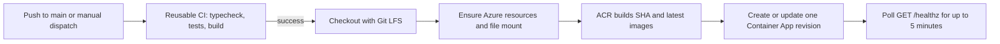

# Deployment

Twilio Games deploys Voice Racer, Voice Monsters, and Voice Fighter to one Azure Container App. The Node process serves the built browser clients, APIs, static assets, Twilio webhooks, and all WebSocket endpoints.

For project setup and local development, see the [README](../README.md). For the one-time Azure and GitHub setup, see [Infrastructure setup](./INFRA_SETUP.md).

## Deployment flow



`.github/workflows/deploy.yml` runs on pushes to `main` and manual `workflow_dispatch` events. Production deployments are serialized and are not canceled in progress.

1. The `ci` job calls `.github/workflows/ci.yml`; it does not inherit deployment secrets.
2. CI checks out Git LFS objects with `actions/checkout@v6`, installs Node 20 with `actions/setup-node@v6`, runs `npm ci`, `npm run typecheck`, `npm test`, and `npm run build`.
3. `npm audit --audit-level=high` is informational because the workflow appends `|| true`.
4. The deploy job checks out Git LFS objects again and signs in with `azure/login@v3` using the `AZURE_CREDENTIALS` service-principal JSON secret.
5. Azure CLI commands idempotently ensure the resource group, Basic ACR, Standard LRS storage account, 5 GiB Azure Files share, Log Analytics workspace, Container Apps environment, and environment storage attachment.
6. `az acr build` builds remotely from the checked-out repository and pushes `twilio-games:<commit-sha>` and `twilio-games:latest`.
7. The workflow renders `.github/containerapp.yaml` with `envsubst`, then creates or updates the Container App. A first deployment creates a minimal tagged app, sets its secrets, resolves its FQDN, and applies the full specification with the correct `PUBLIC_BASE_URL`.
8. The workflow polls `https://<fqdn>/healthz` every 10 seconds for up to 30 attempts. A non-200 result after five minutes fails the deployment.

The Container App specification does not define an Azure liveness, readiness, or startup probe. `/healthz` is currently a post-deployment workflow smoke test only.

## Image and process model

The `Dockerfile` uses `node:20-bookworm-slim`, installs `ca-certificates` and `tini`, and runs `npm ci --include=dev`. Development dependencies remain necessary in the production image because Vite and TypeScript build the client and `tsx` runs the TypeScript server directly.

`npm run build` typechecks the server and client and writes the Vite multi-page build to `client/dist`. `tini` runs as PID 1. `scripts/start.sh` prepares persistent storage and executes:

```bash
npx tsx server/index.ts
```

The process listens on `PORT`, which is `8080` in the image and Container App. Ingress is external, targets port 8080, and uses `transport: auto` for HTTP and WebSocket upgrades. The deployed container requests 2 vCPU and 4 GiB memory.

The app must remain at exactly one replica. Racer, battle, Fighter, host, and SMS session state is in memory, and the WebSockets are process-local. `.github/containerapp.yaml` sets both `minReplicas` and `maxReplicas` to `1`. Scaling out requires shared room/session state and cross-replica messaging.

## Git LFS and runtime assets

Fighter map GLBs under `assets/fighters/maps/*.glb` and Fighter source FBX files under `assets/fighters/source/*.fbx` are Git LFS objects. Both workflows use `actions/checkout@v6` with `lfs: true`, so ACR receives file contents rather than LFS pointer files.

Before a local Docker build from a fresh clone, install Git LFS and materialize the objects:

```bash
git lfs install
git lfs pull
docker build -t twilio-games .
```

The Docker context excludes `data`, local raw/quarantined asset directories, local environment files, and development output. Runtime models, maps, Fighter animations, bundled previews, audio, fonts, and the built client ship in the image under `/app/assets` and `/app/client/dist`. A new image is required to update them.

## Persistence

The Container Apps environment exposes the Azure Files share as `appdata`; the container mounts it read-write at `/app/appdata`. `DATA_MOUNT=/app/appdata` causes `scripts/start.sh` to create `/app/appdata/data` and replace `/app/data` with a symlink to that directory.

These default paths persist:

| Path | Contents | Initialization |
|---|---|---|
| `data/leaderboard.json` | Racer leaderboard | Created on the first completed race |
| `data/analytics.json` | Anonymous daily activation rollups for all games | Created when the first match or accepted voice command is recorded; retains 730 days |
| `data/maps.json` | Live Racer level catalog | Seeded from `assets/maps/maps.json` when missing, blank, or corrupt; a valid live file is not overwritten |
| `data/arena.json` | Live Voice Monsters arena configuration | Read from the bundled `assets/arena/arena.json` fallback until the editor first saves a live copy |
| `data/fighter-maps.json` | Live Fighter map catalog | Seeded from `assets/fighters/maps/maps.json` when the live catalog cannot be parsed |
| `data/fighter-previews/*.png` | Fighter map previews captured in the editor | Created by editor uploads |

`assets/manifest.json` is not persistent. Garage writes modify the running container's image layer and are lost on restart or redeploy unless the resulting manifest is copied back into the repository and included in a new image. Bundled GLB, FBX, audio, and preview files are also image-owned rather than Azure Files content.

If `DATA_MOUNT` is absent or is not a directory, the server still runs, but all `data/` writes use ephemeral container storage.

## Runtime configuration

The deployed specification currently sets these variables:

| Variable | Current source | Runtime behavior |
|---|---|---|
| `PORT` | Literal `8080` | HTTP and WebSocket listener |
| `NODE_ENV` | Literal `production` | Production mode and missing-editor-token warning |
| `PUBLIC_BASE_URL` | Resolved Container App FQDN | Absolute Twilio callback URLs and the Conversation Relay `wss://` URL |
| `DATA_MOUNT` | Literal `/app/appdata` | Persistent mount used by `scripts/start.sh` |
| `TWILIO_AUTH_TOKEN` | Container App secret `twilio-token` | Enables fail-closed Twilio webhook signature validation when non-empty; also becomes the Conversation Relay setup token unless `VOICE_RELAY_TOKEN` is set |
| `EDITOR_TOKEN` | Container App secret `editor-token` | Requires `x-editor-token` or `?token=` on disk-writing editor and garage APIs when non-empty |
| `GOOGLE_OAUTH_CLIENT_ID` | Container App secret `google-oauth-client-id` | Identifies the Google OAuth web client used by `/analytics` |
| `GOOGLE_OAUTH_CLIENT_SECRET` | Container App secret `google-oauth-client-secret` | Server-side Google authorization-code exchange |
| `ANALYTICS_ALLOWED_EMAIL` | GitHub repository variable | Allows one exact verified Google email in addition to `@twilio.com` accounts |
| `GAME_PHONE_NUMBER` | GitHub repository variable | Number displayed and QR-encoded in game lobbies; empty shows a configuration placeholder |
| `CR_TTS_VOICE` | GitHub repository variable | ElevenLabs Conversation Relay voice ID; empty uses the Relay default |
| `CR_TTS_VOICE_PT_BR` | GitHub repository variable | Optional Brazilian Portuguese ElevenLabs voice ID; empty uses Relay's `pt-BR` default |
| `DEFAULT_LOCALE` | GitHub repository variable | Locale used when no localized display is connected; empty defaults to `en-US` |
| `OPENAI_API_KEY` | GitHub Actions secret rendered as a plain environment value | Enables the OpenAI host; empty uses deterministic/scripted behavior |
| `OPENAI_MODEL` | GitHub repository variable | OpenAI model; empty defaults to `gpt-4o-mini` |

The server also supports `TWILIO_VALIDATE_SIGNATURES`, `VOICE_RELAY_TOKEN`, `FIGHTER_DISPLAY_TOKEN`, `MAPS_PATH`, `BUNDLED_MAPS_PATH`, `ARENA_PATH`, `BUNDLED_ARENA_PATH`, `FIGHTER_MAPS_PATH`, `BUNDLED_FIGHTER_MAPS_PATH`, and `FIGHTER_PREVIEW_DIR`. The current workflow and Container App template do not set these overrides. See [Infrastructure setup](./INFRA_SETUP.md#configuration-gaps-and-security-notes) before relying on `VOICE_RELAY_TOKEN` or `FIGHTER_DISPLAY_TOKEN` in Azure.

## Public URLs

Replace `<base>` with `https://<app-fqdn>`.

| Purpose | URL |
|---|---|
| Home and game launcher | `<base>/` |
| Voice Racer shared display | `<base>/play.html?display=1&room=4821` |
| Voice Racer browser player | `<base>/play.html?room=4821&name=Ada` |
| Voice Monsters | `<base>/monsters.html?room=4821` |
| Voice Fighter | `<base>/fighter.html?room=4821` |
| Unified editor hub | `<base>/editor` |
| Racer editor | `<base>/editor?game=racer` |
| Monsters arena editor | `<base>/editor?game=battler` |
| Fighter map editor | `<base>/editor?game=fighter` |
| Racer garage and manifest editor | `<base>/garage` |
| Private activation analytics | `<base>/analytics` |
| Health check | `<base>/healthz` |
| Voice webhook | `<base>/voice/incoming` using HTTP POST |
| Legacy voice join alias | `<base>/voice/join` using HTTP POST |
| Voice session-ended callback | `<base>/voice/session-ended` using HTTP POST |
| SMS webhook | `<base>/sms` using HTTP POST |

The Fighter browser page is `/fighter.html`; `/fighter` is the Fighter WebSocket upgrade endpoint and is not an HTTP page. If `FIGHTER_DISPLAY_TOKEN` is wired into the deployment, an authorized Fighter display uses `/fighter.html?room=4821&displayToken=<token>`.

WebSocket endpoints are `/game`, `/battle`, `/fighter`, and `/voice`. The same Node server also serves `/api/*`, `/assets/*`, `/fighter-previews/*`, `/brand/*`, and `/fonts/*`.

## Editor writes

`/editor` is a hub for Racer levels, the Monsters arena, and Fighter maps. `EDITOR_TOKEN` protects write operations for the asset manifest, Racer maps, Monsters arena, Fighter map catalog, and Fighter preview uploads. Reads remain public. The browser accepts the token through its prompt or an initial `?token=` query and stores it in local storage.

The editor can change persistent JSON and generated Fighter previews, but it cannot upload required GLB or FBX runtime assets. Add those files to the repository, ensure LFS tracks the applicable Fighter paths, and deploy a new image.

## Actual npm scripts

| Command | Function |
|---|---|
| `npm test` | Run Vitest once |
| `npm run test:watch` | Run Vitest in watch mode |
| `npm run typecheck` | Typecheck server/shared code and the client project |
| `npm run dev:server` | Run `server/index.ts` with `tsx watch` |
| `npm run dev:client` | Run Vite with `client` as its root |
| `npm run build` | Typecheck both projects and build the Vite client |
| `npm run make-fixtures` | Run the fixture generator |
| `npm run inspect-assets` | Inspect runtime assets |
| `npm run optimize-assets` | Optimize assets |
| `npm run smoke` | Run the browser render smoke script |
| `npm run smoke:editor` | Run the editor smoke script |

CI runs `typecheck`, `test`, and `build`; it does not run either browser smoke script.

## Local production-mode check

```bash
npm ci
npm run build
PORT=8099 NODE_ENV=production npx tsx server/index.ts
curl --fail http://localhost:8099/healthz
```

With no `TWILIO_AUTH_TOKEN`, Twilio signature validation defaults off. If `TWILIO_VALIDATE_SIGNATURES=true` is set without an auth token, webhook requests fail with status 500.

## Rollback

Deploy an older immutable SHA tag rather than `latest`:

```bash
az containerapp update \
  --name twilio-games \
  --resource-group rg-twilio-games \
  --image twiliogames.azurecr.io/twilio-games:<old-commit-sha>
```

This changes only the image. Persistent files on Azure Files remain at their current versions and may not be schema-compatible with older application code.
