# Deployment

Twilio Games deploys Voice Racer, Voice Monsters, and Voice Fighter to one Azure Container App. The Node process serves the built browser clients, APIs, static assets, Twilio webhooks, and all WebSocket endpoints.

For project setup and local development, see the [README](../README.md). For the one-time Azure and GitHub setup, see [Infrastructure setup](./INFRA_SETUP.md).

## Deployment flow

```mermaid
flowchart LR
  Push[Push to main or manual dispatch] --> Validate[Reusable CI: typecheck, tests, build]
  Validate -->|success| LFS[Checkout with Git LFS]
  LFS --> Infra[Ensure Azure resources and file mount]
  Infra --> Build[ACR builds SHA and latest images]
  Build --> Stop[Stop old revisions and assert zero replicas]
  Stop --> Deploy[Apply uniquely named full-spec revision]
  Deploy --> Verify[Verify SHA image, Provisioned, Healthy, latestReady, mount, and probes]
  Verify --> Smoke[Smoke /livez, /healthz, and pages on revision FQDN]
  Smoke --> Cutover[Assign 100% public traffic]
  Cutover --> Commit[Restore and verify single revision mode]
```



`.github/workflows/deploy.yml` runs on pushes to `main` and manual `workflow_dispatch` events. Deployments are serialized and are not canceled in progress. There is no GitHub environment approval gate; a push to `main` deploys automatically after CI succeeds.

1. The `ci` job calls `.github/workflows/ci.yml`; it does not inherit deployment secrets.
2. CI checks out Git LFS objects with `actions/checkout@v6`, installs Node 22.13 with `actions/setup-node@v6`, runs `npm ci`, `npm run typecheck`, `npm test`, and `npm run build`.
3. `npm audit --audit-level=high` is informational because the workflow appends `|| true`.
4. The deploy job checks out Git LFS objects again and signs in with `azure/login@v3` using the `AZURE_CREDENTIALS` service-principal JSON secret.
5. Azure CLI commands idempotently ensure the resource group, Basic ACR, Standard LRS storage account, 5 GiB Azure Files share, Log Analytics workspace, Container Apps environment, and environment storage attachment.
6. `az acr build` builds remotely from the checked-out repository and pushes `twilio-games:<commit-sha>` and `twilio-games:latest`.
7. The workflow renders `.github/containerapp.yaml` with a unique `sha-<short-sha>-r<run-id>-a<attempt>` revision suffix. On an existing app it requires one active revision in single mode, changes to multiple mode, deactivates that revision, and waits until Azure reports it inactive with zero replicas before updating. This planned outage preserves the single-writer guarantee.
8. A first deployment creates the minimal tagged app required by tenant policy at zero replicas, records that temporary revision, sets secrets, resolves the FQDN, then applies the full specification. The temporary revision never serves application traffic.
9. Before committing the rollout, the workflow requires the exact uniquely named revision to use `twilio-games:<commit-sha>`, be active with one replica, be `Provisioned` and `Healthy`, equal `latestReadyRevisionName`, include the `appdata` Azure Files mount, and include all three health probes. It also asserts that no other revision has a running replica and that ingress sends 100 percent of traffic to the latest revision.
10. Before public cutover, the candidate revision FQDN must return HTTP 200 for `/livez`, `/healthz`, `/`, `/join`, `/player`, and `/operator`. The route set is retried for up to five minutes. The workflow then assigns 100% public traffic and restores single revision mode around the verified revision.
11. Before the candidate can produce external or public durable side effects, a failed rollout may stop it, restore the byte-verified pre-rollout Azure Files snapshot, and pin traffic to the prior revision in multiple mode. Once outbound delivery may run or public traffic is admitted, automatic rollback is deliberately disabled: the workflow leaves current data and revision state intact for manual recovery rather than erasing accepted registrations/webhooks or duplicating Twilio messages.

The Container App specification uses process-only `/livez` for Azure startup, readiness, and liveness probes. The workflow separately calls dependency-aware `/healthz` on the candidate revision before public cutover.

The deployment does not perform a writable persistent-store smoke. The current public write APIs change real editor, Arcade, or messaging state, and there is no existing authenticated, idempotent endpoint for a disposable write-and-delete check. Using one of those mutations as a probe would be less safe than omitting the check.

Container App secrets are application-scoped, not revision-scoped. A revision rollback does not restore previous Twilio, Google, editor, signing, display, Relay, or OpenAI secret values. Rotate secrets in a separate controlled change, retain the prior values securely, and restore them explicitly before reactivating an older revision when a credential change caused the failure.

## Image and process model

The `Dockerfile` uses `node:22-bookworm-slim`, installs `ca-certificates` and `tini`, and runs `npm ci --include=dev`. Development dependencies remain necessary in the production image because Vite and TypeScript build the client and `tsx` runs the TypeScript server directly. Node 22.13 or later is required by `twilio-agent-connect`.

`npm run build` typechecks the server and client and writes the Vite multi-page build to `client/dist`. `tini` runs as PID 1. `scripts/start.sh` prepares persistent storage and executes:

```bash
npx tsx server/index.ts
```

The process listens on `PORT`, which is `8080` in the image and Container App. Ingress is external, targets port 8080, and uses `transport: auto` for HTTP and WebSocket upgrades. The deployed container requests 2 vCPU and 4 GiB memory.

The app must remain at exactly one replica. Racer, battle, Fighter, host, and SMS session state is in memory, and the WebSockets are process-local. `.github/containerapp.yaml` sets both `minReplicas` and `maxReplicas` to `1`. Scaling out requires shared room/session state and cross-replica messaging.

## Git LFS and runtime assets

Fighter map GLBs under `assets/fighters/maps/*.glb` and Fighter source FBX files under `assets/fighters/source/*.fbx` are Git LFS objects. Both workflows use `actions/checkout@v6` with `lfs: true`, so ACR receives file contents rather than LFS pointer files.

Before a local Docker build from a fresh clone, install Git LFS and materialize the objects:

```bash
git lfs install
git lfs pull
docker build -t twilio-games .
```

The Docker context excludes `data`, local raw/quarantined asset directories, local environment files, and development output. Runtime models, maps, Fighter animations, bundled previews, audio, fonts, and the built client ship in the image under `/app/assets` and `/app/client/dist`. A new image is required to update them.

## Persistence

The Container Apps environment exposes the Azure Files share as `appdata`; the container mounts it read-write at `/app/appdata`. `DATA_MOUNT=/app/appdata` causes `scripts/start.sh` to create `/app/appdata/data` and replace `/app/data` with a symlink to that directory.

These default paths persist:

| Path | Contents | Initialization |
|---|---|---|
| `data/leaderboard.json` | Racer leaderboard | Created on the first completed race |
| `data/analytics.json` | Anonymous daily activation rollups for all games | Created when the first match or accepted voice command is recorded; retains 730 days |
| `data/maps.json` | Live Racer level catalog | Seeded from `assets/maps/maps.json` when missing, blank, or corrupt; a valid live file is not overwritten |
| `data/arena.json` | Live Voice Monsters arena configuration | Read from the bundled `assets/arena/arena.json` fallback until the editor first saves a live copy |
| `data/fighter-maps.json` | Live Fighter map catalog | Seeded from `assets/fighters/maps/maps.json` when the live catalog cannot be parsed |
| `data/fighter-previews/*.png` | Fighter map previews captured in the editor | Created by editor uploads |
| `data/arcade-config.json` | Current versioned Arcade runtime configuration | Defaults to mode `off`; created on the first admin update |
| `data/arcade-config-audit.jsonl` | Hash-chained Arcade configuration audit | Appended on every admin update |
| `data/arcade-state.json` | Arcade players, leads, wallets, station state, messaging identities, and the outbound notification outbox | Opened when Arcade is enabled and for mode-off webhook replay/status cleanup |

`assets/manifest.json` is not persistent. Garage writes modify the running container's image layer and are lost on restart or redeploy unless the resulting manifest is copied back into the repository and included in a new image. Bundled GLB, FBX, audio, and preview files are also image-owned rather than Azure Files content.

If `DATA_MOUNT` is absent or is not a directory, the server still runs, but all `data/` writes use ephemeral container storage.

## Runtime configuration

The deployed specification currently sets these variables:

| Variable | Current source | Runtime behavior |
|---|---|---|
| `PORT` | Literal `8080` | HTTP and WebSocket listener |
| `NODE_ENV` | Literal `production` | Production mode and missing-editor-token warning |
| `PUBLIC_BASE_URL` | Resolved Container App FQDN | Absolute Twilio callback URLs and the Conversation Relay `wss://` URL |
| `DATA_MOUNT` | Literal `/app/appdata` | Persistent mount used by `scripts/start.sh` |
| `TWILIO_AUTH_TOKEN` | Container App secret `twilio-token` | Enables fail-closed Twilio webhook signature validation |
| `VOICE_RELAY_TOKEN` | Container App secret `voice-relay-token` | Dedicated Conversation Relay setup-frame bearer token; production validation rejects reuse of `TWILIO_AUTH_TOKEN` |
| `TWILIO_ACCOUNT_SID`, `TWILIO_API_KEY`, `TWILIO_API_SECRET` | Container App secrets populated from matching GitHub secrets | Primary SMS/WhatsApp account credentials for TAC, Conversation Memory, and Messaging REST calls |
| `TWILIO_PT_AUTH_TOKEN` | Container App secret `twilio-pt-token` | Validates incoming Voice and session-ended callbacks from the separate Portuguese Voice account |
| `TWILIO_PHONE_NUMBER`, `TWILIO_SMS_NUMBER` | GitHub `TWILIO_SMS_NUMBER` variable | SMS-capable sender for joining and outbound notices; never falls back to a voice-only number |
| `TWILIO_CONVERSATION_CONFIGURATION_ID` | Matching GitHub repository variable | Active Conversation Orchestrator configuration linked to the Memory store; TAC invokes deterministic application tools inside its callback |
| `EDITOR_TOKEN` | Container App secret `editor-token` | Requires `x-editor-token` or `?token=` on disk-writing editor and garage APIs when non-empty |
| `GOOGLE_OAUTH_CLIENT_ID` | Container App secret `google-oauth-client-id` | Identifies the Google OAuth web client used by `/analytics` |
| `GOOGLE_OAUTH_CLIENT_SECRET` | Container App secret `google-oauth-client-secret` | Server-side Google authorization-code exchange |
| `ANALYTICS_ALLOWED_EMAIL` | GitHub repository variable | Allows one exact verified Google email in addition to `@twilio.com` accounts |
| `ARCADE_ADMIN_EMAILS` | GitHub repository variable | Comma-separated authenticated emails allowed to update Arcade runtime configuration; empty disables admin updates |
| `ARCADE_SIGNING_SECRET` | Container App secret populated from the matching GitHub secret | Root key for signed player sessions and challenge claims; ignored while station mode is `off` |
| `ARCADE_DISPLAY_TOKEN` | Container App secret populated from the matching GitHub secret | Pre-shared kiosk capability for station launch and display-ready acknowledgement; use at least 16 random characters |
| `GAME_PHONE_NUMBER` | GitHub repository variable | Legacy fallback used only when an operator has not configured locale-specific voice numbers |
| Runtime `channels.voiceNumbers` | Twilio Games operator settings | Public `en-US` and `pt-BR` voice numbers used by lobbies and call-now notices; editable without deployment |
| `TWILIO_SMS_NUMBER` | GitHub repository variable | SMS-capable number used by the join chooser and outbound SMS transport |
| `TWILIO_WHATSAPP_NUMBER` | GitHub repository variable | Approved WhatsApp sender used by the localized `/join` chooser; empty hides WhatsApp |
| `TWILIO_MESSAGING_SERVICE_SID` | GitHub repository variable | Messaging Service used for approved WhatsApp Content Templates |
| `ARCADE_OUTBOUND_MESSAGING_ENABLED` | GitHub repository variable | Explicit outbound station-notification kill switch; only literal `true` enables enqueue and REST delivery |
| `TWILIO_WHATSAPP_CONTENT_SID_STATION_*_{EN_US,PT_BR}` | GitHub repository variables | Optional approved WhatsApp templates for admitted, overflow, call-now, results, and next-game notices outside the 24-hour session window |
| `CR_TTS_VOICE` | GitHub repository variable | ElevenLabs Conversation Relay voice ID; empty uses the Relay default |
| `CR_TTS_VOICE_PT_BR` | GitHub repository variable | Optional Brazilian Portuguese ElevenLabs voice ID; empty uses Relay's `pt-BR` default |
| `DEFAULT_LOCALE` | GitHub repository variable | Locale used when no localized display is connected; empty defaults to `en-US` |
| `OPENAI_API_KEY` | Container App secret populated from the matching GitHub secret | Enables the OpenAI host; a missing secret uses deterministic/scripted behavior |
| `OPENAI_MODEL` | GitHub repository variable | OpenAI model; empty defaults to `gpt-4o-mini` |

Open the booth display at `https://<app-fqdn>/#displayToken=<ARCADE_DISPLAY_TOKEN>`. The URL fragment is never sent to the server. The page immediately captures the token in same-tab `sessionStorage`, removes it from the address bar, and keeps it out of game/home URLs and the visitor QR. Query-string display tokens are intentionally unsupported.

The server also supports `TWILIO_VALIDATE_SIGNATURES`, `VOICE_RELAY_TOKEN`, `FIGHTER_DISPLAY_TOKEN`, `MAPS_PATH`, `BUNDLED_MAPS_PATH`, `ARENA_PATH`, `BUNDLED_ARENA_PATH`, `FIGHTER_MAPS_PATH`, `BUNDLED_FIGHTER_MAPS_PATH`, and `FIGHTER_PREVIEW_DIR`. See [Infrastructure setup](./INFRA_SETUP.md#configuration-gaps-and-security-notes) before relying on additional overrides in Azure.

## Public URLs

Replace `<base>` with `https://<app-fqdn>`.

| Purpose | URL |
|---|---|
| Home and game launcher | `<base>/` |
| Visitor join chooser | `<base>/join` (the shared-screen QR adds station and locale automatically) |
| Browser player page | `<base>/player` |
| Staff operator console | `<base>/operator` |
| Voice Racer shared display | `<base>/play.html?display=1&room=4821` |
| Voice Racer browser player | `<base>/play.html?room=4821&name=Ada` |
| Voice Monsters | `<base>/monsters.html?room=4821` |
| Voice Fighter | `<base>/fighter.html?room=4821` |
| Unified editor hub | `<base>/editor` |
| Racer editor | `<base>/editor?game=racer` |
| Monsters arena editor | `<base>/editor?game=battler` |
| Fighter map editor | `<base>/editor?game=fighter` |
| Racer garage and manifest editor | `<base>/garage` |
| Private activation analytics | `<base>/analytics` |
| Process liveness | `<base>/livez` |
| Health check | `<base>/healthz` |
| Voice webhook | `<base>/voice/incoming` using HTTP POST |
| Legacy voice join alias | `<base>/voice/join` using HTTP POST |
| Voice session-ended callback | `<base>/voice/session-ended` using HTTP POST |
| SMS webhook | `<base>/sms` using HTTP POST |
| Conversation Orchestrator callback | `<base>/tac/webhook` using signed HTTP POST |
| Messaging delivery callback | `<base>/twilio/messaging/status` using HTTP POST; generated requests include signed outbox/attempt query IDs |

The Fighter browser page is `/fighter.html`; `/fighter` is the Fighter WebSocket upgrade endpoint and is not an HTTP page. If `FIGHTER_DISPLAY_TOKEN` is wired into a standalone deployment, open `/fighter.html?room=4821#displayToken=<token>` so the credential remains in the URL fragment.

WebSocket endpoints are `/game`, `/battle`, `/fighter`, and `/voice`. The same Node server also serves `/api/*`, `/assets/*`, `/fighter-previews/*`, `/brand/*`, and `/fonts/*`.

Outbound station notices use a schema-versioned transactional outbox in `arcade-state.json`. The single-replica worker persists an attempt before calling Twilio, retries transient failures up to five times, expires stale notices, and retains terminal delivery records for 30 days. Before every attempt it revalidates admitted, overflow, call-now, results, and next-game notices against current station state so leave, reset, launch failure, promotion, and completion transitions cannot send obsolete instructions. WhatsApp uses free-form content only within 24 hours of the last inbound message (with a five-minute safety margin); outside that window, delivery requires the matching approved Content SID.

The operator console distinguishes inbound SMS/WhatsApp onboarding from proactive notifications and reports the effective outbound state, worker error, status counts, storage capacity, cleanup eligibility, and recent failures from `/api/admin/arcade/status`. Signed inbound messages are limited per address and across the single process before a new messaging identity can be created; durable provider-SID replays are resolved before those limits. New identities stop at a guarded count/file watermark rather than reaching the state-store hard maximum.

Inactive anonymous messaging players and incomplete drafts become cleanup candidates after 30 days. Each inbound transaction prunes at most 100 oldest candidates. Cleanup is fail-closed: it retains completed lead profiles, CRM/conversation profiles, marketing consent, any wallet balance or economic history, queue or station history, ready/match state, non-messaging idempotency dependencies, and outbound notifications. Inbound receipts tied only to a deleted anonymous identity are deleted with it. Effective outbound delivery requires the literal kill switch, valid REST credentials, an enabled runtime channel, and its configured sender; mode `off` or a false kill switch enqueue and send nothing. An authenticated operator can explicitly retry a still-current `FAILED`/undelivered notice only while it is unexpired and has an attempt remaining. Retry requests require same-origin POST, a reason, and an idempotency key; the transition and actor/reason are committed atomically to the bounded schema-v7 messaging audit. Provider-terminal failures never auto-retry, and ambiguous provider acceptance is never eligible for operator retry.

## Editor writes

`/editor` is a hub for Racer levels, the Monsters arena, and Fighter maps. `EDITOR_TOKEN` protects write operations for the asset manifest, Racer maps, Monsters arena, Fighter map catalog, and Fighter preview uploads. Reads remain public. The browser accepts the token through its prompt or an initial `?token=` query and stores it in local storage.

The editor can change persistent JSON and generated Fighter previews, but it cannot upload required GLB or FBX runtime assets. Add those files to the repository, ensure LFS tracks the applicable Fighter paths, and deploy a new image.

## Actual npm scripts

| Command | Function |
|---|---|
| `npm test` | Run Vitest once |
| `npm run test:watch` | Run Vitest in watch mode |
| `npm run typecheck` | Typecheck server/shared code and the client project |
| `npm run dev:server` | Run `server/index.ts` with `tsx watch` |
| `npm run dev:client` | Run Vite with `client` as its root |
| `npm run build` | Typecheck both projects and build the Vite client |
| `npm run make-fixtures` | Run the fixture generator |
| `npm run inspect-assets` | Inspect runtime assets |
| `npm run optimize-assets` | Optimize assets |
| `npm run smoke` | Run the browser render smoke script |
| `npm run smoke:editor` | Run the editor smoke script |

CI runs `typecheck`, `test`, and `build`; it does not run either browser smoke script.

## Local production-mode check

```bash
npm ci
npm run build
PORT=8099 NODE_ENV=production npx tsx server/index.ts
curl --fail http://localhost:8099/healthz
```

In production, Twilio signature validation defaults on and the deployment requires `TWILIO_AUTH_TOKEN`. Outside production it defaults off unless `TWILIO_VALIDATE_SIGNATURES=true`; enabling validation without an auth token makes webhook requests fail with status 500.

## Rollback

Normal deployment failures roll back automatically as described above. For an operator-initiated rollback, reactivate an existing healthy revision whose immutable image is the desired SHA. Do not run `az containerapp update --image` while the current writer is active.

First identify the target revision and verify its image and state:

```bash
az containerapp revision list \
  --name twilio-games \
  --resource-group rg-twilio-games \
  --all \
  --query '[].{name:name,image:properties.template.containers[0].image,provisioning:properties.provisioningState,health:properties.healthState,active:properties.active,replicas:properties.replicas}' \
  --output table
```

Set `TARGET_REVISION` to the revision using `twiliogames.azurecr.io/twilio-games:<old-commit-sha>`, then use the same zero-overlap sequence as the workflow:

```bash
set -Eeuo pipefail
APP=twilio-games
GROUP=rg-twilio-games
STORAGE_ACCOUNT=twiliogamesdata
FILE_SHARE=twiliogamesdata
TARGET_REVISION=<target-revision-name>
EXPECTED_IMAGE=twiliogames.azurecr.io/twilio-games:<old-commit-sha>

wait_zero() {
  local revision=$1
  for _ in $(seq 1 60); do
    state=$(az containerapp revision show --name "$APP" --resource-group "$GROUP" \
      --revision "$revision" --output json)
    [ "$(jq -r '.properties.active' <<< "$state")" = "false" ] \
      && [ "$(jq -r '.properties.replicas' <<< "$state")" = "0" ] && return 0
    sleep 5
  done
  return 1
}

wait_ready() {
  local revision=$1
  for _ in $(seq 1 60); do
    state=$(az containerapp revision show --name "$APP" --resource-group "$GROUP" \
      --revision "$revision" --output json)
    [ "$(jq -r '.properties.active' <<< "$state")" = "true" ] \
      && [ "$(jq -r '.properties.provisioningState' <<< "$state")" = "Provisioned" ] \
      && [ "$(jq -r '.properties.healthState' <<< "$state")" = "Healthy" ] \
      && [ "$(jq -r '.properties.replicas' <<< "$state")" -ge 1 ] && return 0
    sleep 5
  done
  return 1
}

CURRENT_REVISIONS=$(az containerapp revision list --name "$APP" --resource-group "$GROUP" \
  --all --query '[?properties.active].name' --output json)
[ "$(jq length <<< "$CURRENT_REVISIONS")" -eq 1 ]
CURRENT_REVISION=$(jq -r '.[0]' <<< "$CURRENT_REVISIONS")
[ -n "$CURRENT_REVISION" ] && [ "$CURRENT_REVISION" != "$TARGET_REVISION" ]
TARGET_STATE=$(az containerapp revision show --name "$APP" --resource-group "$GROUP" \
  --revision "$TARGET_REVISION" --output json)
[ "$(jq -r '.properties.template.containers[0].image' <<< "$TARGET_STATE")" = "$EXPECTED_IMAGE" ]
[ "$(jq -r '.properties.provisioningState' <<< "$TARGET_STATE")" = "Provisioned" ]
[ "$(jq -r '.properties.healthState' <<< "$TARGET_STATE")" = "Healthy" ]

restore_current() {
  local status=$?
  trap - ERR
  set +e
  az containerapp revision set-mode --name "$APP" --resource-group "$GROUP" --mode multiple
  az containerapp revision deactivate --name "$APP" --resource-group "$GROUP" --revision "$TARGET_REVISION"
  if wait_zero "$TARGET_REVISION"; then
    az containerapp revision activate --name "$APP" --resource-group "$GROUP" --revision "$CURRENT_REVISION"
    wait_ready "$CURRENT_REVISION"
    az containerapp ingress traffic set --name "$APP" --resource-group "$GROUP" \
      --revision-weight "${CURRENT_REVISION}=100"
  else
    echo "Target still has replicas; refusing to overlap the previous writer." >&2
  fi
  exit "$status"
}
trap restore_current ERR

az containerapp revision set-mode \
  --name "$APP" \
  --resource-group "$GROUP" \
  --mode multiple
az containerapp revision deactivate --name "$APP" --resource-group "$GROUP" --revision "$CURRENT_REVISION"
wait_zero "$CURRENT_REVISION"
STORAGE_KEY=$(az storage account keys list --resource-group "$GROUP" \
  --account-name "$STORAGE_ACCOUNT" --query '[0].value' --output tsv)
ROLLBACK_SNAPSHOT=$(az storage share snapshot --name "$FILE_SHARE" \
  --account-name "$STORAGE_ACCOUNT" --account-key "$STORAGE_KEY" \
  --metadata "manual_rollback=$(date -u +%Y%m%dT%H%M%SZ)" --query snapshot --output tsv)
[ -n "$ROLLBACK_SNAPSHOT" ]
echo "Retain snapshot $ROLLBACK_SNAPSHOT until rollback validation is complete."
az containerapp revision activate --name "$APP" --resource-group "$GROUP" --revision "$TARGET_REVISION"
wait_ready "$TARGET_REVISION"
az containerapp ingress traffic set \
  --name "$APP" \
  --resource-group "$GROUP" \
  --revision-weight "${TARGET_REVISION}=100"

FQDN=$(az containerapp show --name "$APP" --resource-group "$GROUP" \
  --query properties.configuration.ingress.fqdn --output tsv)
for route in /healthz / /join /player /operator; do
  curl --fail --silent --show-error --max-time 20 "https://${FQDN}${route}" > /dev/null
done
trap - ERR
```

This intentionally creates a short outage so old and target revisions never write the JSON stores concurrently. Keep multiple mode and explicitly pin 100% traffic to the verified target; switching to single mode can select the newer revision being rolled back. For a manual revision rollback, first stop the current writer, take and retain an equivalent share snapshot, and verify file-schema compatibility. Never reactivate schema-older code against files written by a newer revision, and never restore a snapshot after the candidate has accepted public interactions or external Twilio side effects.
