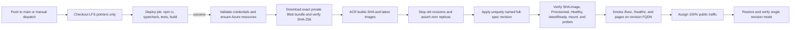

# Deployment

Twilio Games deploys Voice Racer, Voice Monsters, Voice Fighter, and Voice Karaoke to one Azure Container App. The Node process serves the built browser clients, APIs, static assets, Twilio webhooks, game WebSockets, and Karaoke Media Streams.

For project setup and local development, see the [README](../README.md). For the one-time Azure and GitHub setup, see [Infrastructure setup](./INFRA_SETUP.md).

## Deployment flow


```mermaid
flowchart LR
  Push[Push to main or manual dispatch] --> Checkout[Checkout LFS pointers only]
  Checkout --> Validate[Deploy job: npm ci, typecheck, tests, build]
  Validate -->|success| Infra[Validate credentials and ensure Azure resources]
  Infra --> Assets[Download exact private Blob bundle and verify SHA-256]
  Assets --> Build[ACR builds SHA and latest images]
  Build --> Stop[Stop old revisions and assert zero replicas]
  Stop --> Deploy[Apply uniquely named full-spec revision]
  Deploy --> Verify[Verify SHA image, Provisioned, Healthy, latestReady, mount, and probes]
  Verify --> Smoke[Smoke /livez, /healthz, and pages on revision FQDN]
  Smoke --> Cutover[Assign 100% public traffic]
  Cutover --> Commit[Restore and verify single revision mode]
```

`.github/workflows/deploy.yml` runs on pushes to `main` and manual `workflow_dispatch` events. Deployments are serialized and are not canceled in progress. There is no GitHub environment approval gate. A push triggers CI and deployment independently; deployment reaches Azure only after its own validation steps succeed.

1. `deploy.yml` validates independently. It does not call `.github/workflows/ci.yml`, even though the separate CI workflow runs equivalent checks for pushes and pull requests.
2. The deploy job checks out Git LFS pointers without downloading their binaries, installs Node 22.13 with `actions/setup-node@v6`, runs `npm ci`, `npm run typecheck`, `npm test`, and `npm run build`, validates production credentials, then signs in with `azure/login@v3` using `AZURE_CREDENTIALS`.
3. Unlike `ci.yml`, `deploy.yml` does not run `npm audit`. The CI workflow runs the high-severity audit as informational with `|| true`.
4. Azure CLI commands create missing resource group, Basic ACR, Standard LRS storage account, private Fighter asset Blob container, 5 GiB Azure Files share, Log Analytics workspace, Container Apps environment, and environment storage attachment. Existing resource properties and tags are not generally reconciled.
5. Before ACR build, the workflow derives an immutable bundle ID from every committed LFS path, size, and SHA-256, downloads only that prefix from the private `fighter-build-assets` container, and verifies every hydrated byte against the committed pointers. Missing, stale, corrupt, or unresolved assets stop deployment before an image is built.
6. `az acr build` builds remotely and pushes `twilio-games:<commit-sha>` plus the mutable `twilio-games:latest`. These are image tags, not Azure resource tags, and ACR does not enforce their immutability.
7. A new ACR is created with its admin account enabled. An existing ACR must already expose admin credentials. The workflow reads the admin username/password, masks the password, and stores it as the application-scoped `acr-password` secret.
8. The workflow renders `.github/containerapp.yaml` with a unique `sha-<short-sha>-r<run-id>-a<attempt>` revision suffix. An existing app may be in `Single` or `Multiple` mode, but it must have exactly one active revision. The workflow switches to `Multiple` when needed, pins traffic to the old revision, deactivates it, and waits for zero replicas before updating. It also accepts a stopped, zero-running-replica first-deployment retry; every other topology fails closed.
9. A first deployment creates the minimal Azure-resource-tagged app required by tenant policy with external ingress and `minReplicas=0`, records its temporary revision, immediately switches to Multiple mode, deactivates it, and waits for zero replicas before setting secrets or applying the full specification. Because external ingress exists before deactivation, do not treat the temporary shell as a traffic-isolation boundary.
10. Before committing the rollout, the workflow requires the exact uniquely named revision to use `twilio-games:<commit-sha>`, be active with one replica, be `Provisioned` and `Healthy`, equal `latestReadyRevisionName`, include the `appdata` Azure Files mount, and include all three health probes. It also asserts that no other revision has a running replica.
11. Before public cutover, the candidate revision FQDN must return HTTP 200 for `/livez`, `/healthz`, `/`, `/instructions`, `/join`, `/player`, `/karaoke.html`, and `/analytics`, plus the expected HTTP 302 authentication redirect for `/operator`. The route set is retried for up to five minutes. The workflow then assigns 100% public traffic and requires exact `Single` mode around the verified revision.
12. Before the candidate can produce external or public durable side effects, a failed rollout may stop it, restore the byte-verified pre-rollout Azure Files snapshot, reactivate the prior revision, pin 100% traffic to it, and deliberately leave recovery in `Multiple` mode. If outbound delivery is enabled, restore becomes unsafe before the candidate update because its worker may call Twilio immediately. Once restore is unsafe, automatic rollback is disabled and the workflow leaves data and revision state intact for manual recovery rather than erasing accepted registrations/webhooks or duplicating messages. A failed first deployment has no prior revision to restore and remains stopped.

The Container App specification uses process-only `/livez` for Azure startup, readiness, and liveness probes. The workflow separately calls dependency-aware `/healthz` on the candidate revision before public cutover.

The deployment does not perform a writable persistent-store smoke. The current public write APIs change real editor, Arcade, or messaging state, and there is no existing authenticated, idempotent endpoint for a disposable write-and-delete check. Using one of those mutations as a probe would be less safe than omitting the check.

Container App secrets are application-scoped, not revision-scoped. A revision rollback does not restore previous Twilio, Google, editor, signing, display, Relay, OpenAI, Deepgram, or Dub secret values. Rotate secrets in a separate controlled change, retain the prior values securely, and restore them explicitly before reactivating an older revision when a credential change caused the failure.

## Image and process model

The `Dockerfile` uses `node:22-bookworm-slim`, installs `ca-certificates` and `tini`, and runs `npm ci --include=dev`. Development dependencies remain necessary in the production image because Vite and TypeScript build the client and `tsx` runs the TypeScript server directly. Node 22.13 or later is required by `twilio-agent-connect`.

`npm run build` typechecks the server and client and writes the Vite multi-page build to `client/dist`. `tini` runs as PID 1. `scripts/start.sh` prepares persistent storage and executes:

```bash
npx tsx server/index.ts
```

The process listens on `PORT`, which is `8080` in the image and Container App. Ingress is external, targets port 8080, and uses `transport: auto` for HTTP and WebSocket upgrades. The deployed container requests 2 vCPU and 4 GiB memory.

The app must remain at exactly one replica. Racer, battle, Fighter, host, and SMS session state is in memory, and the WebSockets are process-local. `.github/containerapp.yaml` sets both `minReplicas` and `maxReplicas` to `1`. Scaling out requires shared room/session state and cross-replica messaging.

## Runtime asset mirror

Fighter map GLBs under `assets/fighters/maps/*.glb` and Fighter source FBX files under `assets/fighters/source/*.fbx` remain Git LFS objects for source provenance. GitHub Actions deliberately checks out only their small pointer files, so CI and deployment do not consume GitHub LFS bandwidth.

Production binaries live in the private `fighter-build-assets` Blob container in `twiliogamesdata`. `npm run sync:fighter-assets` verifies the local files against committed LFS pointers, derives a content-addressed bundle ID, copies only tracked objects into an exact staging tree, and uploads a new prefix without overwrite. It then downloads the prefix to a temporary directory, rejects missing or extra files, and verifies every hash again. Run it after committing any Fighter FBX or map GLB change and before pushing the deployment commit:

```bash
npm run verify:fighter-assets
npm run sync:fighter-assets
```

The sync command requires an authenticated Azure CLI identity that can list the storage account keys. Interrupted uploads are resumable because sync uploads only missing exact paths and never overwrites an existing object. If verification identifies a corrupt existing object, delete that bundle prefix explicitly and rerun sync. Old bundle prefixes are inert and may be removed after no branch or pending deployment references their pointer set.

Before a local Docker build from a fresh clone, install Git LFS and materialize the objects:

```bash
git lfs install
git lfs pull
docker build -t twilio-games .
```

The Docker context excludes `data`, local raw/quarantined asset directories, local environment files, and development output. Runtime models, maps, Fighter animations, bundled previews, audio, fonts, and the built client ship in the image under `/app/assets` and `/app/client/dist`. A new image is required to update them.

## Persistence

The Container Apps environment exposes the Azure Files share as `appdata`; the container mounts it read-write at `/app/appdata`. `DATA_MOUNT=/app/appdata` causes `scripts/start.sh` to create `/app/appdata/data` and replace `/app/data` with a symlink to that directory.

These default paths persist:

| Path | Contents | Initialization |
|---|---|---|
| `data/leaderboard.json` | Racer leaderboard | Created on the first completed race |
| `data/karaoke-leaderboard.json` | Per-song Voice Karaoke leaderboard | Created on the first completed Karaoke performance |
| `data/analytics.json` | Anonymous daily activation rollups for all games | Created when the first match or accepted voice command is recorded; the 730-day age cutoff can retain 731 inclusive UTC date buckets |
| `data/maps.json` | Live Racer level catalog | Seeded from `assets/maps/maps.json` when missing, blank, or corrupt; a valid live file is not overwritten |
| `data/arena.json` | Live Voice Monsters arena configuration | Read from the bundled `assets/arena/arena.json` fallback until the editor first saves a live copy |
| `data/fighter-maps.json` | Live Fighter map catalog | Seeded from `assets/fighters/maps/maps.json` when the live catalog cannot be parsed |
| `data/fighter-previews/*.png` | Fighter map previews captured in the editor | Created by editor uploads |
| `data/karaoke-venue.json` | Live Voice Karaoke stage and camera configuration | Seeded from `assets/karaoke/venue.json` when missing, blank, or corrupt |
| `data/karaoke-timings.json` | Sparse per-word Karaoke timing overrides | Created by authenticated timing-editor saves; compiled chart timings remain the fallback |
| `data/arcade-config.json` | Current versioned Arcade runtime configuration | Defaults to mode `off`; created on the first admin update |
| `data/arcade-config-audit.jsonl` | Hash-chained Arcade configuration audit | Appended on every admin update |
| `data/arcade-state.json` | Arcade players, leads, wallets, station state, messaging identities, and the outbound notification outbox | Opened when Arcade is enabled and for mode-off webhook replay/status cleanup |

`assets/manifest.json` is not persistent. Garage writes modify the running container's image layer and are lost on restart or redeploy unless the resulting manifest is copied back into the repository and included in a new image. Bundled GLB, FBX, audio, and preview files are also image-owned rather than Azure Files content.

If `DATA_MOUNT` is absent or is not a directory, the server still runs, but all `data/` writes use ephemeral container storage.

## Runtime configuration

The deployed specification currently sets these variables:

| Variable | Current source | Runtime behavior |
|---|---|---|
| `PORT` | Literal `8080` | HTTP and WebSocket listener |
| `NODE_ENV` | Literal `production` | Production mode and fail-closed credential checks |
| `PUBLIC_BASE_URL` | Resolved Container App FQDN | Absolute Twilio callback URLs and the Conversation Relay `wss://` URL |
| `DATA_MOUNT` | Literal `/app/appdata` | Persistent mount used by `scripts/start.sh` |
| `TWILIO_AUTH_TOKEN` | Container App secret `twilio-token` | Enables fail-closed Twilio webhook signature validation |
| `VOICE_RELAY_TOKEN` | Container App secret `voice-relay-token` | Dedicated Conversation Relay setup-frame bearer token; production validation rejects reuse of `TWILIO_AUTH_TOKEN` |
| `TWILIO_ACCOUNT_SID`, `TWILIO_API_KEY`, `TWILIO_API_SECRET` | Container App secrets populated from matching GitHub secrets | Primary SMS/WhatsApp account credentials for TAC, Conversation Memory, and Messaging REST calls |
| `TWILIO_PT_AUTH_TOKEN` | Container App secret `twilio-pt-token` | Validates incoming Voice and session-ended callbacks from the separate Portuguese Voice account |
| `TWILIO_PHONE_NUMBER`, `TWILIO_SMS_NUMBER` | GitHub `TWILIO_SMS_NUMBER` variable | SMS-capable sender for joining and outbound notices; never falls back to a voice-only number |
| `TWILIO_CONVERSATION_CONFIGURATION_ID` | Matching GitHub repository variable | Active Conversation Orchestrator configuration linked to the Memory store; TAC enriches messaging identities while the signed `/sms` webhook owns commands and replies |
| `ARCADE_TAC_ENABLED` | Literal `true` | Starts TAC/Orchestrator and Conversation Memory integration when event mode is active; an active-mode connection failure degrades `/healthz` |
| `EDITOR_TOKEN` | Required Container App secret `editor-token` | Requires `x-editor-token` or `?token=` on disk-writing editor and garage APIs; production fails closed when missing |
| `GOOGLE_OAUTH_CLIENT_ID` | Container App secret `google-oauth-client-id` | Identifies the Google OAuth web client used by `/analytics` and `/operator` |
| `GOOGLE_OAUTH_CLIENT_SECRET` | Container App secret `google-oauth-client-secret` | Server-side Google authorization-code exchange |
| `ANALYTICS_ADMIN_PIN` | Container App secret `analytics-admin-pin` | Alternative 6-64 character login for `/analytics` and `/operator`; five failures from one client lock that client out for 15 minutes |
| `ANALYTICS_ALLOWED_EMAIL` | GitHub repository variable | Allows one exact verified Google email in addition to `@twilio.com` accounts |
| `ARCADE_SIGNING_SECRET` | Container App secret populated from the matching GitHub secret | Root key for signed player sessions and challenge claims; ignored while station mode is `off` |
| `ARCADE_DISPLAY_TOKEN` | Container App secret populated from the matching GitHub secret | Server-held kiosk capability for station launch and display-ready acknowledgement; use at least 16 random characters |
| `ARCADE_STATE_PATH` | Literal `/app/data/arcade-state.json` | Schema-versioned player, economy, station, identity, outbox, and audit state on Azure Files |
| `ARCADE_STANDALONE_VOICE_ENABLED` | Literal `true` | Permits standalone routing to the most recently registered eligible open shared display; no display means no Relay connection and no Racer default |
| `GAME_PHONE_NUMBER` | GitHub repository variable | Legacy fallback used only when an operator has not configured locale-specific voice numbers |
| Runtime `channels.voiceNumbers` | Twilio Games operator settings | Public `en-US` and `pt-BR` voice numbers used by lobbies and call-now notices; changing one also requires reapproving the matching WhatsApp Phone CTA template and updating its Content SID |
| `TWILIO_WHATSAPP_NUMBER` | GitHub repository variable | Approved WhatsApp sender used by the localized `/join` chooser; empty hides WhatsApp |
| `TWILIO_MESSAGING_SERVICE_SID` | GitHub repository variable | Messaging Service used for approved WhatsApp Content Templates |
| `ARCADE_OUTBOUND_MESSAGING_ENABLED` | GitHub repository variable | Explicit outbound station-notification kill switch; only literal `true` enables enqueue and REST delivery |
| `TWILIO_WHATSAPP_CONTENT_SID_STATION_{ADMITTED,OVERFLOW,CALL_NOW,RESULTS,NEXT_GAME}_{EN_US,PT_BR}` | Ten GitHub repository variables | Approved localized WhatsApp templates; call-now uses a static Phone CTA inside and outside the 24-hour window, while other configured templates are selected outside it |
| `CR_TTS_VOICE` | GitHub repository variable | ElevenLabs Conversation Relay voice ID; empty uses the Relay default |
| `CR_TTS_VOICE_PT_BR` | GitHub repository variable | Optional Brazilian Portuguese ElevenLabs voice ID; empty uses Relay's `pt-BR` default |
| `DEFAULT_LOCALE` | GitHub repository variable | Fallback when the dialed number and selected display do not identify a locale; empty defaults to `en-US` |
| `OPENAI_API_KEY` | Container App secret populated from the matching GitHub secret | Enables English free-form Racer and Monsters help; missing uses deterministic behavior, and Portuguese free-form OpenAI remains disabled |
| `OPENAI_MODEL` | GitHub repository variable | OpenAI model; empty defaults to `gpt-4o-mini` |
| `DEEPGRAM_API_KEY` | Required Container App secret `deepgram-api-key` populated from the matching GitHub secret | Enables direct streaming lyric verification for Voice Karaoke; production startup and deploy validation fail closed when missing |
| `KARAOKE_CALIBRATION_OFFSET_MS` | Optional repository variable, default `0` | Applies the measured handset/carrier offset to authoritative Karaoke scoring; accepted range is `-5000..5000` ms |
| `DUB_API_KEY` | Container App secret `dub-api-key` | Enables challenge-link shortening only when `DUB_SHORT_DOMAIN` is also valid; missing preserves the original long URL |
| `DUB_FOLDER_ID` | Container App secret `dub-folder-id` | Optional folder assigned to links created by the enabled Dub shortener |
| `DUB_SHORT_DOMAIN` | GitHub repository variable | Valid custom Dub hostname paired with `DUB_API_KEY`; the workflow rejects a key/domain partial configuration |

The primary account owns the English Voice number, dedicated SMS number, optional WhatsApp sender, TAC/Orchestrator configuration, Memory store, and all REST credentials. The second account owns only the Portuguese Voice number and `TWILIO_PT_AUTH_TOKEN`. Incoming Voice, Voice WebSocket, and session-ended validation accept either configured Auth Token; after authentication, the exact dialed `To` number selects the locale. The Relay token authenticates custom setup parameters but does not turn them into signed claims; station setup revalidates them against the live call binding and persisted match.

Provision the booth display from that tab: open `https://<app-fqdn>/operator`, authenticate with Google or the admin PIN, and select **Pair this tab as the big screen**. The same-origin action installs display access in `sessionStorage` and returns the tab to `/`. Staff never need to know the display capability, and it is never placed in a URL, page, notice, or visitor QR. Repeat the action for independent browser sessions because they do not inherit the paired tab's session storage.

The server also supports `TWILIO_VALIDATE_SIGNATURES`, `VOICE_RELAY_TOKEN`, `FIGHTER_DISPLAY_TOKEN`, `MAPS_PATH`, `BUNDLED_MAPS_PATH`, `ARENA_PATH`, `BUNDLED_ARENA_PATH`, `FIGHTER_MAPS_PATH`, `BUNDLED_FIGHTER_MAPS_PATH`, `FIGHTER_PREVIEW_DIR`, `KARAOKE_VENUE_PATH`, `BUNDLED_KARAOKE_VENUE_PATH`, `KARAOKE_TIMINGS_PATH`, `KARAOKE_ASSET_DIRECTORY`, and `KARAOKE_LEADERBOARD_PATH`. See [Infrastructure setup](./INFRA_SETUP.md#configuration-gaps-and-security-notes) before relying on additional overrides in Azure.

## Public URLs

Replace `<base>` with `https://<app-fqdn>`.

| Purpose | URL |
|---|---|
| Home and game launcher | `<base>/` |
| Visitor join chooser | `<base>/join` (the shared-screen QR adds station and locale automatically) |
| Browser player page | `<base>/player` |
| Staff operator console | `<base>/operator` (Google or PIN authentication required) |
| Standalone Voice Racer shared display | `<base>/play.html?display=1&room=4821` |
| Standalone Voice Monsters shared display | `<base>/monsters.html?display=1&room=4821` |
| Standalone Voice Fighter shared display | `<base>/fighter.html?display=1&room=4821` |
| Standalone Voice Karaoke shared display | `<base>/karaoke.html?display=1&room=4821` after operator enablement |
| Voice Karaoke local keyboard acceptance | Open `http://localhost:5173/karaoke.html`, press hidden `P`, then use mouse/keyboard controls; public and production origins reject browser singers |
| Standalone Voice Racer browser player | `<base>/play.html?room=4821&name=Ada` |
| Challenge portal | `<base>/challenge/` with the signed 15-minute token in the URL fragment; messaging supplies the complete link |
| Unified editor hub | `<base>/editor` |
| Racer editor | `<base>/editor?game=racer` |
| Monsters arena editor | `<base>/editor?game=battler` |
| Fighter map editor | `<base>/editor?game=fighter` |
| Racer garage and manifest editor | `<base>/garage` |
| Private activation analytics | `<base>/analytics` |
| Process liveness | `<base>/livez` |
| Health check | `<base>/healthz` |
| Voice webhook | `<base>/voice/incoming` using HTTP POST |
| Legacy voice join alias | `<base>/voice/join` using HTTP POST |
| Voice session-ended callback | `<base>/voice/session-ended` using HTTP POST |
| SMS webhook | `<base>/sms` using HTTP POST |
| Conversation Orchestrator callback | `<base>/tac/webhook` using signed HTTP POST |
| Messaging delivery callback | `<base>/twilio/messaging/status` using HTTP POST; generated requests include signed outbox/attempt query IDs |

Room `4821` belongs only to standalone play. Station launches use the selected game's route with a generated 12-character room code, match ID, and launch generation from the authenticated display projection; operators should not construct station launch URLs manually.

The Fighter browser page is `/fighter.html`; `/fighter` is the Fighter WebSocket upgrade endpoint and is not an HTTP page. Voice Karaoke follows the same split with `/karaoke.html` and `/karaoke`. Browser URLs do not accept `hostToken` or display credentials. Station launches inherit the booth access installed from `/operator`; `FIGHTER_DISPLAY_TOKEN` remains only a server-side override for custom standalone integrations.

WebSocket endpoints are `/game`, `/battle`, `/fighter`, `/karaoke`, `/karaoke-media`, and `/voice`. `/karaoke-media` accepts only signed, query-free Twilio upgrades and one-use call-bound attempt tokens. The same Node server also serves `/api/*`, `/assets/*`, `/fighter-previews/*`, `/brand/*`, and `/fonts/*`.

### Karaoke lyric verification and privacy

Voice Karaoke scores caller input as exactly 50% timing, 30% recognized lyrics, and 20% pitch. Voice activity gates acoustic credit; matching lyric confidence smoothly increases timing and pitch credit but missing singing ASR no longer turns an otherwise timed word into an automatic miss. Pitch is octave-invariant so different vocal ranges are scored against the same melodic contour. Silence scores zero and weights are never renormalized. Karaoke is enabled in the default Arcade configuration, and production fails closed without its required lyric provider.

When `DEEPGRAM_API_KEY` is configured, the server opens a direct Deepgram streaming WebSocket for each authenticated Karaoke Media Stream and supplies a bounded set of chart keyterms. It sends only live inbound caller mu-law audio at 8 kHz. The browser backing track, instrumental URL, and any outbound audio are never sent. Audio and recognized provider words remain bounded in process memory; the application does not log or persist raw audio or recognized transcripts. Deepgram source timestamps and confidences are reduced to per-chart-word scalar scoring evidence. At Twilio stop, the server asks Deepgram to finalize and waits at most about 2.5 seconds; timeout or provider failure rejects the score instead of accepting interim evidence.

Deepgram is a third-party audio processor. Before operating Karaoke, confirm participant notice/consent, the Deepgram account's region, retention and model-improvement settings, contractual data-processing terms, and applicable voice/biometric and child-privacy requirements. Application non-persistence does not control Deepgram's own service-side handling. The deployment and production startup fail closed without the configured key.

Outbound station notices use a schema-versioned transactional outbox in `arcade-state.json`. The single-replica worker persists an attempt before calling Twilio, makes at most five total delivery attempts with bounded transient backoff, expires stale notices, and retains terminal delivery records for 30 days. Before every attempt it revalidates admitted, overflow, call-now, results, and next-game notices against current station state so leave, reset, launch failure, promotion, and completion transitions cannot send obsolete instructions.

WhatsApp free-form delivery is limited to 24 hours after the last inbound message with a five-minute safety margin. Outside that safe window, the notice requires its approved Content SID. Call-now uses three explicit states: a configured approved SID sends the localized Phone CTA template inside or outside the window; a missing SID inside the window sends the free-form locale Voice number and Phone-app instruction; a missing SID outside the window suppresses the notice with `WHATSAPP_TEMPLATE_REQUIRED`. A Voice-number or locale change also suppresses a pending stale call-now notice.

Results always supply template variable `{{1}}` for the localized game name and supply `{{2}}` only when paid-mode balance inclusion emits a balance. One Content SID serves all result configurations, so `{{1}}`-only is the safe general template contract; making `{{2}}` mandatory breaks free-play or balance-off sends. Challenge-bearing result notices deliberately set no Content SID because the conditional challenge prompt does not fit that approved template contract. They send to WhatsApp only as in-window free-form content and suppress outside the window. `CHALLENGE_REWARD` notices have the same out-of-window limitation.

The operator console distinguishes inbound SMS/WhatsApp onboarding from proactive notifications and reports the effective outbound state, worker error, status counts, storage capacity, cleanup eligibility, and recent failures from `/api/admin/arcade/status`. Signed inbound messages are limited per address and across the single process before a new messaging identity can be created; durable provider-SID replays are resolved before those limits. New identities stop at a guarded count/file watermark rather than reaching the state-store hard maximum.

Inactive anonymous messaging players and incomplete drafts become cleanup candidates after 30 days. Each inbound transaction prunes at most 100 oldest candidates. Cleanup is fail-closed: it retains completed lead profiles, CRM/conversation profiles, marketing consent, any wallet balance or economic history, queue or station history, ready/match state, non-messaging idempotency dependencies, and outbound notifications. Inbound receipts tied only to a deleted anonymous identity are deleted with it. Effective outbound delivery requires the literal kill switch, valid REST credentials, an enabled runtime channel, and its configured sender; mode `off` or a false kill switch enqueue and send nothing. An operator can explicitly retry a still-current `FAILED`/undelivered notice only while it is unexpired and has an attempt remaining. Retry requests require same-origin POST, a reason, and an idempotency key; the transition and actor/reason are committed atomically to the bounded schema-v10 messaging audit. Provider-terminal failures never auto-retry, and ambiguous provider acceptance is never eligible for operator retry.

### Arcade State Schema V10

Schema v9 gave each outbound call-now notice a dedicated `callNumber`. Schema v10 extends validated station assignments and round choices to Voice Karaoke without changing stored player economics. The store supports ordered migrations through v10 and writes v10 on the next transaction after a valid load.

Older application revisions reject v10. Activate v6 configuration/v10 state writers only after the rollback release can read them, or retain the pre-rollout Azure Files snapshot for a stop-the-writer rollback. Never edit the version number by hand or restore a snapshot after the candidate may have accepted public interactions or produced Twilio side effects.

## Editor writes

`/editor` is a hub for Racer levels, the Monsters arena, Fighter maps, and Karaoke venue/timing authoring. `EDITOR_TOKEN` protects all write operations. Reads remain public. The browser accepts the token through its prompt or an initial `?token=` query and stores it in local storage.

The editor can change persistent JSON and generated Fighter previews, but it cannot upload required GLB or FBX runtime assets. Add those files to the repository, ensure LFS tracks the applicable Fighter paths, and deploy a new image.

## Actual npm scripts

| Command | Function |
|---|---|
| `npm test` | Run Vitest once |
| `npm run test:watch` | Run Vitest in watch mode |
| `npm run typecheck` | Typecheck server/shared code and the client project |
| `npm run dev:server` | Run `server/index.ts` with `tsx watch` |
| `npm run dev:client` | Run Vite with `client` as its root |
| `npm run build` | Typecheck both projects and build the Vite client |
| `npm run make-fixtures` | Run the fixture generator |
| `npm run inspect-assets` | Inspect runtime assets |
| `npm run optimize-assets` | Optimize assets |
| `npm run smoke` | Run the browser render smoke script |
| `npm run smoke:editor` | Run the editor smoke script |
| `npm run smoke:karaoke-editor` | Run the Karaoke venue/timing editor browser smoke script |

CI runs `typecheck`, `test`, and `build`; it does not run the browser smoke scripts.

## Local production-mode check

```bash
npm ci
npm run build
ARCADE_SIGNING_SECRET="$(openssl rand -hex 32)" \
EDITOR_TOKEN="$(openssl rand -hex 32)" \
DEEPGRAM_API_KEY=local-production-check \
TWILIO_VALIDATE_SIGNATURES=false \
PORT=8099 NODE_ENV=production npx tsx server/index.ts
curl --fail http://localhost:8099/healthz
```

The synthetic Deepgram value is only for startup validation. Do not place a Karaoke call during this local check.

In production, Twilio signature validation defaults on and the deployment requires `TWILIO_AUTH_TOKEN`. Outside production it defaults off unless a Twilio token is present or `TWILIO_VALIDATE_SIGNATURES=true`. Without the primary token, SMS, WhatsApp, TAC, and messaging-status webhooks fail with status 500; Voice requests can still validate with `TWILIO_PT_AUTH_TOKEN`. The deployed `ARCADE_STANDALONE_VOICE_ENABLED=true` setting permits routing to the most recently registered eligible open display; no eligible display returns unavailable TwiML and never defaults to Racer.

## Rollback

Automatic rollback is conditional, not universal:

| Failure point | Workflow behavior |
|---|---|
| Before a candidate can make external or public durable changes | Stops every non-previous revision, waits for zero replicas, restores and byte-verifies the pre-rollout Azure Files snapshot, reactivates the previous revision, pins it to 100% traffic, and leaves the app in `Multiple` mode |
| After outbound delivery may start or public traffic is admitted | Does not restore data or switch revisions automatically; leaves current data and revision state intact for manual recovery |
| First deployment with no previous revision | Stops incomplete revisions and leaves no serving revision |

A successful deployment alone restores exact `Single` mode. An automatic rollback intentionally remains in `Multiple` mode with the previous revision pinned, so the next normal deployment can inspect that unambiguous recovery topology.

For an operator-initiated rollback, first inventory every revision and verify the full expected SHA image:

```bash
az containerapp revision list \
  --name twilio-games \
  --resource-group rg-twilio-games \
  --all \
  --query '[].{name:name,image:properties.template.containers[0].image,provisioning:properties.provisioningState,health:properties.healthState,active:properties.active,replicas:properties.replicas}' \
  --output table
```

Use the same zero-overlap invariants as the workflow:

1. Confirm exactly one current writer and verify that the target revision references `twiliogames.azurecr.io/twilio-games:<full-old-commit-sha>`. A commit tag is conventional, not registry-enforced immutability.
2. Verify schema and secret compatibility. Container App secrets are application-scoped, so reactivating an old revision does not restore its former Twilio, Google, Relay, editor, signing, display, OpenAI, Deepgram, or Dub values.
3. Switch to `Multiple`, explicitly pin 100% traffic to the current revision, deactivate it, and wait until it is inactive with zero replicas. This creates a planned outage and preserves the single-writer guarantee.
4. Take and retain an Azure Files share snapshot after the current writer stops.
5. Activate only the target revision. Wait for `Provisioned`, `Healthy`, and one replica, then use its revision-specific FQDN for read-only `/livez`, `/healthz`, `/`, `/instructions`, `/join`, and `/player` checks plus the `/operator` authentication redirect check.
6. Pin 100% public traffic to the verified target and keep `Multiple` mode. Do not switch to `Single`, because Azure can select the newer revision that the rollback is replacing.
7. If target validation fails, stop it and wait for zero replicas before considering the previous writer. Restore the snapshot only when no public request, webhook, worker, or external Twilio side effect could have occurred. Otherwise retain current data and perform a compatibility-aware forward recovery.

Never run `az containerapp update --image` while a writer is active, start schema-older code against schema v10, overlap revisions on the mounted JSON stores, or restore a snapshot after accepted external activity.
