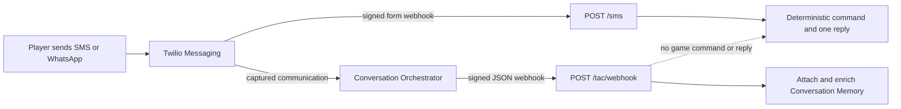

# Infrastructure Setup

This runbook covers the Azure and GitHub configuration required by `.github/workflows/deploy.yml`. For application behavior and local setup, see the [README](../README.md). For image, runtime, persistence, URLs, and rollback details, see [Deployment](./DEPLOYMENT.md).

The workflow uses service-principal JSON credentials, Azure CLI provisioning, a remote ACR build, and an Azure Container Apps YAML specification. It does not use GitHub OIDC or `azure/container-apps-deploy-action`.

## Prerequisites

- An Azure subscription and permission to create a service principal and role assignment.
- Permission to create resources in the target subscription or resource group.
- GitHub repository administrator access for Actions secrets and variables.
- Git LFS objects available to GitHub Actions. Both CI and deploy explicitly check them out.
- A primary Twilio account with an English Voice number and a separate SMS-capable number, plus a second account with the Portuguese Voice number. An approved WhatsApp sender is required for preferred Portuguese Messaging entry; lead-capture mode retains a browser fallback.
- Asset redistribution rights appropriate for the deployment. See [Asset licensing](#asset-licensing).

No local Docker installation is required for the GitHub deployment because `az acr build` runs in Azure. Azure CLI is required only for manual setup and operations.

## Resource names

The workflow currently declares:

| Resource | Name or value |
|---|---|
| Resource group | `rg-twilio-games` |
| Region | `centralus` |
| Azure Container Registry | `twiliogames` |
| Container Apps environment | `cae-twilio-games` |
| Log Analytics workspace | `law-twilio-games` |
| Container App | `twilio-games` |
| Storage account | `twiliogamesdata` |
| Azure Files share | `twiliogamesdata` |
| Environment storage attachment | `appdata` |
| Image repository | `twilio-games` |

ACR and storage account names are globally unique. Change the values in the workflow `env` block if they are unavailable. Keep `.github/containerapp.yaml`, documentation, and operational commands aligned with any name changes.

The workflow passes `created_by=github-actions` and `managed_by=twilio-games-ci` when it creates ACR, storage, Log Analytics, the Container Apps environment, and the Container App. It does not tag the resource group, file share, or environment-storage attachment, and it does not reconcile tags on existing resources. These Azure resource tags are unrelated to the container image tags. The explicit tagged Log Analytics workspace prevents the Container Apps environment from attempting to create an untagged workspace that tenant policy would deny.

## Create the deployment identity

The checked-in workflow passes one JSON secret to `azure/login@v3` through its `creds` input. Create a client-secret-based service principal:

```bash
az ad sp create-for-rbac \
  --name twilio-games-deploy \
  --role Contributor \
  --scopes /subscriptions/<subscription-id> \
  --sdk-auth
```

Store the complete JSON output as the GitHub Actions secret `AZURE_CREDENTIALS`. This is client-secret authentication, not federated OIDC. Rotate the service-principal secret according to the organization's credential policy and replace the GitHub secret before expiration.

Subscription scope permits the workflow's first run to create `rg-twilio-games`. To reduce scope, create the resource group first and assign Contributor on:

```text
/subscriptions/<subscription-id>/resourceGroups/rg-twilio-games
```

Contributor is broad but matches the workflow's resource creation and update behavior. A custom role can be used if it includes the required resource group, ACR, storage, Log Analytics, Container Apps environment, Container App, and environment-storage operations.

## Twilio account topology

This deployment intentionally uses two Twilio accounts:

| Responsibility | Primary English/messaging account | Portuguese Voice account |
|---|---|---|
| English Voice number | Yes | No |
| Dedicated SMS number | Yes | No |
| Approved WhatsApp sender | Optional | No |
| TAC and Conversation Orchestrator | Yes | No |
| Conversation Memory store | Yes | No |
| Outbound Messaging API | Yes | No |
| Portuguese Voice number | No | Yes |
| Runtime Account SID/API key | Required | Not used |
| Webhook Auth Token | `TWILIO_AUTH_TOKEN` | `TWILIO_PT_AUTH_TOKEN` |

TAC has one account context, so `TWILIO_ACCOUNT_SID`, `TWILIO_API_KEY`, `TWILIO_API_SECRET`, `TWILIO_AUTH_TOKEN`, `TWILIO_SMS_NUMBER`, any `TWILIO_WHATSAPP_NUMBER`, the Memory store, and the Conversation Configuration must all belong to the primary account. The Portuguese account supplies only its Voice number and `TWILIO_PT_AUTH_TOKEN`; it does not supply runtime REST credentials. Both Voice numbers send webhooks to the same application. Voice and session-ended requests are accepted when either account token validates the Twilio signature, then the exact dialed `To` number selects the locale. The token that validated the request does not select the locale.

## Configure GitHub Actions secrets

Open **Settings > Secrets and variables > Actions > Secrets** and configure:

| Secret | Required | Use |
|---|---|---|
| `AZURE_CREDENTIALS` | Yes | `azure/login@v3` service-principal JSON |
| `TWILIO_AUTH_TOKEN` | Yes | Primary account Auth Token; validates English Voice, SMS, WhatsApp, TAC, and Messaging callbacks |
| `TWILIO_PT_AUTH_TOKEN` | Yes | Auth Token from the separate account that owns the Portuguese Voice number |
| `TWILIO_ACCOUNT_SID` | Yes | Primary account SID for TAC, Memory, Orchestrator, and Messaging |
| `TWILIO_API_KEY` | Yes | Twilio API key SID used by TAC and server-side REST clients |
| `TWILIO_API_SECRET` | Yes | Twilio API key secret used by TAC and server-side REST clients |
| `VOICE_RELAY_TOKEN` | Yes | Independent random token of at least 32 characters for Conversation Relay setup-frame authentication; do not reuse `TWILIO_AUTH_TOKEN` |
| `ARCADE_SIGNING_SECRET` | Yes | Exactly 64 hexadecimal characters; derives separate signed player-session and challenge-token keys |
| `ARCADE_DISPLAY_TOKEN` | Yes | Random server-held kiosk capability of at least 16 characters; required for display-ready and station game controls |
| `EDITOR_TOKEN` | Strongly recommended for public deployments | Stored as Container App secret `editor-token`; protects disk-writing editor and garage APIs |
| `GOOGLE_OAUTH_CLIENT_ID` | Required for analytics | Stored as Container App secret `google-oauth-client-id`; Google OAuth web client ID |
| `GOOGLE_OAUTH_CLIENT_SECRET` | Required for analytics | Stored as Container App secret `google-oauth-client-secret`; Google OAuth web client secret |
| `OPENAI_API_KEY` | No | Enables English free-form Racer and Monsters help; empty uses deterministic behavior, and Portuguese free-form OpenAI remains disabled |
| `DUB_API_KEY` | No | Enables shortening of eligible challenge portal URLs when paired with `DUB_SHORT_DOMAIN`; empty preserves the original application URL |
| `DUB_FOLDER_ID` | No | Optional Dub folder for created challenge links; it has no effect without an enabled Dub shortener |

Credential sources:

| Value | Where to obtain it |
|---|---|
| Primary Account SID and Auth Token | Primary Twilio Console: **Develop > API Key & creds > Auth Tokens** |
| `TWILIO_PT_AUTH_TOKEN` | Portuguese account Console: **Develop > API Key & creds > Auth Tokens** |
| API Key SID and Secret | Primary account Console: **Develop > API Key & creds > API Keys > Create API Key**. Create a Standard key and save the secret when shown; it cannot be displayed again. |
| `VOICE_RELAY_TOKEN` | Generate it yourself. It is an application secret, not a Twilio credential: `openssl rand -hex 32`. |
| Arcade signing secret | Generate separately with `openssl rand -hex 32`. |
| Display/editor tokens | Generate separate random values, for example `openssl rand -base64 32`. |

`VOICE_RELAY_TOKEN` protects the public `/voice` WebSocket. The server embeds it in Conversation Relay custom parameters in its TwiML and validates the subsequent setup frame. You do not paste it into Twilio Console and must not reuse either account Auth Token.

The workflow validates webhook authentication, TAC credentials, the dedicated Relay token, both Arcade secrets, and the Dub key/domain pairing before touching Azure. Missing OpenAI and Dub secrets use the placeholder `disabled`, which the server treats as unset.

An empty primary or Portuguese Auth Token makes the corresponding production webhooks fail closed. An empty `EDITOR_TOKEN` leaves editor and garage writes open. Missing Google OAuth credentials disable analytics sign-in.

## Configure GitHub Actions variables

Open **Settings > Secrets and variables > Actions > Variables** and configure as needed:

| Variable | Required | Use |
|---|---|---|
| `GAME_PHONE_NUMBER` | No | Legacy voice-number fallback until both locale numbers are saved in the operator console |
| `TWILIO_SMS_NUMBER` | Yes | E.164 SMS-capable Twilio number registered with TAC; intentionally separate from the US and Brazilian voice numbers |
| `TWILIO_WHATSAPP_NUMBER` | Required to offer WhatsApp | Approved WhatsApp sender; omit the `whatsapp:` prefix or include it, both are accepted |
| `TWILIO_MESSAGING_SERVICE_SID` | Required for WhatsApp Phone CTA and out-of-session notices | Messaging Service SID containing the approved WhatsApp sender |
| `ARCADE_OUTBOUND_MESSAGING_ENABLED` | No | Set to literal `true` only after REST credentials, senders, callbacks, and templates are ready; defaults off. The operator console reports whether proactive delivery is effectively enabled separately from inbound onboarding. |
| `TWILIO_WHATSAPP_CONTENT_SID_STATION_{ADMITTED,OVERFLOW,CALL_NOW,RESULTS,NEXT_GAME}_{EN_US,PT_BR}` | Call-now required for Phone CTA; others required out of session | Ten approved Content SIDs covering five station notice kinds in English and Brazilian Portuguese |
| `CR_TTS_VOICE` | No | ElevenLabs voice ID for Conversation Relay TTS; empty uses the Relay default |
| `CR_TTS_VOICE_PT_BR` | No | Optional Brazilian Portuguese ElevenLabs voice ID; empty uses Relay's `pt-BR` default |
| `DEFAULT_LOCALE` | No | Fallback when the dialed number and selected display do not identify a locale; defaults to `en-US` |
| `OPENAI_MODEL` | No | OpenAI model name; empty defaults to `gpt-4o-mini` |
| `ANALYTICS_ALLOWED_EMAIL` | No | One exact verified Google email allowed to view analytics in addition to `@twilio.com` accounts |
| `TWILIO_CONVERSATION_CONFIGURATION_ID` | Yes | Active Conversation Orchestrator configuration ID matching `conv_configuration_<26 lowercase letters or digits>` and linked to the Memory store |
| `DUB_SHORT_DOMAIN` | No | Custom Dub hostname such as `go.example.com`; must be configured together with `DUB_API_KEY` |

These values are rendered into the Container App specification on every deployment.

Set secrets interactively so they do not appear in shell history:

```bash
gh secret set TWILIO_AUTH_TOKEN
gh secret set TWILIO_PT_AUTH_TOKEN
gh secret set TWILIO_ACCOUNT_SID
gh secret set TWILIO_API_KEY
gh secret set TWILIO_API_SECRET
openssl rand -hex 32 | gh secret set VOICE_RELAY_TOKEN
```

Set the non-secret IDs and senders after provisioning them:

```bash
gh variable set TWILIO_SMS_NUMBER --body '+1...'
gh variable set TWILIO_WHATSAPP_NUMBER --body '+1...'
gh variable set TWILIO_CONVERSATION_CONFIGURATION_ID --body 'conv_configuration_...'
gh variable set DUB_SHORT_DOMAIN --body 'go.example.com'
```

When `DUB_API_KEY` and a valid `DUB_SHORT_DOMAIN` are present, the server shortens only HTTPS application URLs whose path is `/challenge/` and whose one-time token remains in the URL fragment. It creates non-indexed, non-conversion links and optionally assigns `DUB_FOLDER_ID`. A timeout, API error, collision that cannot be reconciled, or malformed Dub response fails closed to the original long challenge URL; it does not block the player reply.

Create a Google OAuth 2.0 web client with `https://<app-fqdn>/auth/google/callback` as an authorized redirect URI. If `ANALYTICS_ALLOWED_EMAIL` belongs to an account outside Twilio Workspace, the OAuth application audience must permit external users. See [Analytics setup](./analytics.md).

### First-deployment Orchestrator bootstrap

The production workflow validates `TWILIO_CONVERSATION_CONFIGURATION_ID` before Azure creates the app FQDN. For the first deployment, create the Memory store and Conversation Orchestrator configuration in the primary account first, but leave its final HTTPS callback unset (or point it at a controlled temporary endpoint). Store the configuration ID in GitHub, deploy the app to obtain its FQDN, then set the signed callback to `POST https://<app-fqdn>/tac/webhook`. Keep runtime mode `off` until the callback and Memory profile convergence are tested. Later deployments reuse the stable FQDN.

## First deployment

Push to `main`, or run **Actions > Deploy to Azure Container Apps > Run workflow**. `deploy.yml` performs its own checkout, Node setup, dependency install, typecheck, tests, and build in the deployment job. It does not call the reusable `ci.yml` workflow, although the separate CI workflow runs the same application checks on pushes and pull requests.

Each deployment run performs these operations:

1. Checks out repository and Git LFS content, installs Node and dependencies, and runs typecheck, tests, and the client build.
2. Validates production Twilio, Arcade, Relay, Orchestrator, SMS, and Dub configuration before Azure login.
3. Signs in to Azure with `AZURE_CREDENTIALS` and creates or verifies the resource group, ACR, storage account, file share, Log Analytics workspace, Container Apps environment, and `appdata` environment storage.
4. Builds and pushes the commit-SHA image tag and the mutable `latest` tag in ACR.
5. Reads the ACR admin username/password and stores the password as the Container App secret `acr-password`. The workflow enables the admin account only when it creates ACR; an existing registry must already have `adminUserEnabled=true` or the credential step fails.
6. Accepts an existing app in `Single` or `Multiple` mode only when exactly one revision is active, switches to `Multiple` when needed, pins traffic to that revision, deactivates it, and waits for zero replicas. It also accepts a stopped, zero-running-replica first-deployment retry. Any other revision topology fails closed. On first create, it creates an Azure-resource-tagged zero-replica shell, then stops its temporary revision.
7. Applies `.github/containerapp.yaml` as a uniquely named full-spec revision, including the Azure Files mount, one-replica limit, 2 vCPU, 4 GiB memory, health probes, secrets, and complete runtime environment.
8. Requires the exact SHA image revision to be `Provisioned`, `Healthy`, and latest-ready with the expected mount and `/livez` probes; asserts it is the only running revision; then checks `/livez`, dependency-aware `/healthz`, `/`, `/instructions`, `/join`, `/player`, and `/operator` through the candidate revision FQDN before public cutover.
9. Assigns public traffic, then requires exact `Single` revision mode around the verified revision. Automatic snapshot restore is allowed only before the candidate can produce external or public durable side effects. If outbound delivery is enabled, restore becomes unsafe before the candidate update because its worker can call Twilio as soon as the revision starts. Once restore is unsafe, a failure leaves current data and revision state intact for manual recovery rather than erasing accepted interactions.

The workflow is create-if-missing for supporting infrastructure, not a full declarative reconciliation system. For example, it does not change an existing storage SKU, share quota, region, resource tags, ACR admin setting, or Log Analytics configuration to match the checked-in defaults.

## Configure Twilio, Orchestrator, and Memory

After deployment, let `<base>` be the printed `https://<fqdn>` value.

Configure both accounts' incoming Voice webhooks:

```text
POST <base>/voice/incoming
```

In the primary account, configure the English Voice number. In the Portuguese account, configure the Brazilian Voice number. Both use the same URL and `POST`. The application accepts the request when either configured Voice account token validates the signature; it does not bind one token to one locale. In the Twilio Games operator console, save the primary-account number under **English voice number** and the second-account number under **Portuguese voice number**. The exact dialed `To` number selects the locale, so the two configured values must be distinct.

Create and configure the Twilio resources in this order:

1. Sign in to the primary account in Twilio Console.
2. Go to **Products & services > Conversation Orchestrator > Conversation configurations**.
3. Click **Create a Conversation configuration**, enter a name and description, and configure automatic capture for the primary SMS number and approved WhatsApp sender. Do not add the Portuguese number because it belongs to another account and TAC does not own Voice gameplay here.
4. Choose the Basic lifecycle and set channel inactive/closed timeouts suitable for the event.
5. On **Enable Conversation Memory**, create and select a Memory store. Use a promoted phone identifier such as `Contact.phone` so SMS and WhatsApp can converge on one profile.
6. Finish the configuration and copy the ID beginning with `conv_configuration_`. Set it as the GitHub variable `TWILIO_CONVERSATION_CONFIGURATION_ID`.
7. Edit the configuration webhook and set `POST <base>/tac/webhook`.
8. Confirm the primary SMS number and WhatsApp sender have both inbound and outbound capture rules (`number -> *` and `* -> number`).

Official references: [TAC quickstart](https://www.twilio.com/docs/conversations/agent-connect/quickstart) and [Conversation Orchestrator quickstart](https://www.twilio.com/docs/conversations/orchestrator/quickstart). The optional TAC Python setup wizard can create the Memory store and Conversation Configuration automatically; run `make setup` from the [TAC Python repository](https://github.com/twilio/twilio-agent-connect-python).

Keep the Twilio phone number's direct incoming Messaging webhook as the fail-safe endpoint:

```text
POST <base>/sms
```

Configure the approved WhatsApp sender's incoming-message webhook with the same `POST <base>/sms` URL. The signed direct `/sms` route owns deterministic game commands and immediate replies for both SMS and WhatsApp, so player entry still works if an Orchestrator callback is delayed or unavailable. Conversation Orchestrator delivers captured communications to `/tac/webhook` for Conversation Memory profile enrichment only; it does not execute the game command or send a second reply. Keep the sender in the same Orchestrator capture configuration, open the generated join link, and verify that the prefilled `JOIN` command creates one Conversation, one Memory profile, and one deterministic reply.

The visitor entry policy is locale-specific. English (`en-US`) may use configured SMS or WhatsApp entry. Brazilian Portuguese (`pt-BR`) uses WhatsApp instead of SMS: `/join` hides SMS, station displays prefer WhatsApp, and the signed `/sms` route rejects Portuguese SMS attempts with localized guidance. In lead-capture mode, both locales also receive a visually secondary browser fallback. Keep the primary SMS sender enabled for English even though it is not offered for Portuguese entry.



The voice webhook returns TwiML that connects Conversation Relay to `wss://<fqdn>/voice` and sets `POST <base>/voice/session-ended` as the session-ended callback. `PUBLIC_BASE_URL` is populated from the Container App FQDN, so these derived URLs do not require separate configuration.

In station mode, the server routes each call by its persisted admitted identity, match, room, and launch generation. Recent-display routing remains only the standalone fallback. Current launch URLs are listed in [Deployment](./DEPLOYMENT.md#public-urls).

Carrier registration requirements, including A2P 10DLC or toll-free verification, may apply to outbound US messaging. Confirm the Twilio number and campaign configuration before an event.

Approved WhatsApp Content Templates must match the application variables: admitted uses `{{1}}` for game, overflow uses `{{1}}` for position, call-now uses `{{1}}` for game, results always sends `{{1}}` for game and sends `{{2}}` only when paid-mode balance inclusion is enabled, and next-game uses no variables. Configure both `EN_US` and `PT_BR` Content SIDs before relying on out-of-session delivery. Because one results Content SID serves free play, paid play, and balance-on/off configurations, do not make `{{2}}` mandatory unless operations guarantee that every use emits it; the safest general results template uses only `{{1}}`.

Create each call-now template as `twilio/call-to-action` with one **Phone** action, not a WhatsApp **Voice Call** action. The Phone action must contain the static E.164 Voice number for that locale; WhatsApp does not allow variables in Phone actions. Use button text **Call with phone app** for `EN_US` and **Ligar pelo telefone** for `PT_BR`. Both labels stay within WhatsApp's 20-character button limit. Suggested bodies are:

```text
EN_US: GAME TIME! Tap "Call with phone app" below and stay on the line. Your voice will control {{1}} on the display.
PT_BR: HORA DE JOGAR! Toque em "Ligar pelo telefone" abaixo e permaneça na linha. Sua voz controlará {{1}} na tela principal.
```

Set each Phone action to the corresponding operator-configured `channels.voiceNumbers` value, submit both templates for WhatsApp approval, and assign their SIDs to `TWILIO_WHATSAPP_CONTENT_SID_STATION_CALL_NOW_EN_US` and `TWILIO_WHATSAPP_CONTENT_SID_STATION_CALL_NOW_PT_BR`. The application selects the SID by the player's locale. Call-now delivery has three states:

| Template and session state | Behavior |
|---|---|
| Matching approved Content SID configured | Sends the Phone CTA template both inside and outside the 24-hour window, so the native dialer button is present |
| Content SID missing, still inside the 24-hour window minus the five-minute margin | Sends a free-form fallback containing the locale Voice number and instructing the player to use the Phone app |
| Content SID missing, outside that safe window | Suppresses the notice with `WHATSAPP_TEMPLATE_REQUIRED`; it never sends an unapproved free-form message |

If either Voice number changes, create or update and reapprove the matching template before changing the operator setting. Pending call-now notices are revalidated against the current locale number and suppress themselves when the route changed.

Challenge-bearing results deliberately have no results Content SID because the current approved results template contract cannot represent the conditional challenge prompt safely. They can send as free-form WhatsApp only inside the safe 24-hour window and are suppressed outside it. `CHALLENGE_REWARD` notices have the same template limitation. SMS is not subject to the WhatsApp window.

## Verify the deployment

```bash
FQDN=$(az containerapp show \
  --name twilio-games \
  --resource-group rg-twilio-games \
  --query properties.configuration.ingress.fqdn \
  --output tsv)

curl --fail "https://${FQDN}/healthz"
```

Expected response shape:

```json
{"status":"ok","rooms":0}
```

`/healthz` is dependency-aware and returns 503 for repairable station/TAC/configuration degradation. ACA startup, readiness, and liveness probes call `/livez` instead, so a Twilio outage does not restart the process or hide the operator console. The deployment workflow also verifies the home, instructions, join, player, and operator pages, but it does not perform live Twilio, Memory, Azure Files write, or WebSocket gameplay tests.

There is no safe existing persistent-store write probe. Every public write endpoint changes real editor, Arcade, or messaging state, so the workflow intentionally does not call one. Do not substitute an unauthenticated or production-data mutation. A future persistent write smoke should use an authenticated, idempotent endpoint designed to create and remove a disposable probe record.

For an event readiness check, also load `/play.html`, `/monsters.html`, `/fighter.html`, and `/editor`; verify representative GLB and FBX-backed scenes; save and reload a disposable editor change; and complete a real Twilio call.

### Live acceptance checklist

Keep runtime mode `off` during provisioning. After item 1 passes, open the event from `/operator` and continue:

1. Confirm `/livez` and `/healthz` return `200` while mode is `off`.
2. After opening the event, confirm `/healthz` returns `200` again. Active mode requires TAC and Conversation Memory to be connected; a post-open `503` is a real readiness failure even when the pre-open check passed.
3. In the primary account, send `JOIN` by SMS and confirm exactly one reply, one Conversation, and one Memory profile. Send `ENTRAR` by SMS and confirm it is durably rejected with guidance to use WhatsApp or the lead-capture browser fallback; legacy `LANG` commands remain supported.
4. Send `ENTRAR` through WhatsApp and confirm it resolves to the same profile for the same phone identity.
5. In lead-capture mode, register through `/player` once in English and once in Portuguese. Confirm both players can join immediately without an OTP and that `/join` presents browser registration below the preferred Messaging actions.
6. Run a paid two-player game. During game selection, vote by SMS with `1` or `RACER`, change the vote by sending another enabled game, and confirm the browser player can vote from `/player`. Confirm the shared display shows looping previews and live totals. When gameplay starts, confirm one coin is redeemed from each admitted player and an overflow player's coin remains reserved.
7. Switch the event to free play and confirm no wallet grants, reservations, or redemptions are created.
8. Call the English number and confirm either configured Voice Auth Token can validate the request, the English `To` number selects English recognition/TTS, and the call reaches its assigned generated room.
9. Call the Portuguese number and confirm either configured Voice Auth Token can validate the request, the Portuguese `To` number selects `pt-BR`, and free-form OpenAI help remains disabled.
10. Complete Racer, Monsters, and Fighter once and confirm the operator sees authoritative results.
11. Reset an inactive test player from `/operator`. The reset must delete the linked Conversation Memory profile before local identity, wallet, messaging, and roster retirement commits; it fails closed if Memory deletion is unavailable or fails. Confirm the next `JOIN` creates a fresh profile and wallet. Never reset a connected caller or a player with an active game, coin hold, or pending outbound notice.
12. If proactive messaging is enabled, confirm SMS delivery callbacks, all three WhatsApp call-now states where practical, and one approved out-of-session template.
13. With the event paused, open `/operator` in the intended booth tab and select **Pair this tab as the big screen**. Confirm the same tab returns to `/`, display access is held only in `sessionStorage`, and no credential appears in the URL. The operator console is intentionally unauthenticated for this deployment. During a launch, verify an absent or rejected display session links to `/operator` instead of showing a secret field or a stuck countdown. Then restart the Container App and confirm persisted event recovery, wallet balances, and Memory-linked messaging still work.

## Persistent storage operations

Azure Files is mounted at `/app/appdata`; `scripts/start.sh` links `/app/data` to `/app/appdata/data`. Persistent files include activation analytics, the leaderboard, Racer maps, Monsters arena configuration after its first save, Fighter map catalog, and generated Fighter previews.

Back up the share before destructive editor work or rollback across a data-format change. The workflow creates a temporary pre-rollout share snapshot after the old writer stops. It deletes the snapshot after success and restores it automatically only while no external or public side effects can have occurred. Azure retention policies and long-lived backups remain an operator responsibility.

Do not place image-owned assets or `assets/manifest.json` on the share without changing application behavior deliberately. See [Deployment persistence](./DEPLOYMENT.md#persistence) for the exact boundary.

## Configuration gaps and security notes

`FIGHTER_DISPLAY_TOKEN` remains available as a server-side standalone override for custom integrations, but browser URLs no longer accept display credentials. The deployed server passes `ARCADE_DISPLAY_TOKEN` to Fighter, Racer, and Monsters, so station engine rooms share the kiosk capability installed through `/operator`.

`VOICE_RELAY_TOKEN` is wired as its own Container App secret and is mandatory in the deployment workflow. Rotate it independently from `TWILIO_AUTH_TOKEN`; the server places the current value in newly generated Conversation Relay setup parameters.

`OPENAI_API_KEY`, `DUB_API_KEY`, and `DUB_FOLDER_ID` are stored as Container App secrets and referenced from the container environment; their values are not rendered into the checked deployment YAML. `DUB_SHORT_DOMAIN` is a non-secret rendered value.

The workflow creates a new ACR with its admin account enabled, but it does not enable or reconcile that setting on an existing ACR. Every deployment reads an admin password and places it in the Container App as `acr-password`; existing ACR must therefore already have the admin account enabled. This uses long-lived registry credentials. A managed identity with `AcrPull` would reduce credential exposure and rotation work.

Manual `az containerapp update --set-env-vars` changes are not authoritative. A later `az containerapp update --yaml` can replace the container environment list with the checked-in specification. Persist runtime configuration by updating the workflow and `.github/containerapp.yaml`; this documentation-only runbook does not add missing secret wiring.

## Asset licensing

Git LFS checkout includes Fighter map GLBs and Fighter source FBX files in the build context and production image. `assets/CREDITS.md` states that Fighter asset source URLs, authors, and licenses are still unknown and must be verified before public redistribution. Do not treat successful LFS checkout as proof of redistribution rights.

The asset credits also identify `assets/maps/drift_race_track_free.glb` as CC-BY-ND 4.0. Distribute only an unmodified work and preserve required attribution. Review [assets/CREDITS.md](../assets/CREDITS.md) before every public or commercial deployment.

## Operational rollback

Every build pushes a commit-SHA tag and updates `latest`; ACR does not lock either tag against mutation. Use the expected full SHA when identifying a rollback image. Follow the zero-overlap procedure in [Deployment rollback](./DEPLOYMENT.md#rollback); do not run a direct image update while the old revision is active. A later normal deployment reapplies the full YAML and the current commit image. Validate persistent-file compatibility before rolling back application code.
