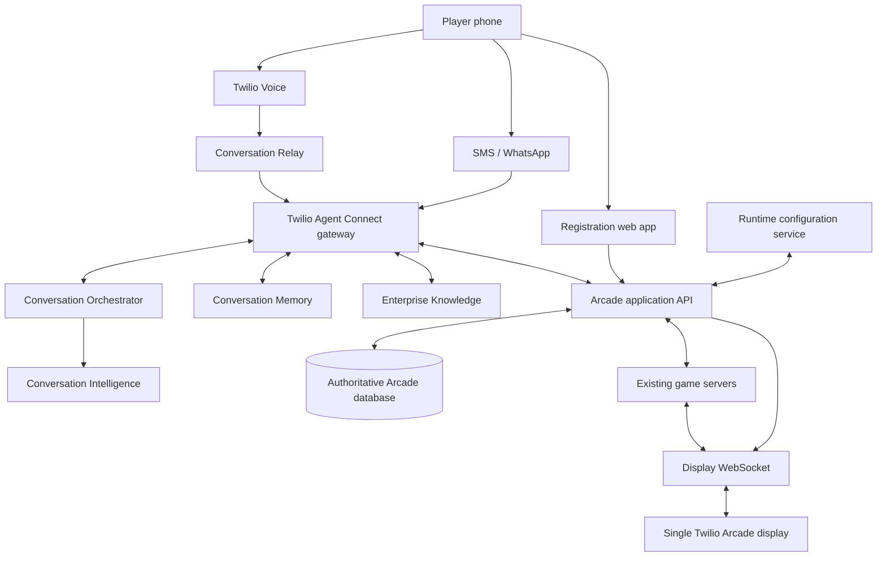
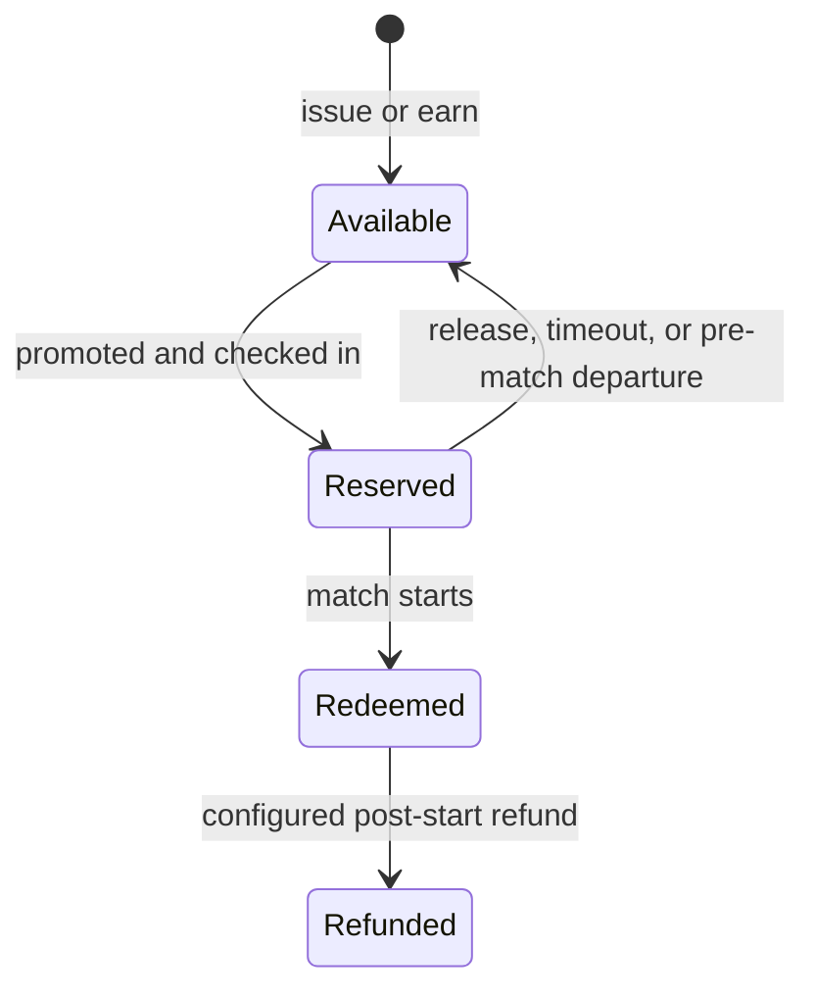
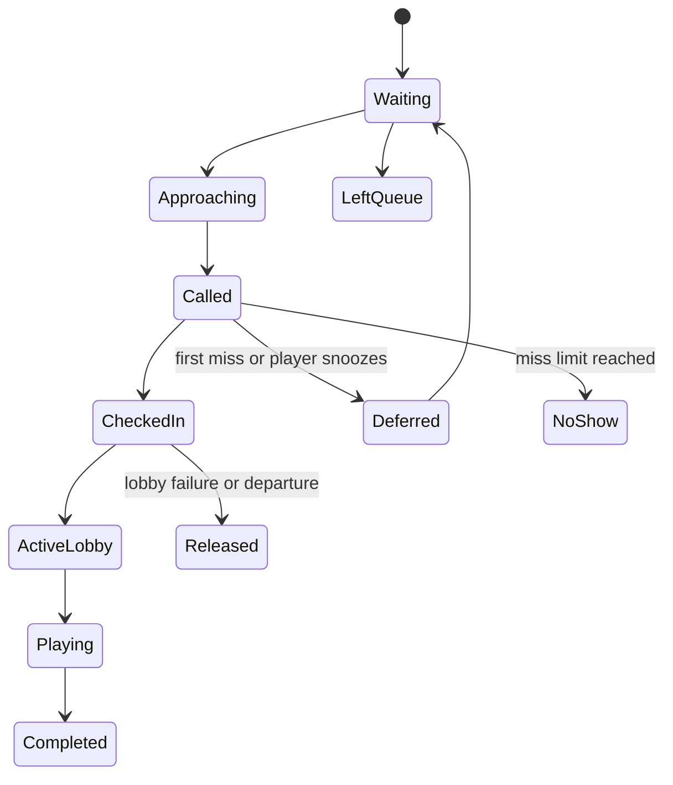

# Twilio Arcade: TAC, Lead Capture, Digital Coins, and Smart Queue Plan

**Date:** 2026-07-20
**Status:** Approved planning baseline; implementation not started
**Project:** Twilio Games, proposed rename to Twilio Arcade
**Canonical memory:** This file is the durable source of truth for the product direction agreed in
the planning session. Future sessions should read this document before designing or implementing
TAC, registration, digital coins, earning challenges, queues, post-game messaging, or Conversation
Intelligence.

## 1. Executive Summary

Twilio Games will evolve into **Twilio Arcade**, a single-display event experience that demonstrates
Twilio Agent Connect (TAC), the new Twilio Conversations layer, Conversation Relay, Messaging,
Conversation Memory, Conversation Intelligence, and application tools through a cohesive arcade
metaphor.

The intended event journey is:

1. A visitor scans a persistent QR code on the shared display.
2. Depending on runtime configuration, the visitor either enters the current call-and-play flow,
   receives coins without a lead form, or completes a required lead-capture form.
3. Lead-capture registration requires first name, last name, work email, company name, phone number,
   and a two-character country code. Work email is not verified. Job title is not collected.
4. A registered visitor receives one Arcade Coin by default.
5. The visitor joins the virtual line for the one physical arcade display.
6. When promoted, the visitor checks in and one coin is reserved.
7. The coin is redeemed only when the match actually starts.
8. Multiplayer games form waves based on each game's capacity. Standby players replace no-shows.
9. After a match, TAC sends a localized score summary, wallet balance, rematch/queue options, and
   simple one-click opportunities to earn more coins.
10. A visitor earns a coin immediately by clicking a configured tracked URL. Challenges are simple
    click-through links with configurable titles, destinations, rewards, ordering, schedules, and
    runtime enable/disable controls.
11. Conversation Intelligence can analyze the call for confusion, sentiment, repeated commands,
    language mismatch, help requests, and product interest. It never determines game results,
    balances, rewards, or refunds.

Every feature must be runtime-configurable. Disabling Arcade Coins must restore the current Twilio
Games experience without deleting player profiles, wallets, balances, queue history, or results.

## 2. Locked Product Decisions

These decisions are approved unless explicitly revisited later.

| Area | Decision |
|---|---|
| Product name | Proposed rename from Twilio Games to Twilio Arcade |
| Physical setup | One shared display, one active match at a time |
| Communications framework | Use Twilio Agent Connect as the communications/agent gateway |
| Voice transport | TAC uses Conversation Relay underneath for Voice |
| Gameplay authority | Existing deterministic game servers remain authoritative |
| LLM role | Optional conversational assistance only; never authoritative for commands, scores, coins, queue order, or rewards |
| Coin feature | Runtime mode: `off`, `coin_only`, or `lead_capture` |
| Starting balance | Configurable live; approved default is `1` |
| Default coin cost | One coin per human player per match |
| AI opponents | Never consume coins |
| Coin consumption | Reserve at check-in; redeem at match start |
| Lead fields | First name, last name, work email, company name, phone number, country code |
| Required fields | Every enabled lead field is required by default |
| Work email verification | Not required |
| Job title | Not collected |
| Country | Store a two-character uppercase `countryCode` |
| Challenges | Simple tracked URL clicks; no quiz or proof step by default |
| Challenge reward | Configurable; default one coin per unique player/challenge |
| Social challenges | Track the click, not whether the visitor actually followed the account |
| Queue capacity | Independent of game capacity; configurable high limit, default 250 waiting players |
| Queue fairness | FIFO with party, readiness, capacity, and one deferral adjustment |
| Shared display privacy | Show first names/aliases and queue status only; never email, company, or phone |
| Post-game | Configurable score, wallet, leaderboard, challenge, and rematch summary |
| Intelligence | Configurable call analysis; advisory only |
| Runtime changes | Stored centrally, versioned, audited, and pushed live without deployment |

## 3. Product Modes

The backend should expose one explicit operating mode rather than several independent booleans that
can create invalid combinations.

| Mode | Registration | Coins | Queue | Existing game behavior |
|---|---|---|---|---|
| `off` | None | Disabled | Optional direct lobby | Current call-and-play experience |
| `coin_only` | No lead form | Required | Enabled | Player gets an anonymous/channel-linked wallet |
| `lead_capture` | Required lead form | Required | Enabled | Full Twilio Arcade experience |

Mode transitions must not delete data:

- Switching to `off` bypasses new coin and registration checks.
- Existing wallet balances and profiles remain intact.
- Switching back to a coin mode reuses existing wallets.
- Active matches finish under the configuration snapshot captured when they started.
- Active lobbies finish under the configuration snapshot captured when the wave was created.

## 4. Simple Product Mental Model

| Product | Arcade responsibility |
|---|---|
| Conversation Relay | The microphone and speakers: speech-to-text, text-to-speech, interruptions, and DTMF |
| Twilio Agent Connect | The arcade attendant: connects Voice and Messaging to the application and tools |
| Conversation Orchestrator | The activity timeline: links calls and messages into a continuous conversation |
| Conversation Memory | The player profile card: name, language, preferences, and high-level history |
| Conversation Intelligence | The analyst: detects confusion, sentiment, help requests, and product interest |
| Enterprise Knowledge | The rulebook: game instructions, event information, and product documentation |
| Arcade application database | The cash drawer and scoreboard: exact leads, balances, reservations, queue order, scores, and achievements |

TAC does not remember a player by itself. Orchestrator links interactions, Conversation Memory stores
and recalls context, and TAC retrieves that context and passes it to the game host.

## 5. Target Architecture



### 5.1 Recommended Service Boundary

TAC should become a communications gateway while the existing game server remains authoritative.

```text
Voice / SMS / WhatsApp
          |
          v
TAC channel and session layer
          |
          +--> identity and memory
          +--> queue/wallet/challenge tools
          +--> deterministic game command adapter
          |
          v
Existing Room, BattleRoom, and FighterRoom engines
```

The current game server already handles low-latency partial transcripts and deterministic actions.
Before replacing the direct Conversation Relay connection, implement a TAC capability spike that
verifies support for:

- Partial Voice prompts
- Final Voice prompts
- Interrupt events
- DTMF
- Recognition hints
- Per-call language selection
- Reconnect behavior
- Low-latency command bursts
- Current game-specific routing

If TAC's standard Voice channel does not expose a required low-level event, implement a TAC-compatible
custom Voice channel or keep a hybrid path where TAC owns identity/onboarding/post-game interactions
and the current Relay adapter owns the live gameplay interval. The final architecture must still make
TAC visible as the cross-channel agent and tool layer.

### 5.2 Runtime Requirements

The TypeScript TAC SDK currently requires Node.js 22.13 or later. The repository currently documents
Node.js 20. The implementation plan must either:

1. Upgrade the entire application and container to Node.js 22.13+, or
2. Run TAC as a separate Node.js 22 service beside the existing game server.

The recommended first spike is an in-process Node.js 22 upgrade because the current deployment is a
single application and the game code is already TypeScript. Run the full test, asset, browser, and
deployment suite before accepting that upgrade.

TAC stores active sessions in instance-local memory by default. A one-replica event deployment can
start that way. Any multi-replica production deployment must add shared session state or deterministic
conversation-based routing before scaling horizontally.

## 6. Runtime Configuration

Runtime behavior must not depend on environment variables or require a deployment. Environment
variables can bootstrap defaults, but administrators must edit active configuration through an
authenticated API and admin screen.

### 6.1 Canonical Configuration Shape

```json
{
  "version": 1,
  "updatedAt": "2026-07-20T00:00:00.000Z",
  "updatedBy": "admin@example.com",
  "arcade": {
    "mode": "lead_capture",
    "cabinetId": "ARCADE-01",
    "displayName": "Twilio Arcade"
  },
  "registration": {
    "requiredByDefault": true,
    "fields": [
      { "key": "firstName", "enabled": true, "required": true },
      { "key": "lastName", "enabled": true, "required": true },
      { "key": "workEmail", "enabled": true, "required": true, "verify": false },
      { "key": "companyName", "enabled": true, "required": true },
      { "key": "phoneNumber", "enabled": true, "required": true, "verify": false },
      { "key": "countryCode", "enabled": true, "required": true, "length": 2 }
    ],
    "termsAcknowledgementRequired": true,
    "marketingConsentMode": "separate"
  },
  "coins": {
    "startingBalance": 1,
    "defaultGameCost": 1,
    "gameCosts": {
      "racer": 1,
      "monsters": 1,
      "fighter": 1,
      "trivia": 1
    },
    "chargePolicy": "per_player",
    "consumeWhen": "match_start",
    "expiresAfterHours": null,
    "refundOnLobbyTimeout": true,
    "disconnectGraceSeconds": 30
  },
  "earning": {
    "enabled": true,
    "defaultRewardCoins": 1,
    "challenges": []
  },
  "queue": {
    "enabled": true,
    "maximumWaitingPlayers": 250,
    "approachingNotificationGroups": 2,
    "checkInWindowSeconds": 60,
    "baseJoinWindowSeconds": 45,
    "readyGraceSeconds": 20,
    "hardStartDeadlineSeconds": 90,
    "standbyPlayers": 2,
    "automaticDeferrals": 1,
    "removeAfterMisses": 2,
    "snoozeSeconds": 300
  },
  "channels": {
    "voice": true,
    "sms": true,
    "whatsapp": true
  },
  "postGame": {
    "enabled": true,
    "channels": ["sms", "whatsapp"],
    "includeScore": true,
    "includeLeaderboard": true,
    "includeCoinBalance": true,
    "includeChallenges": true,
    "includeRematchLink": true,
    "includeAchievement": true,
    "includeIntelligenceTip": true
  },
  "intelligence": {
    "enabled": true,
    "analyzeConfusion": true,
    "analyzeSentiment": true,
    "analyzeRecognitionProblems": true,
    "analyzeLanguageMismatch": true,
    "analyzeHelpRequests": true,
    "analyzeProductInterest": true
  }
}
```

### 6.2 Configuration Storage

For the event-demo implementation, a versioned file under the existing persistent Azure Files mount
is acceptable:

```text
data/arcade-config.json
data/arcade-config-audit.jsonl
```

Writes must be serialized and atomic, following the existing map and leaderboard store patterns.
The admin API must use authentication and optimistic concurrency through `version` or an ETag.

For a production or multi-replica system, migrate runtime configuration and transactions to a
transactional database. Configuration reads can be cached, but every update must publish an
`arcade_config_updated` event to clients and TAC sessions.

### 6.3 Live Change Semantics

| Change | Required behavior |
|---|---|
| Mode changed to `off` | New players bypass registration and coins; active sessions continue |
| Mode changed to `coin_only` | New wallets require no lead form; existing profiles remain |
| Mode changed to `lead_capture` | New players must complete all enabled required fields |
| Starting balance changed | Applies only to new wallets |
| Existing visitors need a top-up | Use an explicit grant operation; never silently rewrite balances |
| Game cost changed | Applies to new reservations only |
| Challenge changed | New clicks use the new version; prior claims remain valid |
| Queue timing changed | Applies to newly created promotion waves |
| Post-game disabled | New completed matches send no summary |
| Intelligence disabled | Stop submitting new conversations for analysis |

Every wallet transaction, challenge claim, queue promotion, match, and result must record the active
configuration version.

## 7. Registration and Lead Capture

### 7.1 Required Default Fields

| Field | Default | Validation |
|---|---|---|
| `firstName` | Required | Trimmed, length-limited Unicode text |
| `lastName` | Required | Trimmed, length-limited Unicode text |
| `workEmail` | Required | Syntax validation only; no verification workflow |
| `companyName` | Required | Trimmed, length-limited Unicode text |
| `phoneNumber` | Required | E.164 normalization where possible; no verification workflow by default |
| `countryCode` | Required | Exactly two uppercase letters |

The examples `US` and `UK` are accepted as user input. If downstream CRM systems require ISO 3166-1
alpha-2, normalize `UK` to `GB` at the integration boundary while preserving the original submitted
value for audit if desired.

Job title is explicitly excluded. Work email verification is explicitly excluded.

### 7.2 Consent

Participation terms/privacy acknowledgement and marketing consent are separate controls. The exact
legal copy and whether marketing consent may be required must be reviewed for the event jurisdictions.
This plan is not legal advice.

### 7.3 Data Ownership

| Data | Source of truth |
|---|---|
| Lead fields | Arcade database and/or CRM |
| Conversation profile and recall context | Conversation Memory |
| Cross-channel timeline | Conversation Orchestrator |
| Exact wallet balance | Arcade database |
| Exact queue position | Arcade database |
| Exact scores and outcomes | Game server and Arcade database |

On successful registration:

1. Create or update the authoritative lead record.
2. Link the lead to a stable Arcade player ID.
3. Associate channel addresses such as phone number and WhatsApp address.
4. Create/update Conversation Memory profile traits that are appropriate for recall.
5. Create a wallet if none exists.
6. Grant the configured starting balance exactly once.
7. Write a wallet ledger transaction with an idempotency key.
8. Present the wallet and queue options.

### 7.4 Privacy on the Shared Display

The shared display may show:

- First name
- Player-selected alias
- Ready/coin status
- Queue wave/status
- Score and rank

The shared display must never show:

- Last name
- Work email
- Company name unless explicitly configured for a team activation
- Phone number
- Country code
- Marketing consent
- Memory observations
- Raw transcript

## 8. Digital Coin Wallet

### 8.1 Coin State Machine



### 8.2 Ledger Rules

Never store only a mutable balance. Store an append-only ledger and derive/cache the balance.

| Transaction type | Delta | Example |
|---|---:|---|
| `registration_grant` | `+1` | Initial lead form completed |
| `challenge_reward` | `+N` | Tracked URL clicked |
| `operator_grant` | `+N` | Booth staff compensation |
| `reservation` | `0` plus hold | Player checks in |
| `redemption` | `-N` | Match starts |
| `reservation_release` | `0` hold removal | Player no-shows before match |
| `refund` | `+N` | Configured failure after redemption |
| `adjustment` | `+/-N` | Audited administrator correction |

All mutating operations require an idempotency key. Balance and reservation changes must be
transactional to prevent double-spending across simultaneous SMS, WhatsApp, Voice, and browser
requests.

### 8.3 Charge Policies

| Policy | Meaning |
|---|---|
| `per_player` | Every human player pays the configured game cost; approved default |
| `per_match` | One wallet pays one cost for the whole match |
| `host_sponsors` | Party leader pays for all human participants |
| `free` | Coin insertion is visual only; no balance decrement |

AI opponents and the shared spectator display never consume coins.

## 9. One-Click Earning Challenges

### 9.1 Experience

Challenges intentionally avoid friction. A visitor taps a link and receives the configured reward
before being redirected to the destination.

Examples:

- `Explore the Twilio Voice docs`
- `Read about Conversation Relay`
- `Visit our LinkedIn page`
- `Give us a follow`
- `Explore this product page`

For social calls to action, the system records only that the visitor clicked the link. It must not
claim that a follow occurred unless a future platform integration can verify it.

### 9.2 Challenge Model

```json
{
  "id": "voice-docs",
  "title": "Explore the Twilio Voice docs",
  "url": "https://www.twilio.com/docs/voice",
  "rewardCoins": 1,
  "enabled": true,
  "maxClaimsPerPlayer": 1,
  "displayOrder": 1,
  "startsAt": null,
  "endsAt": null
}
```

Administrators can create, edit, reorder, enable, disable, and remove challenges at runtime.
Removing a challenge stops new claims but preserves historical claims and ledger transactions.

### 9.3 Tracked Redirect

Never send the destination URL directly. Generate a player-bound tracked link:

```text
https://arcade.example/earn/voice-docs?t=SIGNED_OPAQUE_PLAYER_TOKEN
```

The redirect handler must:

1. Validate the signed/opaque player token.
2. Load the active challenge configuration.
3. Reject disabled, expired, or not-yet-active challenges.
4. Reject claims above `maxClaimsPerPlayer`.
5. Create the claim and ledger reward atomically.
6. Record challenge ID, player ID, reward, configuration version, timestamp, and request metadata.
7. Redirect immediately to the administrator-configured URL.

Security requirements:

- Administrator authentication for challenge CRUD
- Destination URL validation and allow/deny policy
- HTTPS-only destinations by default
- No arbitrary URL from query parameters
- Signed, expiring, non-PII player tokens
- Idempotent claims
- Rate limits
- Audit logs

## 10. Cabinet and Multiplayer Model

The physical display is a **cabinet**, not a user-visible room. Internal room and match IDs continue
to exist, but visitors should never need to enter a room code.

```text
Cabinet ID: ARCADE-01
Persistent QR: https://arcade.example/join?cabinet=ARCADE-01
Active match: internal UUID
Queue: independent, potentially hundreds of entries
```

### 10.1 Persistent Cabinet QR

The same QR stays on the display throughout the event. Scanning it opens the appropriate experience:

| Cabinet state | Phone experience |
|---|---|
| Attract mode | Register/identify, select game preference, join queue |
| Accepting players | Offer to join the active lobby or general queue |
| Match active | Join queue for a future match |
| Results | Join queue, view challenge options, or wait for next lobby |

### 10.2 Multiplayer Coin Policy

The approved default is one coin per human participant:

| Game | Human capacity | Minimum humans | AI fallback | Default total coin cost |
|---|---:|---:|---|---:|
| Voice Racer | 8 | 1 (prefer 2+) | Optional race with fewer humans | One per human |
| Voice Fighter | 2 | 1 | AI fighter | One per human |
| Voice Monsters | 2 | 1 | AI monster | One per human |
| Voice Trivia | Configurable | Configurable | None by default | One per human |

### 10.3 Party Behavior

Players physically together can form a party without a room code:

1. One player selects `Start a group` from the cabinet join page.
2. Other visitors scanning the same cabinet QR see `Join <first name>'s group`.
3. A private party QR on the leader's phone is optional for disambiguation when several groups form.
4. The scheduler keeps party members in consecutive waves.
5. A party larger than game capacity is split into deterministic sub-waves.
6. Missing party members never block ready party members past the hard deadline.

Examples:

```text
Racer party of 14
Wave 1: players 1-8
Wave 2: players 9-14
```

```text
Fighter party of 7
Match 1: players 1-2
Match 2: players 3-4
Match 3: players 5-6
Match 4: player 7 versus next solo player or AI
```

## 11. Smart Virtual Queue

Queue capacity is separate from game capacity. The default queue accepts 250 waiting players and can
be increased at runtime.

### 11.1 Queue Entry State Machine



Canonical statuses:

```text
WAITING
APPROACHING
CALLED
CHECKED_IN
ACTIVE_LOBBY
PLAYING
COMPLETED
DEFERRED
NO_SHOW
LEFT_QUEUE
RELEASED
```

### 11.2 Queue Entry Model

```json
{
  "id": "queue-entry-uuid",
  "cabinetId": "ARCADE-01",
  "playerId": "player-uuid",
  "partyId": null,
  "preferredGame": "racer",
  "flexibleGame": false,
  "status": "WAITING",
  "joinedAt": "2026-07-20T00:00:00.000Z",
  "originalJoinedAt": "2026-07-20T00:00:00.000Z",
  "calledAt": null,
  "checkInExpiresAt": null,
  "deferralCount": 0,
  "missCount": 0,
  "configVersion": 1
}
```

### 11.3 Fairness Policy

Base scheduling is FIFO by `originalJoinedAt`. Only these factors may alter promotion:

- Party grouping
- Requested game and active cabinet game
- Game capacity
- Player readiness confirmation
- One automatic deferral
- Explicit player snooze/cancellation
- Standby replacement

Operator overrides are allowed but must be audited with operator identity and reason.

### 11.4 Promotion Waves

Each match creates a promotion wave containing primary slots and standby slots.

Example for Racer:

```text
Game capacity: 8
Primary promotions: 8
Standby promotions: 2
Total notified: 10
```

Promotion algorithm:

1. Select the oldest eligible party/players for the game.
2. Fill primary capacity while respecting party order.
3. Select the configured number of standby players.
4. Notify players that they are approaching when two groups away by default.
5. Require an `I'm still here` confirmation when approaching.
6. Call the promotion wave after the active match results.
7. Give called players 60 seconds by default to check in.
8. Promote standby players into unfilled primary slots.
9. Reserve a coin only when a player checks in.
10. Once the preferred minimum is ready, start a 20-second grace period.
11. If all slots fill, allow an immediate short start countdown.
12. At the 90-second hard deadline, start with ready players.
13. Add AI opponents where supported.
14. Release coin reservations for players who did not make the match.
15. Defer first-time no-shows once; remove them after the second miss.

### 11.5 Avoiding Long Holds

Three timers balance accessibility and booth throughput:

| Timer | Default | Purpose |
|---|---:|---|
| Check-in window | 60 seconds | Time for a called visitor to walk to the screen and confirm |
| Ready grace | 20 seconds | Additional time for remaining promoted players after the minimum is ready |
| Hard start deadline | 90 seconds | Absolute maximum before starting with ready players |

The hard deadline always wins. A struggling or missing visitor cannot hold ready visitors beyond it.

### 11.6 No-Show and Snooze Policy

| Scenario | Behavior |
|---|---|
| Player confirms approaching message | Preserve priority |
| Player ignores approaching message | Mark low confidence but do not immediately remove |
| Player taps snooze | Defer for five minutes by default |
| First missed call | One automatic deferral |
| Second missed call | Mark no-show and remove from active queue |
| Removed visitor returns | Rejoin at end of queue |
| Party member missing | Ready members continue; missing member is deferred |
| Fighter/Monsters second player missing | Promote standby, then use AI at hard deadline |
| Racer slots missing | Start with fewer racers at hard deadline |

### 11.7 ETA

Estimate wait from observed event performance, not a fixed constant:

```text
estimated wait =
  scheduled matches ahead
  * moving average match duration for each game
  + moving average setup/results duration
```

Track separate moving averages for Racer, Fighter, Monsters, and future games. Show a range rather
than false precision when confidence is low.

### 11.8 Player and Display Status

Private phone status:

```text
You are #14 in line
Estimated wait: 10-14 minutes
Two groups are ahead of you

[I'm still here]
[Snooze for 5 minutes]
[Leave queue]
```

Shared display status:

```text
NOW PLAYING
Tony and Maria

UP NEXT
Acme Team - 6 players

ON DECK
Sam and Jordan

12 more groups waiting
```

The display should use first names or aliases only.

### 11.9 Operator Controls

The authenticated operator panel should support:

- Pause/resume admissions
- Close/reopen queue
- Call next wave
- Extend current join window within a configured limit
- Force start
- Skip player
- Defer player
- Promote standby
- Move a party together
- Remove an entry
- Grant complimentary coins
- Refund a reservation/redemption with reason
- Change active game
- View queue health, no-show rate, ETA confidence, and current configuration version

## 12. Player Journeys

### 12.1 Mode Off

```text
Scan or call
  -> current lobby
  -> join
  -> play
```

No registration, wallet, challenge, or queue policy blocks the current experience.

### 12.2 Lead Capture and One Coin

```text
Scan cabinet QR
  -> complete required lead form
  -> lead/profile created
  -> wallet created
  -> +1 registration coin
  -> select game preference
  -> join queue
```

### 12.3 Multiplayer Racer

```text
Tony starts Racer party
  -> friends join from persistent cabinet QR
  -> party enters queue
  -> wave promoted
  -> each player checks in
  -> one coin reserved per checked-in human
  -> match starts
  -> reservations redeemed atomically
  -> results saved
  -> summaries sent
```

### 12.4 Fighter or Monsters With Missing Opponent

```text
Tony checks in
  -> second human does not arrive
  -> standby is promoted
  -> standby also misses
  -> hard deadline expires
  -> Tony's coin is redeemed
  -> AI opponent joins for free
```

### 12.5 Earn Another Coin

```text
Post-game wallet: 0
  -> TAC lists enabled challenges
  -> Tony taps "Explore Conversation Relay"
  -> tracked redirect validates claim
  -> +1 challenge reward
  -> redirect to Twilio product page
  -> wallet message updates asynchronously
  -> Tony can rejoin the queue
```

## 13. Post-Game Summaries

The game server creates an authoritative structured result. TAC formats and delivers it.

Example result event:

```json
{
  "matchId": "match-uuid",
  "game": "fighter",
  "playerId": "player-uuid",
  "displayName": "Tony",
  "winner": true,
  "opponent": "Maria",
  "durationSeconds": 84,
  "selectionId": "nyx",
  "score": null,
  "rank": 1,
  "coinsRemaining": 0,
  "achievementIds": ["first-knockout"],
  "configVersion": 1
}
```

Example message:

```text
Great game, Tony!

You won with Nix in 1:24.
Achievement unlocked: First Knockout.
Coins remaining: 0.

Earn another coin:
[Explore Conversation Relay]
[Visit our LinkedIn page]

[Join the queue]
[View leaderboard]
```

Post-game configuration controls:

- Enabled/disabled
- SMS and/or WhatsApp
- Score/result
- Leaderboard position
- Wallet balance
- Achievement
- Rematch link
- Queue link
- Earning challenges
- Intelligence-derived tip

WhatsApp outbound messages must follow applicable opt-in and template/session requirements.

## 14. Conversation Intelligence

Conversation Intelligence augments game telemetry. It never replaces authoritative game state.

Recommended custom operators:

| Operator | Structured result |
|---|---|
| Command confusion | Whether repeated/misunderstood commands occurred and which commands |
| Onboarding friction | Which setup step caused confusion or abandonment |
| Sentiment | Positive, neutral, frustrated |
| Help requests | Count and phase of requests |
| Language mismatch | Whether caller language differed from configured language |
| Recognition quality | Possible noise/transcription problems |
| Product interest | Products/features the visitor asked about |
| Engagement | Interest in playing again or exploring another game |

Example:

```json
{
  "sentiment": "positive",
  "confusionDetected": true,
  "confusedCommands": ["nitro"],
  "helpRequests": 1,
  "languageMismatch": false,
  "productInterest": ["Conversation Relay"],
  "recommendedTip": "Explain nitro before the next race"
}
```

Permitted uses:

- Post-game coaching tip
- Aggregate activation analytics
- Product-interest follow-up
- Recognition-quality monitoring
- Content and onboarding improvement

Forbidden authoritative uses:

- Determining winner or score
- Charging/refunding coins
- Verifying challenge completion
- Reordering the queue
- Removing a visitor
- Changing game state

## 15. Conversation Memory

Memory should make returning-player interactions feel continuous:

```text
First visit:
"My name is Tony"
"I want to play Voice Fighter"

Later visit:
"Welcome back, Tony. Last time you played Luta por Voz. Want to try Monstros por Voz?"
```

Appropriate memory/profile data:

- Confirmed first name
- Preferred language
- Favorite game
- Favorite fighter/monster/car
- High-level participation observations
- Accessibility/help preference
- Last-played game

Do not use generative memory as the only source for:

- Lead fields
- Coin balances
- Queue state
- Challenge claims
- Exact scores
- Consent

Confirmed attributes should be written explicitly through the profile/Memory APIs where needed.

## 16. Data Model

### 16.1 Player and Lead

```text
Player
  id
  createdAt
  firstName
  lastName
  workEmail
  companyName
  phoneNumber
  countryCode
  preferredLocale
  conversationProfileId
  crmLeadId
  termsAcceptedAt
  marketingConsent
```

### 16.2 Wallet and Ledger

```text
Wallet
  playerId
  cachedBalance
  createdAt
  updatedAt

WalletTransaction
  id
  playerId
  type
  delta
  reservationId
  challengeId
  matchId
  idempotencyKey
  configVersion
  metadata
  createdAt
```

### 16.3 Challenge

```text
Challenge
  id
  title
  destinationUrl
  rewardCoins
  enabled
  maxClaimsPerPlayer
  displayOrder
  startsAt
  endsAt
  createdAt
  updatedAt

ChallengeClaim
  id
  challengeId
  playerId
  rewardCoins
  configVersion
  requestMetadata
  claimedAt
```

### 16.4 Cabinet, Queue, Wave, and Match

```text
Cabinet
  id
  displayName
  status
  activeGame
  activeMatchId
  configVersion

Party
  id
  cabinetId
  leaderPlayerId
  preferredGame
  createdAt

QueueEntry
  id
  cabinetId
  playerId
  partyId
  preferredGame
  flexibleGame
  status
  originalJoinedAt
  joinedAt
  calledAt
  checkInExpiresAt
  deferralCount
  missCount
  configVersion

PromotionWave
  id
  cabinetId
  game
  primaryEntryIds
  standbyEntryIds
  status
  calledAt
  hardDeadlineAt
  configVersion

Match
  id
  cabinetId
  game
  roomCode
  waveId
  phase
  startedAt
  endedAt
  configVersion
```

## 17. Application APIs

Proposed public/player APIs:

```text
GET  /api/arcade/config/public
POST /api/arcade/register
GET  /api/arcade/player
GET  /api/arcade/wallet
GET  /api/arcade/challenges
GET  /earn/:challengeId
POST /api/arcade/queue/join
POST /api/arcade/queue/confirm
POST /api/arcade/queue/snooze
POST /api/arcade/queue/leave
POST /api/arcade/check-in
GET  /api/arcade/queue/status
GET  /api/arcade/results/:matchId
```

Proposed authenticated operator/admin APIs:

```text
GET   /api/admin/arcade/config
PATCH /api/admin/arcade/config
GET   /api/admin/arcade/config/audit
GET   /api/admin/arcade/queue
POST  /api/admin/arcade/queue/pause
POST  /api/admin/arcade/queue/resume
POST  /api/admin/arcade/waves/create
POST  /api/admin/arcade/waves/:id/call
POST  /api/admin/arcade/waves/:id/start
POST  /api/admin/arcade/queue/:id/defer
POST  /api/admin/arcade/queue/:id/remove
POST  /api/admin/arcade/wallets/:playerId/grant
POST  /api/admin/arcade/wallets/:playerId/refund
POST  /api/admin/arcade/challenges
PATCH /api/admin/arcade/challenges/:id
DELETE /api/admin/arcade/challenges/:id
```

Internal TAC tools:

```text
get_player_profile
get_wallet_balance
list_coin_challenges
get_challenge_status
join_arcade_queue
get_queue_status
confirm_queue_presence
snooze_queue_entry
leave_arcade_queue
check_in_player
reserve_coin
release_coin
redeem_coin
get_match_result
get_achievements
get_leaderboard
request_human_help
```

The server, not the LLM, validates and authorizes every tool invocation.

## 18. Realtime Events

The display and operator UI need a stable event stream over WebSocket or SSE.

```text
arcade_config_updated
cabinet_state_updated
queue_entry_added
queue_entry_updated
queue_entry_removed
queue_positions_recomputed
promotion_wave_created
promotion_wave_called
player_checked_in
coin_reserved
coin_released
coin_redeemed
active_lobby_updated
match_started
match_completed
post_game_summary_queued
challenge_claimed
wallet_balance_updated
```

Events should contain IDs and safe display fields, not full lead records.

## 19. Failure and Recovery Rules

| Failure | Behavior |
|---|---|
| Registration request repeated | Idempotently return the same player/profile/wallet |
| Challenge redirect repeated | Redirect normally but do not grant twice |
| Coin reserve races with another channel | One transaction wins; other receives current balance |
| Player checks in after expiry | Offer next-wave deferral; do not consume coin |
| Match fails before start | Release all reservations |
| Match crashes after redemption | Apply configured refund policy with idempotent match refund |
| TAC/Memory unavailable | Continue with authoritative Arcade profile and deterministic game path |
| Intelligence unavailable | Complete game and summary without analysis |
| Messaging delivery fails | Preserve summary in player history; allow retry |
| Display disconnects | Pause wave start, preserve queue and reservations, recover cabinet session |
| Operator closes queue | Existing active lobby/match continues; no new entries |
| Runtime config corrupt | Fall back to last valid version; fail closed for spending operations |

## 20. Security, Compliance, and Abuse Controls

- Keep all authoritative writes server-side.
- Use Twilio webhook signature validation.
- Use authenticated admin/operator sessions with audit logs.
- Never place PII, balance, or raw internal IDs in public QR codes.
- Use opaque, signed, expiring player and challenge tokens.
- Rate-limit registration, queue, check-in, and challenge endpoints.
- Enforce one challenge claim per configured player limit.
- Validate and constrain challenge destination URLs.
- Separate participation acknowledgement from marketing consent.
- Define data retention and deletion procedures for lead, transcript, Memory, and Intelligence data.
- Avoid storing sensitive data in Conversation Memory.
- TAC, Conversation Orchestrator, Conversation Memory, and Conversation Intelligence are not PCI
  compliant or HIPAA Eligible Services according to current Twilio documentation.
- WhatsApp messaging must follow opt-in and template/session-window requirements.
- Shared display output must be privacy-safe.

## 21. Analytics and Success Metrics

Extend the existing activation analytics with:

### Funnel

```text
QR scans
registration starts
registration completions
wallets created
coins issued
queue joins
approaching confirmations
check-ins
coin redemptions
matches started
matches completed
post-game messages delivered
challenge clicks
repeat queue joins
```

### Queue

- Current players and groups waiting
- Median and p95 wait time
- ETA accuracy
- Check-in conversion
- Deferral rate
- No-show rate
- Standby utilization
- Match fill rate
- Average join-window duration
- Throughput by game/hour

### Coins and Challenges

- Starting coins issued
- Coins reserved/redeemed/released/refunded
- Coins earned per challenge
- Unique click rate
- Repeat-play rate after a challenge
- Destination/product interest

### Voice and Intelligence

- Accepted command count
- Help requests
- Confusion rate
- Recognition-problem rate
- Language mismatch
- Sentiment distribution
- Abandonment by phase
- Repeat-player rate

Do not expose PII in aggregate dashboards unless the dashboard is explicitly designed and authorized
for lead operations.

## 22. Testing Strategy

### Unit Tests

- Runtime configuration validation and mode transitions
- Required registration fields and country-code normalization
- Wallet ledger derivation
- Reservation/release/redemption/refund idempotency
- Challenge schedule and max-claim rules
- Redirect URL validation
- FIFO queue ordering
- Party splitting
- Standby promotion
- Deferral/no-show limits
- ETA calculation
- Game-specific capacity and AI fallback
- Post-game summary formatting
- Intelligence result validation

### Integration Tests

- Registration creates exactly one wallet/grant
- TAC resolves a returning caller and recalls confirmed name
- Same player continues across Voice, SMS, and WhatsApp
- Challenge click grants once and redirects
- Concurrent challenge clicks do not double-grant
- Concurrent check-ins do not overspend
- Multiplayer wave reserves every ready human
- Match start atomically redeems all reservations
- Missing player is replaced by standby
- Hard deadline starts with available players
- Mode `off` exactly preserves current game entry
- Live config update affects new waves but not active wave
- Post-game result sends through configured channels
- Intelligence outage does not block completion

### End-to-End Event Tests

- One display with 20+ queued simulated players
- Racer wave of eight plus two standby
- Fighter/Monsters one-human AI fallback
- Party larger than capacity split into consecutive waves
- Player snooze, return, one miss, second miss removal
- Operator pause, promote, defer, force-start, and grant
- English and Brazilian Portuguese journeys
- Screen reader and mobile registration usability
- Azure persistent storage and redeploy recovery
- TAC Voice latency and Conversation Relay partial-command behavior

### Load and Concurrency Tests

- 250 queue entries
- Burst QR registrations
- Simultaneous challenge claims
- Multiple channel events for one player
- Wallet transaction contention
- WebSocket/SSE fanout
- Display reconnect
- TAC reconnect and webhook retry behavior

## 23. Implementation Phases

### Phase 0: TAC and Data Spikes

- [x] Upgrade/spike Node.js 22.13+
- [ ] Run existing full test/build/smoke suite on Node 22
- [ ] Build minimal TAC Voice example against current Twilio number
- [ ] Verify partial/final prompts, DTMF, interrupts, hints, language, and reconnects
- [ ] Build minimal TAC SMS example with the same callback
- [ ] Create Orchestrator configuration and test profile grouping
- [ ] Create Memory store and retrieve a confirmed player name
- [ ] Decide in-process TAC versus separate gateway service
- [ ] Select authoritative database technology

**Exit criteria:** A caller says `My name is Tony`, ends the call, later contacts another game, and
the TAC callback receives Tony's confirmed profile context without affecting deterministic gameplay.

### Phase 1: Runtime Configuration and Modes

- [x] Implement versioned configuration schema and validation
- [x] Implement persistent config store and audit log
- [x] Add authenticated admin API
- [ ] Add operator/admin configuration UI
- [x] Broadcast config updates live
- [x] Implement `off`, `coin_only`, and `lead_capture`
- [ ] Add configuration snapshot IDs to sessions

**Exit criteria:** Switching mode live changes new-player behavior without deployment or active-match
disruption.

### Phase 2: Registration, Lead, Profile, and Wallet

- [ ] Build persistent cabinet registration page
- [x] Implement required default fields
- [x] Normalize country code
- [x] Create idempotent lead/player upsert
- [ ] Add CRM integration seam
- [ ] Link Orchestrator/Memory profile
- [x] Implement wallet and append-only ledger
- [x] Grant one starting coin exactly once
- [ ] Add wallet display on phone

**Exit criteria:** A new lead completes all required fields, receives exactly one coin, and is
recognized on a later channel interaction.

### Phase 3: Link Challenges

- [ ] Implement challenge CRUD and ordering
- [ ] Implement tracked redirect endpoint
- [x] Implement signed player claim tokens
- [x] Implement one-time atomic rewards
- [ ] Add challenge list to wallet/post-game UI
- [ ] Add challenge audit and metrics
- [ ] Test disabled, expired, duplicate, and malicious destinations

**Exit criteria:** Clicking a configured URL grants the configured reward exactly once and redirects
without an extra step.

### Phase 4: Cabinet Queue and Multiplayer Waves

- [ ] Introduce Cabinet, Party, QueueEntry, PromotionWave, and Match stores
- [ ] Replace visitor-facing room code with persistent cabinet QR
- [ ] Add game preference and party creation/join
- [ ] Add FIFO scheduler and party splitting
- [ ] Add approaching notifications and still-here confirmation
- [x] Add check-in and coin reservation
- [ ] Add primary/standby wave promotion
- [ ] Add ready grace and hard deadline
- [ ] Add no-show, deferral, snooze, and removal policies
- [ ] Add AI fallback rules
- [ ] Add phone queue status and shared-display queue panel
- [ ] Add operator queue controls and audit
- [ ] Add ETA moving averages

**Exit criteria:** A queue larger than eight feeds one display fairly; no-show players do not block
ready players; coins are charged only when matches start.

### Phase 5: TAC Multichannel Concierge

- [ ] Route SMS and WhatsApp through TAC
- [ ] Add unified `onMessageReady` dispatcher
- [ ] Implement queue/wallet/challenge tools
- [ ] Preserve deterministic game commands
- [ ] Add localized messages
- [ ] Add Memory retrieval and profile context
- [ ] Add Orchestrator conversation continuity
- [ ] Add optional human-help escalation

**Exit criteria:** The same player can register on web, join via SMS, play over Voice, and receive a
WhatsApp summary in one linked conversation.

### Phase 6: Post-Game and Intelligence

- [ ] Normalize authoritative result events for every game
- [ ] Add post-game message templates
- [ ] Include score, rank, balance, achievements, and challenges
- [ ] Configure Conversation Intelligence operators
- [ ] Validate operator JSON outputs
- [ ] Store analysis separately from authoritative game state
- [ ] Add optional coaching tip
- [ ] Extend analytics dashboard

**Exit criteria:** Every completed match can generate a factual localized summary and optional
Intelligence analysis without delaying or changing the game result.

### Phase 7: Production Hardening

- [ ] Shared TAC session state or deterministic routing for multiple replicas
- [ ] Transactional database migration if needed
- [ ] Secret management
- [ ] Rate limiting and abuse tests
- [ ] Data retention/deletion workflows
- [ ] Consent and legal review
- [ ] WhatsApp template/opt-in review
- [ ] Accessibility audit
- [ ] Event load rehearsal
- [ ] Disaster/redeploy recovery rehearsal
- [ ] Operational runbook and staff training

## 24. Acceptance Criteria

The Twilio Arcade plan is fully implemented when:

1. An administrator can switch coin/registration modes live without deployment.
2. Lead-capture mode requires the approved six fields.
3. Registration grants the runtime-configured starting balance once.
4. Coin-only mode skips the lead form.
5. Off mode preserves the current game experience.
6. Challenges can be created, edited, removed, reordered, enabled, and disabled live.
7. One tracked challenge click grants the configured reward exactly once.
8. The virtual line supports more players than any game capacity.
9. Queue positions, ETAs, and statuses are visible privately on player phones.
10. The single display promotes fair multiplayer waves with standby players.
11. A missing player cannot hold ready players beyond the hard deadline.
12. Coin reservations are released on pre-match failure/no-show.
13. One coin per human is redeemed atomically at match start by default.
14. Returning callers are recognized across games and channels.
15. English and Portuguese flows remain complete.
16. Post-game summaries are factual and configurable.
17. Intelligence analysis is advisory and cannot mutate authoritative state.
18. PII never appears on the shared display.
19. All mutable operations are audited and idempotent.
20. Full tests, build, browser smoke, and event load tests pass.

## 25. Open Questions

These are deliberately unresolved and should be answered during implementation spikes:

- Final database choice for leads, wallets, queues, and results
- In-process TAC integration versus separate TAC gateway
- Whether phone number alone is sufficient identity for all event modes
- CRM destination and lead upsert contract
- Final consent copy and retention schedule
- Whether `UK` should be stored directly or normalized to ISO `GB`
- Exact queue display wording and how many upcoming names/groups to expose
- Whether flexible players can be moved between games to improve throughput
- Whether parties can choose to wait longer to remain fully together
- Whether post-start disconnects receive automatic refunds
- Whether achievements grant coins
- Whether operator-granted coins expire
- WhatsApp message templates and event opt-in approach
- Which Intelligence operators are valuable enough to enable by default
- Whether TAC can preserve all current low-latency partial-command behavior without a custom channel

## 26. References

- [Twilio Conversations](https://www.twilio.com/docs/conversations)
- [Twilio Agent Connect](https://www.twilio.com/docs/conversations/agent-connect)
- [TAC overview](https://www.twilio.com/docs/conversations/agent-connect/overview)
- [TAC quickstart](https://www.twilio.com/docs/conversations/agent-connect/quickstart)
- [TAC core concepts](https://www.twilio.com/docs/conversations/agent-connect/core-concepts)
- [Conversation Orchestrator](https://www.twilio.com/docs/conversations/orchestrator)
- [Conversation Memory](https://www.twilio.com/docs/conversations/memory)
- [Conversation Intelligence](https://www.twilio.com/docs/conversations/intelligence)
- [Conversation Relay](https://www.twilio.com/docs/voice/conversationrelay)

## 27. Future-Session Instruction

When resuming this work in a new or cleared session:

1. Read this document first.
2. Treat the locked product decisions as approved requirements.
3. Check the repository for implementation progress against the phase checklists.
4. Do not redesign lead fields, challenge mechanics, queue fairness, or coin timing without an
   explicit user decision.
5. Keep exact balances, queue state, results, and rewards out of generative Memory/LLM authority.
6. Preserve the current no-coin experience behind runtime mode `off`.
7. Keep all configuration editable live at runtime.
